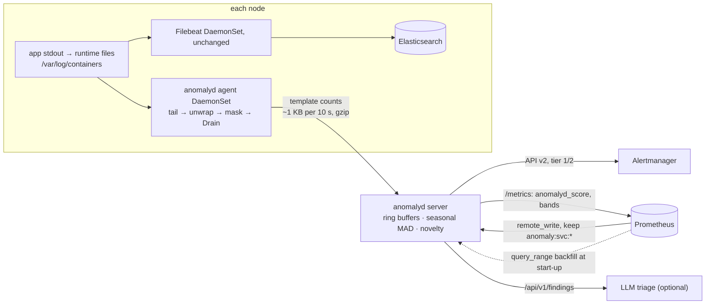

# anomalyd: our own anomaly detection engine for Prometheus series and log templates

**In short:**

- anomalyd is **our own engine**. We built it from open-source ideas plus our own Go code:
  - [Drain](https://jiemingzhu.github.io/pub/pjhe_icws2017.pdf) turns log lines into templates.
  - a [seasonal median](https://about.gitlab.com/blog/anomaly-detection-using-prometheus/) with
    the [median absolute deviation (MAD)](https://en.wikipedia.org/wiki/Median_absolute_deviation)
    scores how unusual a value is.
- It is a proof of concept (PoC): one static Go binary. It adds seasonal anomaly detection to our
  stack and replaces nothing.
- On synthetic data, one core mines 1.3–1.5 M log lines/s. In a side-by-side run on the same
  file, the Python Drain3 exporter mined 94–95 k lines/s.
- In the end-to-end test with real Prometheus and Alertmanager, three injected incidents became
  exactly three alerts. There were no other findings.
- It is the pilot for iteration 2. We have not tested it on our real logs yet.

Terms and abbreviations: [glossary](../docs/glossary.md).

Sections:
[What it is](#what-it-is) ·
[The two algorithms](#the-two-algorithms-in-plain-words) ·
[Why build this](#why-build-this-instead-of-using-the-python-pieces) ·
[How detection works](#how-detection-works) ·
[Resource model](#resource-model) ·
[Wiring it into our stack](#wiring-it-into-our-stack) ·
[Verification](#verification-2026-09-15) ·
[Known limitations](#known-limitations)

## What it is

anomalyd adds seasonal anomaly detection to our stack without replacing anything. Filebeat →
Elasticsearch, Prometheus, Grafana, Alertmanager and Jaeger stay as they are.

What comes from where:

- **Open-source ideas.** The log miner is a Go port of the
  [Drain3](https://github.com/logpai/Drain3) rules. The score is a seasonal median with MAD. It
  is a port of `score_series()` from our Python scorer, `poc/ml/prom_anomaly_job.py`.
- **Our own code.** Everything around them: the log readers, the ring buffers, the detection of
  new templates, the alerts, the state snapshots and the HTTP API.

The binary has two roles:

- **`anomalyd agent`** runs on each node. It is a second reader of the files that Filebeat
  already ships.
  - For apps that log to stdout, these are the container runtime's files under
    `/var/log/containers`. The agent unwraps the envelope that the runtime adds to each line.
    The envelope is in the
    [CRI logging format](https://kubernetes.io/docs/concepts/cluster-administration/logging/)
    (Container Runtime Interface) or the Docker format.
  - It mines Drain templates locally and sends only line counts per template to the server.
  - Raw lines never leave the node.
- **`anomalyd server`** runs centrally. It:
  - receives the anomaly-input
    [recording rules](https://prometheus.io/docs/prometheus/latest/configuration/recording_rules/)
    through Prometheus `remote_write`, with a keep filter. So Prometheus pushes only these
    series. On start-up, the server backfills (loads) their history from Prometheus.
  - receives template counts from the agents.
  - scores every series against a seasonal-median + MAD baseline and detects new log templates.
  - sends findings to Alertmanager (API v2) with our `tier`/`severity` conventions.
  - exposes scores and bands on `/metrics` for Grafana.
  - serves findings as JSON on `/api/v1/findings`. This can be the bundle source for large
    language model (LLM) triage.

The only third-party dependency is `github.com/klauspost/compress`. It gives snappy compression
for remote write. Everything else uses the Go standard library. The PoC runs on Go 1.26. The
latest Go release on 2026-09-14 was go1.27.1 (go.dev/dl).



## The two algorithms, in plain words

**Drain: from a log line to a template.** A template is the fixed text of a log line. The
variable parts are replaced by placeholders.
[Drain](https://jiemingzhu.github.io/pub/pjhe_icws2017.pdf) (He et al., 2017) finds templates
while the lines stream in. For each line, anomalyd does this:

1. **Mask.** It replaces obvious variables with placeholders: `<UUID>`, `<IP>`, `<HEX>`, `<NUM>`
   and `<EMAIL>`. For example, `Connected to 10.0.0.7 in 35ms` becomes
   `Connected to <IP> in <NUM>`.
2. **Find the group.** Drain keeps a small tree. It picks a branch by the number of words in the
   line, then by the first words. So it compares the line with only a few templates, not with
   all of them.
3. **Compare.** It counts the words that match a template at the same position. If the share of
   matching words reaches the similarity threshold (`--drain-sim-th`), the line joins that
   template. Words that differ become `<*>`. For example, `User alice logged in` and
   `User bob logged in` become `User <*> logged in`.
4. **Or start a new template.** If no template is similar enough, the line starts a new one.

After this, anomalyd only counts lines per template. A sudden change in one template's count,
or a template never seen before, is a sign that something changed.

**Seasonal median + MAD: how unusual is this value?** Most traffic repeats every day and every
week. A season is that repeat period, for example 1 week. So the best guess for "now" is what
happened at the same time in earlier seasons.

- **Expected value.** anomalyd takes the value of the same time slot in each earlier season. The
  expected value is their median. The median ignores one odd week, for example a past incident.
  This is called a
  [seasonal median](https://about.gitlab.com/blog/anomaly-detection-using-prometheus/).
- **Usual error.** For each slot of the last season, anomalyd computes the residual: the
  observed value minus the expected value. The MAD of these residuals says how far off the
  expected value usually is. For normally distributed data, 1.4826 × MAD estimates the standard
  deviation. Unlike the standard deviation, one outlier cannot inflate it.
- **Score.** score = (observed − expected) / scale. This is a
  [z-score](https://en.wikipedia.org/wiki/Standard_score). A score of +4 means "4 usual errors
  above the expected value". By default, a finding needs |z| ≥ 4 in 2 buckets in a row.

Public benchmarks show that simple statistics like these do as well as most deep-learning and
foundation models, or better ([research file 05](../docs/research/05-methods-benchmarks.md)).
So our "model" is simple statistics, not a neural network.

## Why build this instead of using the Python pieces

| Measure | anomalyd (Go) | Python PoC ([../poc/](../poc/)) |
|---|---|---|
| Log mining, same 300k-line synthetic file (141 B/line), one core | **1.3–1.5 M lines/s**, 3 MB heap | Drain3 exporter: 94–95 k lines/s |
| Template output on that file | 23 templates, identical text and counts to Drain3 | 23 templates (reference) |
| JSON field extraction per line | 226 ns, no allocation | Go's `encoding/json`, for scale: 1.55 µs, 11 allocations |
| Seasonal score per series (1-week season, 5 min step) | 110 µs with a full MAD pass, 9 µs with the robust scale cached hourly | 1.1–1.6 ms, plus one `query_range` per series per run |
| Where history lives | In memory, fed by `remote_write`, backfilled once | Re-queried from Prometheus on every run |
| Agent → server traffic in the smoke test | 6.5 KB gzip for 90 k lines | Not applicable |

The Drain3 figure comes from this side-by-side run. The PoC's own Drain3 benchmark, a separate
run, gave 96k–110k lines/s ([../poc/README.md](../poc/README.md#what-was-verified-2026-09-14)).

The other option without Python is the OpenTelemetry (OTel) Collector's own Go `drain`
processor. It is the path-B pilot in the main PoC: Drain on each host, counts into Prometheus
([reference architecture](../docs/reference-architecture.md)). We ran both on the same
3M-line file in Docker, limited with `--cpus 1`, using
[test/bench/compare.sh](test/bench/compare.sh):

| Measure | anomalyd agent (`bench`) | otelcol-contrib 0.160.0 (`file_log` + `json_parser` → `drain` → `count`) |
|---|---|---|
| Lines per second | **1.56 M** (1.9 s) | 138 k (21.8 s, collector start-up included) |
| Lines per second, same lines as CRI container stdout (`CONTAINER=cri`) | **1.53 M** (`--container cri`, 1.49–1.60 M over runs) | 92 k (32.5 s, `container` operator in front) |
| Memory | 2.3 MB heap | 78 MiB RSS (95 MiB with the `container` operator) |
| Templates found | 23 | 23 clusters |

Heap is the memory that the Go program allocated. Resident set size (RSS) is all the memory
that the process holds in RAM.

We measured all figures on 2026-09-14/15, on an Apple M-series laptop, with synthetic data. The
commands are in [Verification](#verification-2026-09-15). The templates match because the Go
miner ports Drain3's tree, similarity and merge rules exactly. The masking is a single-pass
scanner that follows the regexes of `poc/logs/drain3_exporter.py`.

What this means for 200 GB–2 TB/day of logs:

- 2 TB/day is about 23 MB/s. At 141 B per line, that is about 164 k lines/s on average and
  about 500 k lines/s at a 3× peak. 141 B is the line size of the synthetic file.
- On the synthetic file, one core mines 1.5 M lines/s. Real logs have longer lines and more
  templates. We assume that they run 3–5× slower (UNVERIFIED). Then mining the logs of the
  whole fleet costs about 0.1–1.7 cores in total, spread over the hosts.
- The cost figures use other line sizes.
  [docs/cost-sizing.md §2](../docs/cost-sizing.md#2-log-template-mining-how-many-cores) assumes
  300–1,000 B per line, so 69k–231k lines/s at a 3× peak. There the agent needs < 0.2 cores, and
  < 1 core if real logs run 5× slower. cost-sizing §8 prices this as 0.05–0.8 vCPU.
- The server only sees counts.

## How detection works

- **Buckets.** anomalyd keeps every series as fixed-width time buckets (`--step`, default 5 m).
  They sit in a ring of `(seasons + 1) × season / step + 2` float32 values. A ring has a fixed
  size: each new bucket overwrites the oldest one.
  - Metric samples in a bucket are averaged.
  - Log counts are summed. An empty log bucket counts as 0.
  - Metric buckets close by data time. So replayed or backfilled data scores the same way as
    live data.
  - Log buckets close by wall clock plus `--grace`.
- **Score.** It is a port of `score_series()` from `poc/ml/prom_anomaly_job.py`. A Go test
  checks that it matches the Python output to 1e-9. It works like this (see
  [The two algorithms](#the-two-algorithms-in-plain-words)):
  - `expected` is the median of the same bucket in previous seasons. With no seasonal history
    yet, it is the median of the last `--*-lookback` instead (cold start).
  - `scale` is `1.4826 × MAD` of last-season residuals. It is never below the floors: the
    scale is the largest of the MAD value and all floors. A floor stops a very flat series from
    giving huge scores for tiny changes. The floors are:
    - for metric series: `--prom-rel-floor` (a fraction of expected) and `--abs-floor` per
      `anomaly_type`.
    - for log counts: 10 % of expected, 1 line, and a
      [Poisson](https://en.wikipedia.org/wiki/Poisson_distribution) floor of `√expected`.
      Random noise in counts is about `√expected`.
  - `score = (observed − expected) / scale`.
- **Findings.**
  - A finding fires after `--for` buckets in a row over `--threshold`. The default is 2 buckets
    at |z| ≥ 4. It resolves after 2 normal buckets.
  - The direction depends on the input. For `anomaly_type` `errors` or `latency`, only an
    increase counts. The same holds for the `error` and `warn` log levels. For everything else,
    both directions count.
  - anomalyd ignores log series with fewer than `--log-min-count` lines in both observed and
    expected.
- **New templates.** The server may see a template for the first time after the
  `--novelty-warmup` period. That template becomes a finding once it has `--novelty-min-lines`
  lines within `--novelty-window`. The finding stays firing for `--novelty-ttl`.
- **Merging templates across hosts.** Each agent sends its masked template text. The server
  re-clusters those texts with its own Drain instance per service. This gives one stable
  `template_id` per service across all hosts. Another host, or an agent after a restart, may
  send a new spelling of a known template. It merges into the existing template and is not
  reported as new. The unit test covers this.
- **Restarts.** anomalyd saves templates and ring buffers to `--state-dir` every
  `--snapshot-interval` and on SIGTERM (the stop signal). It uses Go's gob format and an atomic
  rename, so a crash never leaves a half-written file. After a restore, known templates stay
  known and there is no second warm-up.

anomalyd sends four alerts. "error/warn up" means a rise in error or warn lines. "Down" means a
drop.

| Alert (`alertname`) | `tier` | `severity` | Fires when |
|---|---|---|---|
| `AnomalydMetricAnomaly` | 2 | warning | a remote-written series leaves its seasonal band |
| `AnomalydLogNewTemplate` | 1 | warning (error/warn level) or info | a template first seen after warm-up reaches the minimum lines |
| `AnomalydLogTemplateRate` | 2 | warning (error/warn up) or info | one template's line rate leaves its band |
| `AnomalydLogVolume` | 2 | warning (error/warn up, or info/unknown down) or info | a service's lines per level leave their band |

Every alert carries:

- `source="anomalyd"`, `anomaly_kind` and `direction`.
- the series labels (`service`, `anomaly_name`, …), or `service`, `template_id` and `level`
  for log findings.
- annotations with the observed and expected values, the band and the bucket time. Log findings
  also carry the masked template.

None of them pages a person. This follows our rule: only Service Level Objective (SLO)
[burn-rate alerts](https://sre.google/workbook/alerting-on-slos/) page. Alertmanager routes
anomalyd alerts by `tier`, like every other finding
([../poc/prometheus/alertmanager.yml](../poc/prometheus/alertmanager.yml)).

## Resource model

Each series costs `4 × ring buckets` bytes (4 bytes per float32 value). Labels and state add
about 0.9 KB:

| Settings (defaults) | Ring | Per series | Example |
|---|---|---|---|
| metrics: `--step 5m --prom-season 168h --prom-seasons 2` | 6,050 buckets | ≈ 25 KB | 5 k inputs ≈ 125 MB |
| logs: `--log-season 24h --log-seasons 3` | 1,154 buckets | ≈ 5.5 KB | 200 services × 150 templates ≈ 165 MB |

We measured **291 MB heap** for 5,000 metric series plus 30,000 log series with full rings.
Evaluating all of them took 841 ms on one core the first time. After that, the robust scale is
cached (it refreshes hourly). Then an evaluation takes about 1 ms.

Caps limit the memory:

- `--max-series` (20 k)
- `--max-log-series` (50 k)
- `--max-services` (1 k)
- `--drain-max-templates` (2 k per service, LRU: when full, the least recently used template is
  dropped)

When a cap is hit, anomalyd drops the extra series and counts them. It never grows silently.

## Wiring it into our stack

These examples use placeholder hostnames. Run the server inside the monitoring network.

**Prometheus.** Send only the anomaly inputs, not the 1–10 M raw series:
```yaml
remote_write:
  - url: http://anomalyd.internal:9400/api/v1/write
    write_relabel_configs:
      - source_labels: [__name__]
        regex: "anomaly:svc:.+|slo:.+"
        action: keep
```

**Server:**
```bash
anomalyd server --listen :9400 --state-dir /var/lib/anomalyd --backfill-url http://prometheus.internal:9090 --backfill-match '{__name__=~"anomaly:svc:.+"}' --alertmanager-url http://alertmanager.internal:9093 --external-url http://anomalyd.internal:9400
```

**Agent.** Run it on every node that Filebeat reads from. For container stdout, run it as a
DaemonSet (one pod on each node) with Filebeat's read-only mounts. The manifest is
[deploy/agent-daemonset.yaml](deploy/agent-daemonset.yaml), and `kubeconform -strict` finds it
valid:
```bash
anomalyd agent --path '/var/log/containers/*.log' --container auto --service-from-path '_(?P<service>[^_]+)-[0-9a-f]{64}\.log$' --server http://anomalyd.internal:9400
```

- **Envelope.** `--container cri|docker|auto` unwraps the envelope that the runtime puts around
  each line:
  - CRI (containerd, CRI-O): `<time> <stream> <P|F> <text>`
  - Docker json-file: `{"log":…,"stream":…}`
  - `auto` decides per line

  The runtime splits long lines into 16 KiB chunks (tag `P`, or no trailing `\n`). The agent
  joins them per stream. So a stderr line in between does not break a stdout line. Lines that
  are not envelopes are mined as they are.
- **Service.** The regex above takes the container name from
  `/var/log/containers/<pod>_<namespace>_<container>-<id>.log`. A `service.name` field in the
  app's JSON wins over it.
- **JSON apps.** The default `--format json` reads `message`, `service.name` and `log.level`
  inside the envelope. The fields can be nested or flat-dotted (`"log.level"` as one key).
- **Plain text.** Use `--format text`, or keep `json`: lines that are not JSON are mined as
  text. The level comes from the first tokens (words) of the line.
- **Files and rotation.**
  - Files present at start-up are read from the end.
  - Files that appear later are read from the start, for example rotated files or the files of
    new pods.
  - The kubelet rotates at 10 MiB by default. When a new file appears at the path, the agent
    finishes the old one, then follows the new one.
  - The agent closes a file whose path has been gone for 10 s (pod deleted). So its disk space
    is freed.
- **Plain log files** work too: `--path '/var/log/app/*/*.log' --service-from-path '/var/log/app/(?P<service>[^/]+)/'`
  without `--container`.

**Alertmanager.** When a service stops logging, all of its templates drop as well. Keep the
volume alert and mute the alerts per template. This inhibit rule does that. The end-to-end
(e2e) test and [../poc/prometheus/alertmanager.yml](../poc/prometheus/alertmanager.yml) both
carry it:
```yaml
inhibit_rules:
  - source_matchers: [alertname="AnomalydLogVolume", direction="down"]
    target_matchers: [alertname="AnomalydLogTemplateRate", direction="down"]
    equal: [service]
```

**Container image.** Build a static binary, then use the distroless [Dockerfile](Dockerfile).
A distroless image has no shell and no package manager:
```bash
CGO_ENABLED=0 GOOS=linux GOARCH=amd64 go build -trimpath -ldflags='-s -w' -o anomalyd ./cmd/anomalyd && docker build -t anomalyd .
```

**Grafana** can plot `anomalyd_score` together with `anomalyd_expected` and
`anomalyd_band_upper`/`anomalyd_band_lower`. The server strips `anomaly_*` labels from these
gauges. Otherwise the upstream promql-anomaly-detection rules would pick them up as inputs and
fail with "same labelset".

The server has these HTTP endpoints:

| Endpoint | Purpose |
|---|---|
| `POST /api/v1/write` | Prometheus remote write 1.0 (snappy protobuf). 2.0 is refused with 415. |
| `POST /api/v1/templates` | agent pushes (gzip JSON, [wire format](internal/wire/wire.go)) |
| `POST /api/v1/logs?service=` | raw newline-delimited JSON (NDJSON) or text lines, for small set-ups without agents |
| `GET /api/v1/findings[?state=firing&id=]` | active and recently resolved findings |
| `GET /api/v1/templates[?service=]` | current templates per service with line counts and dominant level |
| `GET /metrics`, `GET /-/healthy` | scores and bands, self-metrics, liveness |

## Verification (2026-09-15)

All checks used synthetic data. Nothing touched our production systems.

| Check | Command | Result |
|---|---|---|
| Unit tests, race detector | `go test -race ./...` | pass (note 1) |
| Scorer parity with Python | `ANOMALYD_FIXTURE_DIR=… go test ./internal/detect -run Parity` + [testdata/parity.py](internal/detect/testdata/parity.py) | Same expected and score as `prom_anomaly_job.py` to 1e-9 (normal, spike, cold start) |
| Template parity with Drain3 | `anomalyd bench --file s300k.ndjson --templates` vs Drain3 0.9.11 with the exporter's masks | Identical 23 templates and counts |
| Throughput | `anomalyd bench --file …` and `drain3_exporter.py --bench` on the same file | 1.3–1.5 M vs 94–95 k lines/s (one core). Wrapped lines: note 2. |
| Benchmarks | `go test -bench . ./internal/...` | Drain add 279 ns/line, tokenize 361 ns, extract 226 ns, score 110 µs full / 9 µs cached |
| Footprint | `ANOMALYD_FOOTPRINT=1 go test ./internal/server -run Footprint -v` | 291 MB heap. Eval 841 ms cold / ~1 ms warm on one core. |
| End to end | [test/e2e/run.sh](test/e2e/run.sh) (Docker, ~14 min) | PASS, see below |
| Agent DaemonSet | `kubeconform -strict` v0.8.0 on [deploy/agent-daemonset.yaml](deploy/agent-daemonset.yaml) | Valid |
| Routing through the repo's Alertmanager config | `amtool config routes test` against [../poc/prometheus/alertmanager.yml](../poc/prometheus/alertmanager.yml) (v0.34.0) | All three finding kinds → `llm-triage` + `chat-anomalies` (note 3) |
| One-core comparison with the OTel `drain` processor | [test/bench/compare.sh](test/bench/compare.sh), plain and `CONTAINER=cri` | See [Why build this](#why-build-this-instead-of-using-the-python-pieces) |

Notes:

1. The unit tests cover:
   - masking cases, Drain grouping, the LRU cap and the cap on children per tree node
   - the remote-write codec and the JSON extractor
   - CRI and Docker envelopes, with split lines joined per stream
   - a deleted file that gets closed, and a new file at the same path that is read from the
     start
   - findings → Alertmanager payload, novelty and snapshot restore
   - the raw-log endpoint
2. We also wrapped the same lines with `gen logs --container …`. Results:
   - CRI: 1.48–1.60 M lines/s
   - Docker json-file: 0.54–0.59 M lines/s, because of the second JSON decode
   - CRI with plain-text apps: 1.11–1.20 M lines/s
3. The inhibit rule above is in that file. `check-config` gives SUCCESS.

The end-to-end run used Prometheus v3.14.0 and Alertmanager v0.34.0, both real. The setup was:

- We imported 8 days of 1-minute history into Prometheus with
  `promtool tsdb create-blocks-from openmetrics`.
- Prometheus ran recording rules with `anomaly_*` labels and a `remote_write` keep filter. It
  also loaded the upstream promql-anomaly-detection rules.
- The generator wrote logs for 5 services at 1,000 lines/s. It wrote them the way containerd
  writes container stdout: CRI envelopes, `/var/log/containers` file names, and error lines on
  stderr. The agent ran with `--container cri` and took the service from the file name.
- We injected three incidents: a 3× request spike on checkout, a new ERROR template on
  checkout, and search going silent.

Results:

- The server backfilled 115,220 samples from `query_range` in about 2 s.
- The three injected incidents became exactly three active alerts in Alertmanager:
  - `AnomalydMetricAnomaly` checkout at z = +38.3. Three earlier runs on plain files gave
    +38.6 to +43.2.
  - `AnomalydLogNewTemplate` checkout.
  - `AnomalydLogVolume` search down at z = −10.
- The inhibit rule above suppressed the four per-template drops of search.
- There were no other findings. The other 9 metric series and 4 services stayed inside their
  bands.
- `promtool check metrics` passed on `/metrics`.
- Prometheus reported 520 samples remote-written, 0 failed, and 0 rule-evaluation failures. The
  upstream band rules ran next to the scraped `anomalyd_score` series.
- Resource use:
  - The agent read 997 k lines (201 MB with the CRI envelopes) and pushed 68.4 KB. It used
    6.7 MiB RSS and 0.81 % CPU. On plain files: 991 k lines (160 MB), 67.7 KB, 7.5 MiB, 0.76 %.
  - The server used 7.1 MiB RSS, with a 3.4 ms evaluation.

We did not verify:

- Throughput and template quality on our real logs.
- Agent CPU next to Filebeat on a busy node, and on a real Kubernetes node (kubelet rotation
  under load).
- Running more than one server, for high availability (HA).
- Remote write 2.0 and native histograms. They are not supported.
- Transport Layer Security (TLS) and authentication on the endpoints. They do not exist. Keep
  the server on an internal network or behind a proxy.

## Known limitations

- **Drain merges look-alike lines**, the same as Drain3. For example, `Cache hit`/`Cache miss`
  share one template. Tune `--drain-sim-th`/`--drain-depth` per log family, or add masks.
- **First-seen templates can carry unmasked words**, such as a user name without digits. They
  keep them until Drain generalises them. Review masks before you route template text to chat
  or an LLM.
- **Agents push at least once**. So a retry after a timeout can double-count one push. The
  agent does not save its file offsets. So it misses the lines written while it is down.
- **Rotation race**. When a new file appears at a path, the agent reads the old file to its end
  once, then switches. It misses lines that are still written to the old file after that. It
  does not read rotated `.gz` files.
- **The service taken from the file name is the container name**. Generic container names
  (`app`, `main`) merge services. Use a regex on the pod name instead, or a `service.name` field
  in the app's JSON. There is no Kubernetes API lookup for labels.
- **Seasonality needs history**. Weekly bands need 2 weeks for a full residual window. The
  backfill covers metrics. Log series start in cold-start mode (recent median) until a day of
  counts exists.
- **One season per source**, set by `--prom-season` and `--log-season`. Holidays and multiple
  seasons at once are out of scope for the PoC. Multiple seasons need a method such as
  [MSTL](https://arxiv.org/abs/2107.13462) (seasonal-trend decomposition for multiple seasonal
  patterns).
