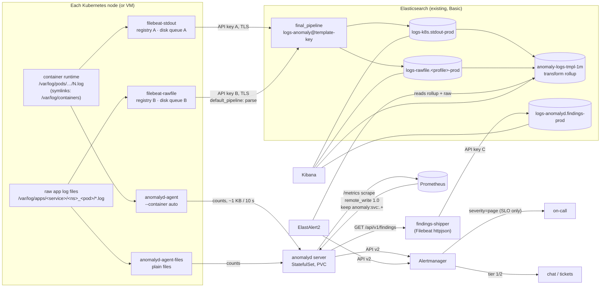

# Deployment plan: independent log sinks, Elasticsearch/Kibana, and anomalyd

**In short:**

- **The files on the node are the fan-out point.** Every sink reads the same files by itself:
  the container runtime's stdout files and the raw app log files. Each sink has its own reader
  process, its own offsets (registry), its own buffer and its own credentials. Nothing is chained.
- **Four independent data paths:**
  1. `filebeat-stdout` reads container stdout and writes to Elasticsearch (ES).
  2. `filebeat-rawfile` reads raw log files on disk, parses them in ES and writes to ES.
  3. `anomalyd-agent` and `anomalyd-agent-files` read the same two kinds of files and send
     template counts to `anomalyd server`.
  4. `findings-shipper` polls anomalyd's findings and writes them to ES, so Kibana can show them.
- **We add no Kafka or Redpanda at the start.** A Filebeat disk queue per ES shipper, plus longer
  kubelet log rotation, gives each ES sink hours of buffer. anomalyd sends only counts and keeps
  its own in-memory backlog. Section 4.4 lists when a broker becomes worth its cost.
- **Only SLO burn-rate alerts page a person**, the same rule as in the rest of this repo. We roll
  out in phases: shadow mode, then chat alerts, then page enrichment. anomalyd findings never
  page on their own.
- **anomalyd needs some new code before production.** TLS and auth are required unless a service
  mesh provides them. Multiline records are required for raw Java-style files. Persisted agent
  offsets, HA fan-out and an alert-label flag are recommended. Section 15 has the full list. The
  rest of the plan needs no new anomalyd code.

Status: plan only. Nothing here has run against our real systems. The versions are the ones
validated in this repo on synthetic data (Elastic Stack 9.5.3, Prometheus 3.14.0, Alertmanager
0.34.0, ElastAlert2 2.31.0, anomalyd at the current commit). A claim that we have not checked is
marked **UNVERIFIED**.

Terms and abbreviations: [glossary](../glossary.md). Background:
[reference architecture](../reference-architecture.md),
[cost and sizing](../cost-sizing.md), [PoC](../../poc/README.md),
[anomalyd](../../anomalyd/README.md), [roadmap](../roadmap.md).

Sections:
[1. Goals](#1-goals-and-non-goals) ·
[2. Topology](#2-target-topology) ·
[3. Components and versions](#3-components-and-versions) ·
[4. Data flow and independence](#4-data-flow-and-sink-independence) ·
[5. Collector configs](#5-collector-configs) ·
[6. anomalyd config](#6-anomalyd-configuration) ·
[7. ES templates, ILM, data streams](#7-elasticsearch-index-templates-ilm-and-data-streams) ·
[8. Kibana](#8-kibana-dashboards-and-alerting) ·
[9. Kubernetes and Helm](#9-kubernetes-manifests-and-helm-structure) ·
[10. VM/systemd variant](#10-vm--systemd-variant) ·
[11. Secrets, TLS, RBAC](#11-secrets-tls-and-rbac) ·
[12. Sizing](#12-sizing) ·
[13. HA and failure modes](#13-ha-and-failure-modes) ·
[14. Rollout](#14-rollout-phases) ·
[15. New anomalyd code](#15-new-code-needed-in-anomalyd) ·
[16. Rollback](#16-rollback) ·
[17. Runbook](#17-runbook) ·
[18. Acceptance checks](#18-acceptance-checks) ·
[19. Open questions](#19-open-questions)

---

## 1. Goals and non-goals

**Goals**

1. Ship container stdout and raw log files to ES, and make them visible in Kibana, without data
   loss during an ES outage of up to about 2 hours (the target; section 12 sizes it).
2. Feed anomalyd from the same sources. **An ES problem must never stop anomaly detection, and an
   anomalyd problem must never stop log shipping.**
3. Keep each sink replaceable. We can swap Filebeat for Elastic Agent, Vector or an OTel
   Collector, or remove anomalyd, without touching the other sinks.
4. Put the anomaly findings next to the logs in Kibana. Keep Alertmanager as the only alert bus.
5. Roll out with shadow mode first. Rollback must be one step per component.

**Non-goals**

- Replacing Elasticsearch, Kibana, Prometheus or Alertmanager.
- Paging on anomaly findings. Only SLO burn rate pages
  ([README](../../README.md#recommended-plan)).
- Sizing the ES cluster for raw log storage. That cluster exists already. We size only what
  this plan adds to it.
- The traces path. It is unchanged; see the [roadmap](../roadmap.md).

---

## 2. Target topology



The independence on one node, as text:

```
                      +-- filebeat-stdout ----[disk queue A]--> ES  logs-k8s.stdout-*
/var/log/containers --+
   (runtime files)    +-- anomalyd-agent -----[mem backlog]---> anomalyd server
                                                                  |
/var/log/apps/**   ---+-- filebeat-rawfile ---[disk queue B]--> ES  logs-rawfile.*-*
   (raw files)        +-- anomalyd-agent-files [mem backlog]---> anomalyd server

   Each reader: own process, own offsets, own buffer, own credentials, own CPU/memory limits.
   No reader reads another reader's output.  The only shared resource is the node's page cache.
```

Namespaces:

- `logging`: the four node readers. They need `hostPath`, so the namespace has the
  Pod Security Admission label `privileged`.
- `monitoring`: anomalyd server, findings-shipper and ElastAlert2. This namespace stays
  `restricted`. Note: the current [agent-daemonset.yaml](../../anomalyd/deploy/agent-daemonset.yaml)
  uses `monitoring`. We move the agent to `logging`.

---

## 3. Components and versions

Pin exact tags. Upgrade one component at a time (section 14).

| Component | Version / image | Kind | Replaces | Notes |
|---|---|---|---|---|
| Elasticsearch, Kibana | existing; plan written for **9.5.x**, works on **8.19.x** | existing | – | Step 0 of the [roadmap](../roadmap.md#step-0-confirm-what-is-actually-running-half-a-day) confirms version and license. The Legacy OSS 7.10 build is out of scope: its branch is in the roadmap. |
| filebeat-stdout | `docker.elastic.co/beats/filebeat:9.5.3` | DaemonSet | today's Filebeat DaemonSet (renamed in place) | Filebeat must not be newer than ES. On an 8.19 cluster use `8.19.x`. |
| filebeat-rawfile | same image | DaemonSet, only on labelled nodes | – | new |
| findings-shipper | same image | Deployment, 1 replica | – | `httpjson` input |
| anomalyd agent | `registry.internal/anomalyd:<git-sha>` | DaemonSet ×2 (stdout, files) | – | built from [anomalyd/Dockerfile](../../anomalyd/Dockerfile), Go 1.26+, distroless `static-debian13:nonroot` |
| anomalyd server | same image | StatefulSet, 1 replica, PVC | – | single instance until the HA code of section 15 exists |
| ElastAlert2 | `jertel/elastalert2:2.31.0` | Deployment, 1 replica | – | rules in [poc/logs/elastalert2](../../poc/logs/elastalert2/) |
| Prometheus | existing; validated with 3.14.0 | existing | – | adds one `remote_write` block |
| Alertmanager | existing; validated with 0.34.0 | existing | – | adds routes from [alertmanager.yml](../../poc/prometheus/alertmanager.yml) |
| Kubernetes | ≥ 1.30 (UNVERIFIED as our minimum; `subPathExpr` and PSA labels are GA well before that) | existing | – | kubelet log rotation settings change (section 4.3) |
| json_exporter (optional) | `quay.io/prometheuscommunity/json-exporter` | sidecar | – | turns Filebeat's `/stats` into Prometheus metrics (section 17) |

**Why Filebeat and not Elastic Agent?** Filebeat has one output per process
([reference-architecture](../reference-architecture.md#notes-on-the-diagram)). In this plan that
limit helps us: one process per sink is exactly the isolation we want. Standalone Elastic Agent
also works. It supports per-input `use_output` and runs its inputs as separate components
(UNVERIFIED for our version). It adds a supervisor layer, and without Fleet it gains us nothing.
If we switch later, only rows 2–4 of the table change, because the template key lives in ES
(section 4.2).

---

## 4. Data flow and sink independence

### 4.1 The four paths

| Path | Source | Reader | Offset store | Buffer when the target is down | Target | Credential |
|---|---|---|---|---|---|---|
| S1 stdout → ES | `/var/log/containers/*.log` (CRI or Docker json-file) | filebeat-stdout | `/var/lib/filebeat-stdout` (hostPath) | kubelet rotation window + disk queue A (10 GiB) | `logs-k8s.stdout-<cluster>` | API key `fb-stdout` |
| S2 raw files → ES | `/var/log/apps/**/*.log` | filebeat-rawfile | `/var/lib/filebeat-rawfile` (hostPath) | app rotation window + disk queue B (5 GiB) | `logs-rawfile.<profile>-<cluster>` | API key `fb-rawfile` |
| S3 both → anomalyd | same files as S1 and S2 | anomalyd-agent, anomalyd-agent-files | none (tails from EOF at start; section 15, item N3) | in-memory backlog, `--max-backlog` count keys | anomalyd server | none yet (section 15, item N1) |
| S4 findings → ES | `GET /api/v1/findings` | findings-shipper | httpjson cursor (emptyDir; dedup by `_id`) | disk queue C (1 GiB) | `logs-anomalyd.findings-<cluster>` | API key `fb-findings` |

Rules that keep them independent:

1. **No sink reads another sink's output.** anomalyd never reads from ES. The ES shippers never
   depend on anomalyd. The only dependency between paths is S4 → anomalyd server, and S4 exists
   only for Kibana.
2. **Separate processes, registries and data directories.** A corrupt registry, a crash loop or a
   bad config in one reader does not touch the others. Two Filebeat processes must never share a
   `path.data`.
3. **Separate buffers.** When ES slows down, only S1, S2 and S4 fill their disk queues. The
   anomalyd agents keep reading at full speed. When anomalyd slows down, only the agents' backlog
   grows. It is capped, and the drops are counted.
4. **Separate data streams, pipelines and mappings in ES.** A mapping explosion or a pipeline bug
   in a raw-file profile cannot reject stdout documents.
5. **Separate Helm releases or Argo CD apps per sink** (section 9). A failed upgrade of one sink
   cannot block or roll back another.
6. **Separate resource limits and one shared PriorityClass.** One reader running out of memory
   (OOM) cannot starve another. The node readers get a PriorityClass above the apps, so the
   scheduler does not evict them first.

### 4.2 Where the template key is computed

The PoC has two variants of the stateless template key: Filebeat processors (xxhash) and an ES
ingest pipeline (MurmurHash3). They produce **different ids**, so a cluster must use only one
([poc gotchas](../../poc/README.md#elasticsearch-and-filebeat)). This plan uses the **ES ingest
pipeline, attached as `index.final_pipeline`**, for both S1 and S2:

- The id no longer depends on the shipper. We can replace Filebeat without changing a
  `log.template_id` and without resetting the ElastAlert2 `new_term` baselines.
- Raw-file parsing (grok/dissect per profile) runs first in the `default_pipeline`. Then the final
  pipeline masks the parsed `message`. So both sources get the same keys.
- The cost is ingest CPU on ES instead of on the hosts. Phase 0 measures it (section 14). If
  it is too high, fall back to the Filebeat processor variant **on every shipper**, and parse raw
  files with Filebeat `dissect` / `script` instead of grok.

anomalyd uses its own Drain templates and its own `template_id`. These ids are not the ES ids.
Section 8.3 describes the drill-down from an anomalyd finding into Kibana.

### 4.3 Buffers: the file on disk is the first queue

A reader that falls behind loses data once the runtime rotates away a file it has not read yet.
The kubelet default is 10 MiB × 5 files per container. A container that logs 1 MB/s rotates
through this in **under 1 minute**. That is far too short to survive an ES outage. Two measures
fix it:

1. **Longer kubelet rotation** (KubeletConfiguration):
   ```yaml
   containerLogMaxSize: 50Mi
   containerLogMaxFiles: 5          # 250 MiB per container
   containerLogMaxWorkers: 2
   containerLogMonitorInterval: 10s
   ```
   For the default node pool: 250 MiB × the number of chatty containers per node must fit on the
   node's log disk. Most containers never fill their first file.
2. **A Filebeat disk queue per ES shipper.** With it, Filebeat keeps reading files during an ES
   outage. It stores events on the node until ES accepts them again. So the buffer no longer
   depends on the rotation of each container:
   ```yaml
   queue.disk:
     max_size: 10GB                               # S1; S2 uses 5GB, S4 1GB
     path: "${path.data}/diskqueue"               # on the hostPath, survives pod restarts
   ```
   The disk queue is GA in current 8.x/9.x Filebeat. Confirm this in the docs for our version.
   A disk queue costs some CPU and IO compared with the memory queue. Phase 0 measures this.

Raw files are rotated by the app or by logrotate, not by the kubelet. Keep at least 2 rotated
generations uncompressed (`delaycompress`), and use `create` rather than `copytruncate` where the
app allows it. Filebeat's `filestream` and the anomalyd agent both handle rename and create.
Truncate works in both, but lines written between the copy and the truncate are lost.

### 4.4 Why no Kafka or Redpanda (yet)

A broker between the node and the sinks (node → Kafka → {ES consumer, anomalyd consumer}) is the
classic fan-out. We do not start with it:

- The files already give us fan-out and replay. Each reader keeps its own offset, like a consumer
  group.
- anomalyd does not want raw lines centrally. The agent mines on the node and sends about 1 KB
  every 10 s. A broker would send 200 GB – 2 TB/day of raw lines over the network, only to reduce
  them again.
- A broker is a stateful cluster to size, run and secure. At 2 TB/day with replication factor 3,
  24 h of retention is about 6 TB of broker disk.

**Add a broker when one of these becomes true:**

| Trigger | Why the files are no longer enough |
|---|---|
| ES outages longer than the node buffer (section 12: about 2–8 h per node) happen, or are planned | A central, replicated queue outlives a node's disk |
| Nodes are short-lived (spot instances, autoscaled away) and lose their unread files | The buffer must leave the node quickly |
| A third or fourth consumer needs **raw lines**: SIEM, archive to object storage, a second region | Readers per node would multiply |
| Logs must cross a network boundary with one choke point (another DC, a DMZ) | One controlled egress |

If a trigger fires: Filebeat `output.kafka` → Redpanda (single binary, Kafka API) with one topic
per source (`logs.stdout`, `logs.rawfile`). ES then gets its data from a consumer: Logstash or an
Elastic Agent Kafka input. The anomalyd agents stay on the node either way, because they need only
counts.

---

## 5. Collector configs

The configs below are complete for their purpose. Hostnames are placeholders. `${VAR}` values come
from environment variables that Kubernetes Secrets or systemd `EnvironmentFile`s fill.

### 5.1 filebeat-stdout (S1)

```yaml
# /etc/filebeat/stdout.yml  (ConfigMap filebeat-stdout-config in Kubernetes)
# The input id and the data path must stay those of the Filebeat that runs today. A new filestream
# `id`, or a new registry, re-reads every file from the start: duplicates.
filebeat.inputs:
  - type: filestream
    id: kubernetes-container-logs          # keep the id of the current Filebeat
    paths: [/var/log/containers/*.log]
    parsers:
      - container: ~                       # CRI or Docker envelope, joins P chunks
      - ndjson:                            # JSON apps; other lines pass through unchanged
          target: ""
          overwrite_keys: true
          ignore_decoding_error: true
    prospector.scanner.symlinks: true
    prospector.scanner.fingerprint.enabled: true
    file_identity.fingerprint: ~           # keep the file_identity of the current Filebeat
    close.on_state_change.removed: true
    clean_removed: true
    processors:
      - add_kubernetes_metadata:
          host: ${NODE_NAME}
          matchers:
            - logs_path: {logs_path: /var/log/containers/}

processors:
  - copy_fields:                           # service.name fallback: container name
      when.not.has_fields: ['service.name']
      fields: [{from: kubernetes.container.name, to: service.name}]
      fail_on_error: false
      ignore_missing: true
  - add_fields:
      target: orchestrator.cluster
      fields: {name: ${CLUSTER_NAME}}
  - drop_fields:                           # keep documents small; keep what dashboards use
      fields: [kubernetes.node.labels, kubernetes.namespace_labels, agent.ephemeral_id]
      ignore_missing: true
# No template-key processors here: ES computes the key in its final_pipeline (section 4.2).

queue.disk:
  max_size: 10GB
  path: "${path.data}/diskqueue"

output.elasticsearch:
  hosts: ["https://es-ingest-1.internal:9200", "https://es-ingest-2.internal:9200"]
  api_key: "${ES_API_KEY}"                 # id:api_key of fb-stdout
  ssl.certificate_authorities: ["/etc/pki/es/ca.crt"]
  index: "logs-k8s.stdout-${CLUSTER_NAME}"
  compression_level: 1
  worker: 2
  bulk_max_size: 1600
  backoff.init: 1s
  backoff.max: 60s
  # Data streams accept only op_type=create. Current Beats send create by default.

setup.template.enabled: false              # templates, ILM and pipelines come from section 7
setup.ilm.enabled: false
setup.kibana: ~

http.enabled: true                         # /stats for json_exporter and the liveness probe
http.host: 0.0.0.0
http.port: 5066
logging.level: info
logging.metrics.enabled: true
```

Gotchas to carry over from the PoC:

- Filebeat's `container` parser can join a split (`P`) stdout line with a stderr line that is
  written between its chunks ([poc gotchas](../../poc/README.md#container-stdout-plain-text-and-split-lines)).
  This is rare and harmless for ES. anomalyd keeps one buffer per stream.
- `ndjson.target: ""` puts the app's keys at the root. Guard the mapping with the field limits of
  section 7.

### 5.2 filebeat-rawfile (S2)

Raw files come in **profiles**. A profile is one file format with one parse pipeline, for example
`nginx`, `java` or `legacy`. Each profile is one filestream input. The profile name goes to
`data_stream.dataset` and chooses the ES pipeline.

**Where the files live on Kubernetes.** Apps that write files inside the container write them to a
hostPath directory with a per-pod subpath. Then one node reader sees them:

```yaml
# In the app's pod spec (the app's own chart):
env:
  - {name: POD_NAME,      valueFrom: {fieldRef: {fieldPath: metadata.name}}}
  - {name: POD_NAMESPACE, valueFrom: {fieldRef: {fieldPath: metadata.namespace}}}
  - {name: APP_NAME,      valueFrom: {fieldRef: {fieldPath: "metadata.labels['app.kubernetes.io/name']"}}}
volumeMounts:
  - name: applogs
    mountPath: /app/logs
    subPathExpr: $(APP_NAME)/$(POD_NAMESPACE)_$(POD_NAME)
volumes:
  - name: applogs
    hostPath: {path: /var/log/apps, type: DirectoryOrCreate}
```

The layout on the node is `/var/log/apps/<service>/<ns>_<pod>/<file>.log`. The service name
comes from the path. It is stable across pods. The hostPath directories outlive their pods, so a
node-level cleanup job removes directories whose pod is gone and whose files are older than 7
days (section 17). The alternative is a Filebeat sidecar per pod. It is simpler for the app, but it
means one reader per pod instead of one per node. Use it only for a few pods that cannot mount
hostPath.

On VMs the files are wherever the app writes them. Map each path glob to a profile.

```yaml
# /etc/filebeat/rawfile.yml
filebeat.inputs:
  - type: filestream
    id: rawfile-java                        # never rename: the id keys the registry
    paths: [/var/log/apps/*/*/app*.log]
    exclude_files: ['\.gz$']
    parsers:
      - multiline:                          # a record starts with an ISO timestamp
          type: pattern
          pattern: '^\d{4}-\d{2}-\d{2}[T ]\d{2}:\d{2}:\d{2}'
          negate: true
          match: after
          max_lines: 500
          timeout: 5s
    fields_under_root: true
    fields: {data_stream: {dataset: rawfile.java}}
    processors:
      - dissect:                            # service from the path, for both S2 and anomalyd
          tokenizer: "/var/log/apps/%{service.name}/%{kubernetes.namespace}_%{kubernetes.pod.name}/%{}"
          field: log.file.path
          target_prefix: ""
          ignore_failure: true

  - type: filestream
    id: rawfile-nginx
    paths: [/var/log/apps/*/*/access*.log]
    fields_under_root: true
    fields: {data_stream: {dataset: rawfile.nginx}}
    processors:
      - dissect:
          tokenizer: "/var/log/apps/%{service.name}/%{}"
          field: log.file.path
          target_prefix: ""
          ignore_failure: true

processors:
  - add_fields: {target: orchestrator.cluster, fields: {name: ${CLUSTER_NAME}}}
  - add_host_metadata: {netinfo.enabled: false}

queue.disk:
  max_size: 5GB
  path: "${path.data}/diskqueue"

output.elasticsearch:
  hosts: ["https://es-ingest-1.internal:9200", "https://es-ingest-2.internal:9200"]
  api_key: "${ES_API_KEY}"                  # fb-rawfile
  ssl.certificate_authorities: ["/etc/pki/es/ca.crt"]
  index: "logs-%{[data_stream.dataset]}-${CLUSTER_NAME}"
  compression_level: 1

setup.template.enabled: false
setup.ilm.enabled: false
http.enabled: true
http.host: 0.0.0.0
http.port: 5067
```

Parsing (grok, `date`, `log.level`) happens in ES, in the profile's `default_pipeline`
(section 7.3). So a parse change is an ES API call, not a rollout to every node.

### 5.3 findings-shipper (S4)

The anomalyd server returns a JSON array of active and recently resolved findings (the last 500)
at `GET /api/v1/findings`. A Filebeat `httpjson` input polls it. The document `_id` is a
fingerprint of (id, startsAt, state). So every finding gives **one document when it fires and
one when it resolves**. Repeated polls get a 409 on create and are dropped.

```yaml
# /etc/filebeat/findings.yml
filebeat.inputs:
  - type: httpjson
    id: anomalyd-findings
    interval: 30s
    request.url: http://anomalyd.monitoring.svc:9400/api/v1/findings
    request.method: GET
    request.timeout: 10s
    # A top-level JSON array is split into one event per element. Check this with one test run on
    # our version (UNVERIFIED); if it is not split, add: response.split: {target: body, type: array}

processors:
  - decode_json_fields: {fields: [message], target: anomalyd.finding, max_depth: 4}
  - drop_fields: {fields: [message], ignore_missing: true}
  - fingerprint:
      fields: [anomalyd.finding.id, anomalyd.finding.startsAt, anomalyd.finding.state]
      target_field: "@metadata._id"
      method: sha256
  - timestamp:
      field: anomalyd.finding.updatedAt
      layouts: ['2006-01-02T15:04:05.999999999Z07:00']
      ignore_missing: true
  - copy_fields:
      fields:
        - {from: anomalyd.finding.labels.service,   to: service.name}
        - {from: anomalyd.finding.labels.alertname, to: rule.name}
        - {from: anomalyd.finding.labels.tier,      to: anomalyd.tier}
      ignore_missing: true
      fail_on_error: false
  - script:                                  # Discover link for this finding (section 8.3)
      lang: javascript
      source: |
        function process(e) {
          var svc = e.Get("service.name"); var b = e.Get("anomalyd.finding.bucket");
          if (!svc || !b) return;
          var t = new Date(b).getTime();
          var from = new Date(t - 15*60000).toISOString(), to = new Date(t + 20*60000).toISOString();
          e.Put("anomalyd.discover_url",
            "https://kibana.internal/app/discover#/?_g=(time:(from:'" + from + "',to:'" + to + "'))" +
            "&_a=(query:(language:kuery,query:'service.name:\"" + svc + "\"'))");
        }
  - add_fields: {target: orchestrator.cluster, fields: {name: ${CLUSTER_NAME}}}

queue.disk: {max_size: 1GB, path: "${path.data}/diskqueue"}

output.elasticsearch:
  hosts: ["https://es-ingest-1.internal:9200"]
  api_key: "${ES_API_KEY}"                   # fb-findings
  ssl.certificate_authorities: ["/etc/pki/es/ca.crt"]
  index: "logs-anomalyd.findings-${CLUSTER_NAME}"

setup.template.enabled: false
setup.ilm.enabled: false
```

Why a poller and not a native ES output in anomalyd: it adds no ES client and no credentials to
anomalyd. If ES is down, anomalyd is not affected. We can also drop it without touching anomalyd.
The known gap: if the shipper is down for longer than it takes the server to resolve more than 500
findings, the oldest resolve events are lost. Alertmanager still has them. Item N6 in section 15
closes this gap.

**Optional, for all detectors at once:** also send Alertmanager's webhook (the `chat-anomalies`
receiver) to a Filebeat `http_endpoint` input and on to `logs-alerts.notifications-<cluster>`.
This puts ElastAlert2, PromQL band and anomalyd notifications in one Kibana view. It shows
notifications (grouped and repeated), not findings, so keep it separate from S4.

### 5.4 Pipeline self-monitoring

Every reader exposes counters. Prometheus scrapes them. No health signal goes through ES only,
because an ES outage would then hide itself.

| Reader | Endpoint | Key series |
|---|---|---|
| filebeat-* | `:5066/stats` via json_exporter | `libbeat.output.events.acked`, `.failed`, `libbeat.pipeline.queue.filled.pct` (disk queue fill), `filebeat.harvester.open_files` |
| anomalyd agent | `:9401/metrics` | `anomalyd_agent_lines_total`, `anomalyd_agent_push_errors_total`, `anomalyd_agent_backlog_dropped_total`, `anomalyd_agent_templates` |
| anomalyd server | `:9400/metrics` | `anomalyd_log_lines_total`, `anomalyd_remote_write_errors_total`, `anomalyd_series_dropped_total`, `anomalyd_alert_errors_total`, `anomalyd_eval_duration_seconds` |

Filebeat's own Stack Monitoring (`monitoring.enabled`) can also go to ES and Kibana. If we use
it, point it at a separate monitoring cluster where one exists.

---

## 6. anomalyd configuration

All flags exist today unless marked **NEW** (section 15).

**Server** (StatefulSet, one replica):

```bash
anomalyd server \
  --listen=:9400 \
  --state-dir=/var/lib/anomalyd --snapshot-interval=5m \
  --step=5m --eval-interval=30s --grace=30s \
  --threshold=4 --for=2 \
  --prom-season=168h --prom-seasons=2 --max-series=20000 \
  --backfill-url=http://prometheus.monitoring.svc:9090 \
  --backfill-match='{__name__=~"anomaly:svc:.+"}' \
  --abs-floor='errors=0.001,latency=5' \
  --log-season=24h --log-seasons=3 --log-min-count=10 \
  --max-log-series=50000 --max-services=1000 --drain-max-templates=2000 \
  --novelty-warmup=1h --novelty-min-lines=5 --novelty-window=15m --novelty-ttl=1h \
  --alertmanager-url=http://alertmanager-0.alertmanager.monitoring.svc:9093 \
  --alertmanager-url=http://alertmanager-1.alertmanager.monitoring.svc:9093 \
  --external-url=https://anomalyd.internal
# NEW (N5): --alert-label=cluster=prod   (needed when several clusters share one Alertmanager)
# NEW (N1): --tls-cert-file, --tls-key-file, --client-ca-file, --auth-token-file
```

- Give every Alertmanager peer its own `--alertmanager-url`. anomalyd posts to each one, the way
  Prometheus does.
- `--novelty-warmup` also applies after a restart without a state file. With the PVC, the restored
  templates stay known.

**Agent for container stdout** (DaemonSet `anomalyd-agent`):

```bash
anomalyd agent \
  --path='/var/log/containers/*.log' \
  --container=auto --format=json \
  --service-from-path='_(?P<service>[^_]+)-[0-9a-f]{64}\.log$' \
  --server=http://anomalyd.monitoring.svc:9400 \
  --name=$(NODE_NAME) --listen=:9401 \
  --flush-interval=10s --step=60 --max-services=200 --max-backlog=100000
```

- The regex takes the **container** name. Generic container names (`app`, `main`) merge
  services. For those, prefer apps that log a `service.name` JSON field, which wins over the path.
  The alternative is a pod-name regex such as
  `'/(?P<service>[a-z0-9-]+?)(-[a-z0-9]{8,10})?-[a-z0-9]{5}_[^_]+_[^_]+-[0-9a-f]{64}\.log$'`.
  Test it on the real `/var/log/containers` listing first.
- The agent's service name must match what ES shows as `service.name`. Otherwise the Kibana
  drill-down (section 8.3) opens the wrong service. Both use `service.name` from JSON first. Both
  fall back to the container name. Keep it that way.

**Agent for raw files** (DaemonSet `anomalyd-agent-files`, a separate process):

```bash
anomalyd agent \
  --path='/var/log/apps/*/*/*.log' \
  --format=text \
  --service-from-path='^/var/log/apps/(?P<service>[^/]+)/' \
  --server=http://anomalyd.monitoring.svc:9400 \
  --name=$(NODE_NAME)-files --listen=:9402
# NEW (N2): --multiline-start='^\d{4}-\d{2}-\d{2}[T ]\d{2}:\d{2}:\d{2}'   (required for stack traces)
```

- Use one agent process per format. `--container`, `--format` and the field names apply to the
  whole process. JSON raw files need a third process with `--format=json`, or `json` for all:
  lines that are not JSON are mined as text anyway.
- Without N2, every stack-trace line (`at com.foo.Bar(...)`) is mined as its own line. That
  gives many `<*>`-heavy templates and volume series that follow the error rate. Until N2 exists,
  keep Java-style profiles out of `anomalyd-agent-files`. Use `--path` only for single-line
  formats (access logs, key=value logs).
- The agent does not read rotated `.gz` files. That is fine, because it follows the live file.

**Prometheus** (existing server, added block):

```yaml
remote_write:
  - url: http://anomalyd.monitoring.svc:9400/api/v1/write
    protobuf_message: prometheus.WriteRequest      # remote write 1.0; anomalyd answers 415 to 2.0
    remote_timeout: 30s
    queue_config: {max_samples_per_send: 2000, capacity: 10000, max_shards: 4}
    write_relabel_configs:
      - source_labels: [__name__]
        regex: "anomaly:svc:.+|slo:.+"
        action: keep
scrape_configs:
  - job_name: anomalyd
    static_configs: [{targets: ["anomalyd.monitoring.svc:9400"]}]
  - job_name: anomalyd-agents
    kubernetes_sd_configs: [{role: pod, namespaces: {names: [logging]}}]
    relabel_configs:
      - source_labels: [__meta_kubernetes_pod_label_app_kubernetes_io_name]
        regex: anomalyd-agent(-files)?
        action: keep
      - source_labels: [__meta_kubernetes_pod_container_port_name]
        regex: metrics
        action: keep
```

**Alertmanager**: use the routes and inhibit rules from
[poc/prometheus/alertmanager.yml](../../poc/prometheus/alertmanager.yml). Add a **shadow route
first** for phase 2:

```yaml
route:
  routes:
    - matchers: ['source="anomalyd"']        # phase 2 only; delete in phase 3
      receiver: blackhole
    # ... existing routes ...
receivers:
  - name: blackhole                          # a receiver with no configs drops notifications
```

---

## 7. Elasticsearch index templates, ILM and data streams

Everything in this section is idempotent `PUT`s. It lives in Git, for example
`deploy/es/` as proposed in section 9. A CI job applies it with an admin API key, **not** a Helm
hook in the cluster, so no admin credential sits in Kubernetes.

Data streams:

| Data stream | Written by | Template pattern | ILM policy | Retention |
|---|---|---|---|---|
| `logs-k8s.stdout-<cluster>` | S1 | `logs-k8s.stdout-*` | `logs-k8s-stdout` | 30 d (match today's retention) |
| `logs-rawfile.<profile>-<cluster>` | S2 | `logs-rawfile.*-*` | `logs-rawfile` | 30 d, per profile if needed |
| `logs-anomalyd.findings-<cluster>` | S4 | `logs-anomalyd.findings-*` | `logs-anomaly-findings` | 400 d (year-over-year review) |
| `anomaly-logs-tmpl-1m` (index, not a data stream) | transform | – | transform `retention_policy` 30 d | 30 d |

Data stream namespaces cannot contain `-`, so `<cluster>` is for example `prod` or `stage`.

### 7.1 ILM policies

```json
PUT _ilm/policy/logs-k8s-stdout
{ "policy": { "phases": {
  "hot":    { "actions": { "rollover": { "max_primary_shard_size": "50gb", "max_age": "1d" },
                           "set_priority": { "priority": 100 } } },
  "warm":   { "min_age": "2d", "actions": { "forcemerge": { "max_num_segments": 1 },
                           "set_priority": { "priority": 50 } } },
  "delete": { "min_age": "30d", "actions": { "delete": {} } } } } }

PUT _ilm/policy/logs-rawfile            // same shape; delete at the retention the owners need

PUT _ilm/policy/logs-anomaly-findings
{ "policy": { "phases": {
  "hot":    { "actions": { "rollover": { "max_primary_shard_size": "10gb", "max_age": "30d" } } },
  "delete": { "min_age": "400d", "actions": { "delete": {} } } } } }
```

If the cluster has warm nodes, add `"allocate": {"require": {"data": "warm"}}` to the warm phase.
ES 9.x also offers data stream lifecycle instead of ILM. Keep ILM if the cluster already uses it.

### 7.2 Component templates

```json
PUT _component_template/logs-anomaly@mappings
{ "template": { "mappings": { "properties": {
  "service.name":        { "type": "keyword" },
  "log.level":           { "type": "keyword" },
  "log.template":        { "type": "keyword", "ignore_above": 1024 },
  "log.template_id":     { "type": "keyword" },
  "log.template_error":  { "type": "keyword", "ignore_above": 512 },
  "orchestrator.cluster.name": { "type": "keyword" }
} } } }

PUT _component_template/logs-guardrails@settings
{ "template": { "settings": {
  "index.mapping.total_fields.limit": 2000,
  "index.mapping.total_fields.ignore_dynamic_beyond_limit": true,
  "index.final_pipeline": "logs-anomaly@template-key"
} } }
```

- `ignore_dynamic_beyond_limit` exists from ES 8.15 (UNVERIFIED for our cluster's version). It
  stops one app with many JSON keys from getting its documents rejected. Without it, set the
  limit higher and watch for `illegal_argument_exception` in Filebeat logs.
- The built-in component templates `logs@mappings`, `logs@settings` and `ecs@mappings` exist in
  current 8.x/9.x. Check with `GET _component_template/ecs@mappings`. If one is missing, drop it
  from `composed_of`.
- ES 9.x may default `logs-*-*` data streams to `logsdb` index mode. Synthetic `_source` is a
  paid feature, and what the Basic license falls back to is UNVERIFIED. Set `index.mode`
  explicitly after a test in Phase 0.

### 7.3 Index templates and ingest pipelines

```json
PUT _index_template/logs-k8s-stdout
{ "index_patterns": ["logs-k8s.stdout-*"], "data_stream": {}, "priority": 250,
  "composed_of": ["logs@mappings", "logs@settings", "ecs@mappings",
                  "logs-anomaly@mappings", "logs-guardrails@settings"],
  "template": { "settings": {
    "index.lifecycle.name": "logs-k8s-stdout",
    "index.number_of_shards": 4,
    "index.default_pipeline": "logs-k8s.stdout@parse" } },
  "_meta": { "owner": "platform-observability", "managed_by": "git:deploy/es" } }

PUT _index_template/logs-rawfile
{ "index_patterns": ["logs-rawfile.*-*"], "data_stream": {}, "priority": 250,
  "composed_of": ["logs@mappings", "logs@settings", "ecs@mappings",
                  "logs-anomaly@mappings", "logs-guardrails@settings"],
  "template": { "settings": {
    "index.lifecycle.name": "logs-rawfile",
    "index.number_of_shards": 1,
    "index.default_pipeline": "logs-rawfile@route" } } }
```

`priority: 250` wins over the built-in `logs` template (priority 100). Set the shard count per
data stream from its GB/day, aiming for 10–50 GB primary shards at rollover.

Pipelines:

```json
PUT _ingest/pipeline/logs-k8s.stdout@parse
{ "processors": [
  { "set": { "field": "service.name", "copy_from": "kubernetes.container.name",
             "if": "ctx.service?.name == null && ctx.kubernetes?.container?.name != null" } },
  { "grok": { "field": "message", "if": "ctx.log?.level == null", "ignore_missing": true,
              "ignore_failure": true,
              "patterns": ["^(?:%{TIMESTAMP_ISO8601}\\s+)?\\[?%{LOGLEVEL:log.level}\\]?[\\s:]"] } },
  { "lowercase": { "field": "log.level", "ignore_missing": true } }
] }

PUT _ingest/pipeline/logs-rawfile@route
{ "processors": [
  { "pipeline": { "name": "logs-{{data_stream.dataset}}@parse", "ignore_missing_pipeline": true } }
] }

PUT _ingest/pipeline/logs-rawfile.java@parse
{ "processors": [
  { "grok": { "field": "message", "ignore_failure": false,
    "patterns": ["^%{TIMESTAMP_ISO8601:_ts}\\s+%{LOGLEVEL:log.level}\\s+\\[%{DATA:process.thread.name}\\]\\s+%{JAVACLASS:log.logger}\\s+-\\s+%{GREEDYDATA:message}"] } },
  { "date": { "field": "_ts", "formats": ["ISO8601", "yyyy-MM-dd HH:mm:ss,SSS"], "target_field": "@timestamp" } },
  { "remove": { "field": "_ts", "ignore_missing": true } },
  { "lowercase": { "field": "log.level", "ignore_missing": true } }
],
  "on_failure": [ { "set": { "field": "error.message", "value": "{{ _ingest.on_failure_message }}" } },
                  { "set": { "field": "event.kind", "value": "pipeline_error" } } ] }

PUT _ingest/pipeline/logs-anomaly@template-key
// = poc/logs/elastic/ingest-pipeline-template-key.json, without its first two processors
//   (service.name and level now come from the per-source parse pipelines).
```

- The templated `name` in the `pipeline` processor and `ignore_missing_pipeline` need a recent
  ES. Check them with `POST _ingest/pipeline/logs-rawfile@route/_simulate` in Phase 0
  (UNVERIFIED). The fallback is one index template per profile, each with its own
  `default_pipeline`.
- A document that fails to parse is still indexed, with `error.message` set. It is never
  dropped. For hard rejections (mapping conflicts), turn on the data stream **failure store**
  where the version has it (GA in 9.1 per Elastic's release notes, UNVERIFIED):
  `"data_stream_options": {"failure_store": {"enabled": true}}` in the index template.

### 7.4 Findings data stream

```json
PUT _index_template/logs-anomalyd-findings
{ "index_patterns": ["logs-anomalyd.findings-*"], "data_stream": {}, "priority": 250,
  "composed_of": ["logs@mappings", "ecs@mappings"],
  "template": {
    "settings": { "index.lifecycle.name": "logs-anomaly-findings", "index.number_of_shards": 1 },
    "mappings": { "dynamic": false, "properties": {
      "@timestamp": { "type": "date" },
      "service.name": { "type": "keyword" },
      "rule.name":    { "type": "keyword" },
      "orchestrator.cluster.name": { "type": "keyword" },
      "anomalyd": { "properties": {
        "tier": { "type": "keyword" },
        "discover_url": { "type": "keyword", "index": false },
        "finding": { "properties": {
          "id": { "type": "keyword" }, "kind": { "type": "keyword" }, "state": { "type": "keyword" },
          "labels": { "type": "flattened" }, "annotations": { "type": "flattened" },
          "startsAt": { "type": "date" }, "updatedAt": { "type": "date" },
          "endsAt": { "type": "date" }, "bucket": { "type": "date" },
          "score": { "type": "float" }, "observed": { "type": "double" },
          "expected": { "type": "double" }, "lower": { "type": "double" },
          "upper": { "type": "double" }, "seasonal": { "type": "boolean" } } } } } } } } }
```

`flattened` is available on Basic. The masked template text is in
`anomalyd.finding.annotations.template`. Review masks before this reaches a wide audience
([known limitations](../../anomalyd/README.md#known-limitations)).

### 7.5 Transform and ElastAlert2

- Transform [transform-logs-tmpl-1m.json](../../poc/logs/elastic/transform-logs-tmpl-1m.json):
  narrow `source.index` to `["logs-k8s.stdout-*", "logs-rawfile.*-*"]`. The `exists` query already
  skips the findings data stream. Keep `missing_bucket` and `sync.time.delay: 60s`. Raise the delay
  to the p99 ingest lag measured in Phase 1. Events that arrive later than the delay are not
  counted, and an ES backlog after an outage is exactly that case.
- ElastAlert2 rules: change `index:` from `filebeat-*` to `logs-k8s.stdout-*,logs-rawfile.*-*`.
  Its read-only role (section 11) covers exactly these patterns.
- Also add `log-source-flatline` for S2 per profile. A dead raw-file shipper then shows up as an
  alert.

---

## 8. Kibana: dashboards and alerting

### 8.1 What Kibana does and does not do here

- On Basic, Kibana alerting has only the Index and Server log connectors. It cannot send a
  webhook ([README finding 1](../../README.md#findings)). So **every notification goes through
  Alertmanager**, from anomalyd, ElastAlert2 and Prometheus. Kibana is the place to look and to
  drill down.
- One optional Kibana rule: an **Elasticsearch query** rule that writes to an index with the Index
  connector, for example "no documents in `logs-rawfile.*` for 15 min". This is only useful if
  something already reads that index. ElastAlert2's flatline rules are the better place.

### 8.2 Saved objects

Store them as NDJSON in Git, for example `deploy/kibana/*.ndjson`. Import them from CI with
`POST /api/saved_objects/_import?overwrite=true` into a space named `observability`.

| Object | Content |
|---|---|
| Data view `logs-k8s.stdout-*` | `@timestamp`; field formatters: `log.template_id` as a string |
| Data view `logs-rawfile.*-*` | same, plus `error.message` |
| Data view `logs-anomalyd.findings-*` | `anomalyd.discover_url` with the **Url** field formatter |
| Data view `anomaly-logs-tmpl-1m` | the rollup |
| Dashboard **Log pipeline health** | docs/min per data stream and per `host.name`; ingest lag (`now - max(@timestamp)`) per data stream; parse failures (`error.message` exists) per profile; top `log.template_error` |
| Dashboard **Anomaly findings** | findings over time by `rule.name` and `service.name`; a table of firing findings (service, kind, score, observed/expected, template, Discover link); resolved vs fired per day; top noisy services |
| Dashboard **Log templates** | new `log.template_id` per service in the last 24 h (rollup); top templates by count; error-level templates week over week |
| Saved search per finding kind | the table columns of the triage view |

Dashboard-to-dashboard drilldowns are on Basic. URL drilldowns need a higher license
(UNVERIFIED), so the Discover link is a field in the finding document instead (section 5.3).

### 8.3 From an anomalyd finding to the raw lines

anomalyd's `template_id` comes from Drain. ES's `log.template_id` comes from the regex key. They
do not match. The drill-down therefore goes by **service + time + level**:

1. The findings table shows `anomalyd.discover_url`. It opens Discover filtered on
   `service.name` over [bucket − 15 min, bucket + 20 min].
2. In Discover, add `log.level` and a phrase from `anomalyd.finding.annotations.template` (the
   longest literal run of words, without `<*>`).
3. For template findings, the **Log templates** dashboard for that service shows which ES
   `log.template_id` changed in the same window.

Optional new code (N7, section 15): anomalyd emits a `kibana_query` annotation with the literal
tokens as a `match_phrase`. Then step 2 happens automatically.

---

## 9. Kubernetes manifests and Helm structure

### 9.1 Chart layout (proposed; nothing of this exists yet)

One chart with one sub-tree per component. Each component is installed as **its own Helm
release**, with `components.<name>.enabled=true` and all others off. A failed or rolled-back
release touches one sink only.

```
deploy/
  helm/log-anomaly/
    Chart.yaml                       # version, appVersion = anomalyd git sha
    values.yaml                      # all components disabled by default
    values/
      prod-filebeat-stdout.yaml
      prod-filebeat-rawfile.yaml
      prod-anomalyd-agent.yaml
      prod-anomalyd-agent-files.yaml
      prod-anomalyd-server.yaml
      prod-findings-shipper.yaml
      prod-elastalert2.yaml
    templates/
      _helpers.tpl
      priorityclass.yaml             # log-readers, value 1000000 (below system-*)
      filebeat-stdout/    {serviceaccount,clusterrole,clusterrolebinding,configmap,daemonset}.yaml
      filebeat-rawfile/   {serviceaccount,configmap,daemonset}.yaml
      anomalyd-agent/     {serviceaccount,daemonset}.yaml
      anomalyd-agent-files/{serviceaccount,daemonset}.yaml
      anomalyd-server/    {serviceaccount,statefulset,service,networkpolicy,pdb}.yaml
      findings-shipper/   {serviceaccount,configmap,deployment,networkpolicy}.yaml
      elastalert2/        {configmap-config,configmap-rules,deployment}.yaml
      node-cleanup/       {daemonset}.yaml   # prunes /var/log/apps dirs of deleted pods
  es/                                # section 7; applied by CI, not by Helm
    ilm/*.json  component/*.json  index-template/*.json  pipeline/*.json  transform/*.json
    apply.sh                         # PUT each file; exits non-zero on any error
  kibana/*.ndjson                    # section 8; imported by CI
  systemd/                           # section 10
```

```bash
helm upgrade --install filebeat-stdout  deploy/helm/log-anomaly -n logging    -f deploy/helm/log-anomaly/values/prod-filebeat-stdout.yaml
helm upgrade --install anomalyd-agent   deploy/helm/log-anomaly -n logging    -f deploy/helm/log-anomaly/values/prod-anomalyd-agent.yaml
helm upgrade --install anomalyd-server  deploy/helm/log-anomaly -n monitoring -f deploy/helm/log-anomaly/values/prod-anomalyd-server.yaml
# …one release per component; with Argo CD, one Application per values file.
```

We do not reuse the archived `elastic/helm-charts` Filebeat chart. If the ES cluster runs on
ECK, its `Beat` custom resource can replace the two Filebeat DaemonSets. The configs of
section 5 carry over unchanged.

`values.yaml` excerpt:

```yaml
cluster: prod
esHosts: ["https://es-ingest-1.internal:9200", "https://es-ingest-2.internal:9200"]
esCASecret: es-ca                     # key ca.crt
components:
  filebeatStdout:
    enabled: false
    image: docker.elastic.co/beats/filebeat:9.5.3
    dataHostPath: /var/lib/filebeat-data   # the CURRENT Filebeat's path: keeps the registry
    apiKeySecret: es-apikey-fb-stdout
    diskQueue: 10GB
    resources: {requests: {cpu: 200m, memory: 300Mi}, limits: {cpu: "1", memory: 1Gi}}
  filebeatRawfile:
    enabled: false
    nodeSelector: {logging.example.com/rawfiles: "true"}
    dataHostPath: /var/lib/filebeat-rawfile
    apiKeySecret: es-apikey-fb-rawfile
    diskQueue: 5GB
    profiles: {java: {paths: ["/var/log/apps/*/*/app*.log"], multiline: iso8601},
               nginx: {paths: ["/var/log/apps/*/*/access*.log"]}}
  anomalydAgent:
    enabled: false
    image: registry.internal/anomalyd:REPLACE_SHA
    server: http://anomalyd.monitoring.svc:9400
    resources: {requests: {cpu: 20m, memory: 32Mi}, limits: {cpu: 500m, memory: 256Mi}}
  anomalydServer:
    enabled: false
    storage: 10Gi
    resources: {requests: {cpu: 500m, memory: 1Gi}, limits: {cpu: "2", memory: 2Gi}}
    shadow: true                      # docs-only switch: phase 2 = blackhole route in Alertmanager
```

### 9.2 Key manifests (rendered form)

**filebeat-stdout DaemonSet** (differences from today's Filebeat in comments):

```yaml
apiVersion: apps/v1
kind: DaemonSet
metadata: {name: filebeat-stdout, namespace: logging, labels: {app.kubernetes.io/name: filebeat-stdout}}
spec:
  selector: {matchLabels: {app.kubernetes.io/name: filebeat-stdout}}
  updateStrategy: {type: RollingUpdate, rollingUpdate: {maxUnavailable: 10%}}
  template:
    metadata:
      labels: {app.kubernetes.io/name: filebeat-stdout}
      annotations: {prometheus.io/scrape: "true", prometheus.io/port: "7979"}   # json_exporter
    spec:
      serviceAccountName: filebeat-stdout
      priorityClassName: log-readers
      terminationGracePeriodSeconds: 30
      tolerations: [{operator: Exists}]
      dnsPolicy: ClusterFirstWithHostNet
      containers:
        - name: filebeat
          image: docker.elastic.co/beats/filebeat:9.5.3
          args: ["-c", "/etc/filebeat/stdout.yml", "-e", "--path.data", "/usr/share/filebeat/data"]
          env:
            - {name: NODE_NAME, valueFrom: {fieldRef: {fieldPath: spec.nodeName}}}
            - {name: CLUSTER_NAME, value: prod}
            - {name: ES_API_KEY, valueFrom: {secretKeyRef: {name: es-apikey-fb-stdout, key: api_key}}}
          securityContext:
            runAsUser: 0                          # runtime log files are root:0640
            readOnlyRootFilesystem: true
            allowPrivilegeEscalation: false
            capabilities: {drop: [ALL], add: [DAC_READ_SEARCH]}   # UNVERIFIED if needed on our nodes
          resources: {requests: {cpu: 200m, memory: 300Mi}, limits: {cpu: "1", memory: 1Gi}}
          livenessProbe: {httpGet: {path: /, port: 5066}, periodSeconds: 30, failureThreshold: 5}
          volumeMounts:
            - {name: config, mountPath: /etc/filebeat, readOnly: true}
            - {name: data, mountPath: /usr/share/filebeat/data}
            - {name: varlog, mountPath: /var/log, readOnly: true}
            - {name: varlibdockercontainers, mountPath: /var/lib/docker/containers, readOnly: true}
            - {name: es-ca, mountPath: /etc/pki/es, readOnly: true}
        - name: stats-exporter                    # optional
          image: quay.io/prometheuscommunity/json-exporter:v0.7.0   # pin the current tag (UNVERIFIED)
          args: ["--config.file=/cfg/json-exporter.yml"]
          resources: {requests: {cpu: 5m, memory: 16Mi}, limits: {memory: 64Mi}}
          volumeMounts: [{name: config, mountPath: /cfg, readOnly: true}]
      volumes:
        - {name: config, configMap: {name: filebeat-stdout-config}}
        - {name: data, hostPath: {path: /var/lib/filebeat-data, type: DirectoryOrCreate}}  # today's path
        - {name: varlog, hostPath: {path: /var/log}}
        - {name: varlibdockercontainers, hostPath: {path: /var/lib/docker/containers}}
        - {name: es-ca, secret: {secretName: es-ca}}
```

**filebeat-rawfile** is the same shape with these changes: `nodeSelector` on the raw-file label,
data at `/var/lib/filebeat-rawfile`, only the `/var/log/apps` mount, its own API key Secret, and no
ClusterRole (it does not call the Kubernetes API).

**anomalyd-agent**: [agent-daemonset.yaml](../../anomalyd/deploy/agent-daemonset.yaml) with these
changes:

```yaml
metadata: {namespace: logging}
spec:
  template:
    spec:
      serviceAccountName: anomalyd-agent
      automountServiceAccountToken: false       # no Kubernetes API access needed
      priorityClassName: log-readers
      containers:
        - name: agent
          image: registry.internal/anomalyd:<git-sha>
          resources: {requests: {cpu: 20m, memory: 32Mi}, limits: {cpu: 500m, memory: 256Mi}}
          livenessProbe: {httpGet: {path: /metrics, port: 9401}, periodSeconds: 30}
```

**anomalyd-agent-files**: the same pod shape. It has the raw-file args of section 6, only the
`/var/log/apps` mount, `--listen=:9402`, and the raw-file `nodeSelector`.

**anomalyd server**:

```yaml
apiVersion: apps/v1
kind: StatefulSet
metadata: {name: anomalyd, namespace: monitoring, labels: {app.kubernetes.io/name: anomalyd-server}}
spec:
  serviceName: anomalyd
  replicas: 1
  podManagementPolicy: Parallel
  updateStrategy: {type: RollingUpdate}
  selector: {matchLabels: {app.kubernetes.io/name: anomalyd-server}}
  template:
    metadata:
      labels: {app.kubernetes.io/name: anomalyd-server}
      annotations: {prometheus.io/scrape: "true", prometheus.io/port: "9400"}
    spec:
      serviceAccountName: anomalyd-server
      automountServiceAccountToken: false
      terminationGracePeriodSeconds: 60          # SIGTERM writes the final snapshot
      securityContext: {runAsNonRoot: true, runAsUser: 65532, fsGroup: 65532, seccompProfile: {type: RuntimeDefault}}
      containers:
        - name: server
          image: registry.internal/anomalyd:<git-sha>
          args: [server, --listen=:9400, --state-dir=/var/lib/anomalyd, "…flags of section 6…"]
          ports: [{name: http, containerPort: 9400}]
          resources: {requests: {cpu: 500m, memory: 1Gi}, limits: {cpu: "2", memory: 2Gi}}
          securityContext: {readOnlyRootFilesystem: true, allowPrivilegeEscalation: false, capabilities: {drop: [ALL]}}
          livenessProbe:  {httpGet: {path: /-/healthy, port: http}, periodSeconds: 20}
          readinessProbe: {httpGet: {path: /-/healthy, port: http}, periodSeconds: 10}  # NEW N8: /-/ready
          volumeMounts: [{name: state, mountPath: /var/lib/anomalyd}]
  volumeClaimTemplates:
    - metadata: {name: state}
      spec: {accessModes: [ReadWriteOnce], resources: {requests: {storage: 10Gi}}}
---
apiVersion: v1
kind: Service
metadata: {name: anomalyd, namespace: monitoring}
spec:
  selector: {app.kubernetes.io/name: anomalyd-server}
  ports: [{name: http, port: 9400, targetPort: http}]
---
apiVersion: networking.k8s.io/v1
kind: NetworkPolicy
metadata: {name: anomalyd-server, namespace: monitoring}
spec:
  podSelector: {matchLabels: {app.kubernetes.io/name: anomalyd-server}}
  policyTypes: [Ingress, Egress]
  ingress:
    - from:        # agents
        - namespaceSelector: {matchLabels: {kubernetes.io/metadata.name: logging}}
          podSelector: {matchExpressions: [{key: app.kubernetes.io/name, operator: In, values: [anomalyd-agent, anomalyd-agent-files]}]}
      ports: [{port: 9400}]
    - from:        # Prometheus (remote_write + scrape), findings-shipper
        - namespaceSelector: {matchLabels: {kubernetes.io/metadata.name: monitoring}}
          podSelector: {matchExpressions: [{key: app.kubernetes.io/name, operator: In, values: [prometheus, findings-shipper]}]}
      ports: [{port: 9400}]
  egress:
    - to: [{namespaceSelector: {matchLabels: {kubernetes.io/metadata.name: monitoring}}}]
      ports: [{port: 9090}, {port: 9093}]    # Prometheus backfill, Alertmanager
    - to: [{namespaceSelector: {}, podSelector: {matchLabels: {k8s-app: kube-dns}}}]
      ports: [{port: 53, protocol: UDP}, {port: 53, protocol: TCP}]
```

This NetworkPolicy is the **only** access control on anomalyd until item N1 exists. The CNI must
enforce NetworkPolicy. Check this in Phase 0 with a curl from a pod that is not allowed.

**findings-shipper**: a Deployment with 1 replica, the Filebeat image, the config of section 5.3,
an `emptyDir` for `path.data`, and egress only to anomalyd:9400 and the ES ingest nodes:9200.

**Namespace**:

```yaml
apiVersion: v1
kind: Namespace
metadata:
  name: logging
  labels:
    pod-security.kubernetes.io/enforce: privileged   # hostPath readers
    pod-security.kubernetes.io/warn: baseline
```

---

## 10. VM / systemd variant

The same four paths, with systemd units instead of pods. One Filebeat package, several instances
through a template unit. Each instance has its own config, data directory and logs.

```ini
# /etc/systemd/system/filebeat@.service     instances: stdout (Docker hosts only), rawfile, findings
[Unit]
Description=Filebeat instance %i
Wants=network-online.target
After=network-online.target

[Service]
EnvironmentFile=/etc/filebeat/%i.env                # ES_API_KEY=…, CLUSTER_NAME=prod (mode 0600)
ExecStart=/usr/share/filebeat/bin/filebeat --environment systemd \
  -c /etc/filebeat/%i.yml --path.home /usr/share/filebeat --path.config /etc/filebeat \
  --path.data /var/lib/filebeat-%i --path.logs /var/log/filebeat-%i
Restart=always
RestartSec=5s
LimitNOFILE=65536
MemoryMax=1G
CPUQuota=100%
Nice=5

[Install]
WantedBy=multi-user.target
```

```ini
# /etc/systemd/system/anomalyd-agent@.service   instances: files (and stdout on Docker hosts)
[Unit]
Description=anomalyd agent %i
After=network-online.target

[Service]
EnvironmentFile=/etc/anomalyd/agent-%i.env          # ANOMALYD_ARGS="--path=… --format=text …"
ExecStart=/usr/local/bin/anomalyd agent $ANOMALYD_ARGS --name=%H-%i
DynamicUser=yes
SupplementaryGroups=adm                             # read group-adm log files; or set ACLs
AmbientCapabilities=CAP_DAC_READ_SEARCH             # only if files are root:0640 without a group
CapabilityBoundingSet=CAP_DAC_READ_SEARCH
ProtectSystem=strict
ProtectHome=yes
PrivateTmp=yes
NoNewPrivileges=yes
ReadOnlyPaths=/var/log
MemoryMax=256M
CPUQuota=50%
Restart=always

[Install]
WantedBy=multi-user.target
```

```ini
# /etc/systemd/system/anomalyd-server.service
[Unit]
Description=anomalyd server
After=network-online.target

[Service]
EnvironmentFile=/etc/anomalyd/server.env
ExecStart=/usr/local/bin/anomalyd server --state-dir=/var/lib/anomalyd $ANOMALYD_ARGS
DynamicUser=yes
StateDirectory=anomalyd
ProtectSystem=strict
NoNewPrivileges=yes
MemoryMax=2G
TimeoutStopSec=60                                   # final snapshot on SIGTERM
Restart=always

[Install]
WantedBy=multi-user.target
```

- Docker hosts without Kubernetes: `filebeat@stdout` reads `/var/lib/docker/containers/*/*-json.log`
  with the `container` parser. The agent uses `--container=docker`. There is no
  `add_kubernetes_metadata`, so set `service.name` from the container name with the
  `add_docker_metadata` processor.
- Firewall instead of NetworkPolicy: allow 9400/tcp on the anomalyd server host only from the
  agent subnets and the Prometheus host.
- Distribute with the config tool we already use (Ansible or similar). The `.env` files hold
  secrets: mode 0600, owned by root.

---

## 11. Secrets, TLS and RBAC

### 11.1 Elasticsearch API keys (least privilege, one per sink)

Create them with an admin key from CI, store them in the secret store, and sync them into
Kubernetes Secrets. External Secrets Operator works, and so does our existing tool.

```json
POST _security/api_key
{ "name": "fb-stdout-prod", "expiration": "180d",
  "role_descriptors": { "writer": {
    "cluster": ["monitor"],
    "indices": [ { "names": ["logs-k8s.stdout-*"], "privileges": ["create_doc", "auto_configure"] } ] } },
  "metadata": { "sink": "S1", "owner": "platform-observability" } }
```

| Key | Index privileges | Pattern |
|---|---|---|
| `fb-stdout` | `create_doc`, `auto_configure` | `logs-k8s.stdout-*` |
| `fb-rawfile` | `create_doc`, `auto_configure` | `logs-rawfile.*-*` |
| `fb-findings` | `create_doc`, `auto_configure` | `logs-anomalyd.findings-*` |
| `elastalert` | `read`, `view_index_metadata` on the log patterns and `anomaly-logs-tmpl-1m`; `all` on `elastalert_status*` | – |
| transform (runs as the user that created it) | `read` on sources, `index`, `create_index` on `anomaly-logs-tmpl-1m` | – |
| Kibana users | a role `logs-viewer` with `read` on all four patterns plus Kibana space access | – |

- Each Filebeat instance needs `cluster: monitor` to check the ES version on connect.
- Rotation: create the new key, update the Secret, roll the DaemonSet, then invalidate the old key
  after 24 h. Keys expire after 180 days. An alert fires 14 days before expiry (runbook R9).
- A separate key per sink means we can revoke one sink without stopping the others.

### 11.2 TLS

| Hop | TLS | How |
|---|---|---|
| Filebeat → ES | yes | ES HTTP layer TLS; CA in the `es-ca` Secret; `ssl.verification_mode: full` (the default) |
| ElastAlert2 → ES | yes | `use_ssl: true`, `verify_certs: true`, `ca_certs` |
| Kibana → ES, browser → Kibana | existing | unchanged |
| agent → anomalyd server | **no, until N1** | NetworkPolicy (section 9.2), or mesh mTLS (Istio/Linkerd) if the cluster has a mesh |
| Prometheus → anomalyd (remote write, scrape) | **no, until N1** | same |
| anomalyd → Alertmanager, anomalyd → Prometheus (backfill) | as today for Prometheus traffic | anomalyd's HTTP client uses the system CA pool for `https://` URLs; no client certificate support (part of N1) |
| findings-shipper → anomalyd | **no, until N1** | NetworkPolicy |

The data on the anomalyd hops is counts, masked template text and scores. There are no raw lines.
Masked templates can still contain names (see the anomalyd known limitations). So treat this
traffic as internal-confidential, not public.

### 11.3 Kubernetes RBAC

| ServiceAccount | Permissions |
|---|---|
| `filebeat-stdout` | ClusterRole: `get, list, watch` on `pods`, `namespaces`, `nodes`; `get, list, watch` on `replicasets` (apps) and `jobs` (batch) for owner names. This is the set in Elastic's manifest. |
| `filebeat-rawfile` | none (`automountServiceAccountToken: false`) |
| `anomalyd-agent`, `anomalyd-agent-files`, `anomalyd-server`, `findings-shipper` | none (`automountServiceAccountToken: false`) |
| `elastalert2` | none |

The hostPath mounts are read-only except the Filebeat data directories. Only the `logging`
namespace is `privileged`. Its write access is limited to the platform team.

---

## 12. Sizing

Every figure is a starting value. Phase 0 measures on a canary node. The worked example uses a
**placeholder fleet of 100 nodes at 2 TB/day**. Replace it with the inventory from Step 0.

| Quantity | Formula | Example (100 nodes, 2 TB/day) |
|---|---|---|
| Average log rate per node | GB/day ÷ nodes ÷ 86,400 | 20 GB/day ≈ 0.23 MB/s |
| Peak per node (3×; hot nodes may reach 10×) | × 3 | ≈ 0.7 MB/s ≈ 0.7–2.3 k lines/s |
| Outage buffer needed per node | peak MB/s × outage × ~1.5 (disk-queue overhead, UNVERIFIED) | 2 h ≈ 7.5 GB → **disk queue A = 10 GB** |
| Hot node (10× average) | same | 2 h ≈ 25 GB → raise `max_size` on that pool, or accept ≈ 50 min of buffer |
| Node log disk | kubelet rotation (section 4.3) + disk queues + raw files | reserve ≥ 30 GB for logging on each node |

Per component:

| Component | Requests | Limits | Basis |
|---|---|---|---|
| filebeat-stdout | 200m, 300Mi | 1 CPU, 1Gi | common Filebeat sizing at ≤ 5 k lines/s per node, **UNVERIFIED for us**; measure `process_cpu_seconds_total` on the canary |
| filebeat-rawfile | 100m, 200Mi | 1 CPU, 768Mi | multiline buffering adds memory |
| anomalyd-agent (each) | 20m, 32Mi | 500m, 256Mi | 0.8 % CPU and 7 MiB RSS at 1 k lines/s in the e2e run; 1.5 M lines/s/core on synthetic data |
| anomalyd server | 500m, 1Gi | 2 CPU, 2Gi | 291 MB heap for 5 k metric + 30 k log series; cold eval 841 ms |
| anomalyd server PVC | 10Gi | – | snapshot ≈ size of heap; 10× headroom |
| findings-shipper | 50m, 64Mi | 200m, 256Mi | < 1 doc/s |
| ElastAlert2 | 100m, 256Mi | 1 CPU, 1Gi | [cost-sizing §3](../cost-sizing.md#3-template-key-at-ingest-what-does-it-cost) |

What this plan adds to ES:

| Item | Estimate | Status |
|---|---|---|
| Final pipeline (6 `gsub` + `fingerprint`) on 69–231 k docs/s at peak | unknown | **measure in Phase 0.** The laptop test indexed 300 k docs in 7.9 s including indexing, which does not isolate the pipeline. Plan dedicated ingest nodes if the pipeline adds > 20 % ingest CPU. |
| Raw-file grok pipelines | by profile volume | measure per profile with `GET _nodes/stats/ingest` |
| Transform | ~1 s of search per 1-min checkpoint at 2 TB/day | extrapolated ([cost-sizing §3](../cost-sizing.md#3-template-key-at-ingest-what-does-it-cost)) |
| Rollup index | ≈ 13 M rows/day, a few GB/day | assumption |
| Findings | < 10 k docs/day, < 50 MB/day | from the finding rate target (≤ 50/day per service) |
| New fields on log docs | `log.template` (keyword ≤ 1,024) + `log.template_id` ≈ 60–150 B/doc before compression | ≈ 1–5 % of log storage (UNVERIFIED) |

---

## 13. HA and failure modes

HA design:

- **Node readers**: one per node by nature. Their HA is the buffer (section 4.3). A reader that
  restarts resumes from its registry (Filebeat), or from EOF (anomalyd agent; N3).
- **ES and Kibana**: existing HA. Filebeat lists at least 2 ingest-node hosts.
- **anomalyd server**: one replica with a PVC. On restart it restores its snapshot, and Prometheus
  replays remote write from its WAL. Agents hold their backlog. The expected gap is under 2 min.
  Findings are not paging, so this is acceptable for Phases 2–3. Active-active HA needs N4
  (section 15): agents fan out to two servers, Prometheus writes to both, and Alertmanager
  deduplicates identical alerts.
- **findings-shipper, ElastAlert2**: one replica each. Their state is in ES (`_id` dedup, the
  writeback index), so a restart is safe.
- **Alertmanager**: the existing cluster. anomalyd posts to every peer.

| # | Failure | Effect on S1 stdout→ES | S2 raw→ES | S3 anomalyd | S4 findings→ES | Detection | Mitigation / action |
|---|---|---|---|---|---|---|---|
| F1 | ES down or rejecting (429) | reads continue into disk queue A; data is delayed | same, queue B | **unaffected** | queue C fills | anomalyd keeps alerting; ElastAlert2 and the transform stop (flatline alerts may fire when ES returns: see R2) | runbook R1; queue fill alert at 70 % |
| F2 | ES slow (ingest lag of minutes) | backpressure, queue grows | same | unaffected | same | the transform undercounts events later than `sync.time.delay`: false template drops | raise `sync.time.delay`; inhibit ElastAlert2 rollup rules while `LogIngestLagHigh` fires |
| F3 | ES outage longer than the disk queue + rotation window | **data loss** for the oldest unread files | same | unaffected | – | `FilebeatDiskQueueFull`; gaps in Kibana | sized for 2 h (section 12); longer outages are the broker trigger (section 4.4) |
| F4 | filebeat-stdout crash loop or bad config | stopped; resumes from the registry within the rotation window | **unaffected** | **unaffected** | unaffected | ES-side flatline for `logs-k8s.stdout-*` (ElastAlert2); `up == 0` | roll back that release only (section 16) |
| F5 | raw-file profile misparses (grok) | unaffected | docs indexed with `error.message` | unaffected | unaffected | parse-failure panel; alert on rate > 1 % | fix the pipeline via the ES API; no node rollout |
| F6 | mapping conflict or field explosion in one raw profile | unaffected (own data stream) | rejects go to the failure store, or are dropped and counted | unaffected | unaffected | `libbeat.output.events.dropped` > 0 | fix the mapping, then roll over the data stream |
| F7 | anomalyd agent crash or OOM | unaffected | unaffected | that node's counts stop; restart tails from EOF, so lines written while it was down are not counted | unaffected | a small dip in volume series for that node's services; `AnomalydAgentDown` | restart; N3 removes the gap |
| F8 | anomalyd server down | unaffected | unaffected | agents keep counts in the backlog (up to `--max-backlog` keys, then drop and count); Prometheus buffers remote write in its WAL (about 2 h) | poller gets errors, nothing is written | no anomalyd findings; `AnomalydServerDown` (meta) | restart; state restores from the PVC |
| F9 | anomalyd server loses its PVC | – | – | cold start: novelty warm-up again, seasonal history only from backfill (metrics); logs start in cold-start mode for 1 day | – | a burst of `AnomalydLogNewTemplate` suppressed by warm-up | expected; keep `--novelty-warmup` ≥ 1h |
| F10 | template explosion (unmasked ids in one service) | unaffected | unaffected | the service hits `--drain-max-templates` (LRU); server series cap is hit, then drops are counted | unaffected | `anomalyd_series_dropped_total` > 0, `anomalyd_agent_templates` high | add a mask, tune `--drain-sim-th`, or exclude the service |
| F11 | Alertmanager down | – | – | anomalyd retries each eval; alerts arrive late | unaffected: findings still reach Kibana | Alertmanager's own meta monitoring | existing runbook |
| F12 | Prometheus down | – | – | metric scoring stops; log scoring continues | unaffected | existing | existing |
| F13 | kubelet rotation faster than a reader | loss for that container | – | loss of counts for that container (it rotates the same file) | – | `filebeat.harvester` metrics; ES vs agent count parity drifts (A7) | raise `containerLogMaxSize` for that node pool |
| F14 | node disk full | kubelet evicts pods; the disk queue cannot grow | same | unaffected (no disk use) | – | node-exporter disk alerts | cap the disk queues below the eviction threshold; clean `/var/log/apps` |
| F15 | findings-shipper down | – | – | unaffected | findings missing in Kibana; lost only if more than 500 resolve during the gap | `up == 0`; ES flatline on findings | restart; N6 removes the loss window |
| F16 | bad anomalyd release (false-positive storm) | – | – | – | Kibana shows it | chat noise | silence `source="anomalyd"` (R6); roll back the image |
| F17 | network partition node ↔ monitoring | ES path may continue if ES is reachable | same | backlog, then drops (counted) | – | push errors | none needed; recovers |

---

## 14. Rollout phases

Each phase has an exit gate. Nothing moves on while a gate fails. Rough durations assume one
cluster. For several clusters, run each phase on the least critical cluster first.

### Phase 0: prepare and measure (1 week)

- Run [roadmap Step 0](../roadmap.md#step-0-confirm-what-is-actually-running-half-a-day): ES
  version, license, `_xpack` features, current Filebeat version, config, input `id`, registry
  path and `file_identity`.
- Build and scan the anomalyd image. Tag it with the git SHA.
- Apply section 7 in a **staging** ES. Check the pipelines with `_simulate` on 1,000 real lines per
  source and profile. Check the templated pipeline name, `ignore_dynamic_beyond_limit`, the failure
  store and `logsdb` behaviour on our version.
- **Canary node** (one busy node): run the new filebeat-stdout config next to the old one, sending
  to a staging data stream. Also run both anomalyd agents. Measure:
  - Filebeat CPU and memory with the memory queue vs the disk queue;
  - agent CPU and memory; lines/s; templates per service on real logs;
  - ingest-node CPU with and without the final pipeline (A2).
- Check NetworkPolicy enforcement.
- **Gate:** the measurements fit the section 12 limits, or the limits are updated. Pipeline parse
  failures are under 1 % per profile. No unmasked personal data shows up in 200 sampled templates.

### Phase 1: split and harden the ES paths (1–2 weeks)

- Kubelet rotation settings (section 4.3), node pool by node pool.
- Convert today's Filebeat into `filebeat-stdout` **in place**: same input `id`, same registry
  hostPath, same `file_identity`. Changes: the output index (new data stream), the disk queue,
  `setup.*` off, the API key. The old `filebeat-*` indices age out under their old ILM.
- Deploy `filebeat-rawfile` on labelled nodes and VMs, one profile at a time.
- Update the transform source and the ElastAlert2 index patterns. Import the Kibana saved objects.
- Fault test (A5): block ES egress from the canary node for 30 min, then allow it again.
- **Gate:** A1–A6 pass. No duplicate spike at cutover (compare docs/min before and after,
  within ±5 %).

### Phase 2: anomalyd in shadow mode (2–4 weeks)

- Deploy the anomalyd server, `remote_write`, both agent DaemonSets and the findings-shipper.
  Alertmanager has the `blackhole` route for `source="anomalyd"`.
- Findings go only to Kibana. Log each week, per finding kind:
  - **precision**: findings that a reviewer marks as real, divided by all findings;
  - **recall**: real incidents from the incident log that anomalyd caught before the page or
    ticket, and by how many minutes;
  - **volume**: findings per service per day.
- Tune `--threshold`, `--for`, `--log-min-count`, the masks and the service regex.
- Fault tests A8–A10 (kill the server, kill an agent, fill the backlog).
- **Gate:**
  - ≥ 14 days of logs, so that 2 daily seasons are full;
  - precision ≥ 50 % for `AnomalydMetricAnomaly` and `AnomalydLogVolume`, and ≥ 30 % for
    template findings (targets to agree with the service owners);
  - ≤ 5 findings per service per day at the 95th percentile;
  - no increase in ES or Filebeat errors caused by anomalyd.

### Phase 3: alerting to chat and tickets (2–4 weeks)

- Remove the `blackhole` route. anomalyd findings follow the existing `tier=~"1|2"` route to
  `chat-anomalies`, and optionally to `llm-triage`, grouped per service. The page inhibit rule
  mutes them while an SLO page fires for the service.
- Services opt in one team at a time. Use a label allow-list in Alertmanager
  (`service=~"checkout|search|…"`) that grows every week.
- **Gate:** teams rate at least 70 % of chat findings "useful" or "expected" over 2 weeks. No team
  asks to mute a whole finding kind.

### Phase 4: page enrichment (not paging on anomalies)

- **Only T0 SLO burn-rate alerts page.** In this phase:
  - the pager notification links the service's firing anomalyd and ElastAlert2 findings (a Kibana
    **Anomaly findings** dashboard link filtered on `service.name`);
  - the LLM triage bundle (iteration 2) gets the findings as context.
- A finding kind may become a page **only** if all of these hold. This needs a separate decision,
  not this plan:
  - its precision is ≥ 90 % over 8 weeks;
  - it is confirmed by a second, independent signal (for example a metric band and a log-volume
    finding for the same service within 10 min);
  - it has an owner and a runbook entry.

---

## 15. New code needed in anomalyd

| # | Need | Priority | What to build | Workaround until then |
|---|---|---|---|---|
| N1 | Transport security and auth | **Required** for production, unless a mesh gives mTLS | server: `--tls-cert-file`, `--tls-key-file`, optional `--client-ca-file` (mTLS), and `--auth-token-file` checked as a bearer token on `POST /api/v1/templates`, `/api/v1/write` and `/api/v1/logs`. Agent: `https://` with `--ca-file`, `--auth-token-file`. Outbound client (Alertmanager, backfill): `--ca-file` and basic/bearer auth | NetworkPolicy (section 9.2) or mesh mTLS |
| N2 | Multiline records in the agent | **Required** before raw Java-style profiles go to anomalyd | `--multiline-start=<regex>`: a line that does not match is appended to the previous record, per file, with `--multiline-max-lines` and `--multiline-timeout` so the last record flushes. Mine only the first line, or the first line plus the exception class. The unit tests must cover rotation during a record | keep multiline profiles out of `anomalyd-agent-files` |
| N3 | Persisted agent offsets | Recommended | `--state-file` with (device, inode, fingerprint of the first bytes, offset) per file, written after each successful push. On start, resume instead of seeking to EOF. The count buckets use wall-clock time, so resumed lines land in the current bucket. Cap the replay with `--max-replay-bytes` to avoid a false spike | accept the gap; restarts are rare and short |
| N4 | Fan-out to two servers (HA) | Recommended in Phase 3+ | a repeatable `--server`, with one backlog and one retry loop per server, so a slow server cannot delay the other | a single server with a PVC |
| N5 | Static labels on alerts | Required if several clusters share one Alertmanager | server `--alert-label k=v` (repeatable), added to every alert and to `/api/v1/findings` | one Alertmanager per cluster, or the `cluster` label added by a proxy |
| N6 | Incremental findings API | Nice to have | `GET /api/v1/findings?since=<RFC3339>` over resolved findings, plus a configurable number of kept resolved findings (`--keep-resolved`, today a fixed 500) | poll every 30 s; the 500 buffer covers hours |
| N7 | Kibana drill-down hint | Nice to have | an annotation `kibana_query` with a KQL `service.name:"x" and message:"<longest literal run>"` | the Filebeat `script` processor builds a service/time link (section 5.3) |
| N8 | Readiness endpoint | Nice to have | `/-/ready` returns 200 only after the snapshot restore and the backfill are done | readiness = liveness |
| N9 | Rotation race and `.gz` | Nice to have | after a rotation, keep reading the old file handle for a grace period (like the removed-file grace) instead of once | kubelet rotation with `create` makes the race rare |

Items that need **no** anomalyd code, because they are covered by configuration:

- findings into ES (section 5.3);
- several formats (one process per format);
- shadow mode (Alertmanager route);
- service naming (path regex or JSON field);
- remote write 1.0 (the Prometheus setting).

---

## 16. Rollback

Every component rolls back alone. None of these steps touches another sink.

| What | Rollback | Data impact |
|---|---|---|
| Kubelet rotation settings | revert the KubeletConfiguration per node pool | none |
| filebeat-stdout (config or version) | `helm rollback filebeat-stdout <rev>`. The registry is on the hostPath, so the old version resumes at the same offsets. **Do not** change the input `id` or `path.data` when rolling back. | none, if rolled back within the buffer window |
| filebeat-stdout output (new data stream → `filebeat-*`) | set `output.elasticsearch.index` back and re-enable the old template. The documents already in `logs-k8s.stdout-*` stay; add that pattern to the data views meanwhile. | none |
| filebeat-rawfile | `helm uninstall filebeat-rawfile`. Its registry stays on the node for a later re-install. | raw files are not shipped while it is removed (they stay on disk) |
| ES pipelines and templates | re-apply the previous Git revision with `apply.sh`. A template change applies at the next rollover, so force `POST <ds>/_rollover` | documents indexed meanwhile keep their old parsing |
| Final pipeline (template key) | remove `index.final_pipeline` from `logs-guardrails@settings` and roll over. The transform then gets no new keys; ElastAlert2 template rules go quiet (flatline expected) | none on the raw logs |
| anomalyd agents | `helm uninstall anomalyd-agent anomalyd-agent-files` | none on ES; anomalyd log findings stop |
| anomalyd server | `helm rollback anomalyd-server`. The snapshot format is gob and can change between versions. Keep a copy of the PVC snapshot before each upgrade (`kubectl cp`), and restore it together with the old image | if the format is incompatible: a cold start (F9) |
| anomalyd alerting (Phase 3 → 2) | put the `blackhole` route back | none |
| Prometheus `remote_write` | remove the block; the WAL for it is released | none |
| findings-shipper | `helm uninstall findings-shipper` | findings missing in Kibana only |

---

## 17. Runbook

Each entry: signal → check → action.

**R1: ES unavailable or rejecting (`FilebeatOutputFailing`, queue fill rising).**
Check `libbeat.output.events.failed` and the reason in the Filebeat logs (429, 5xx, auth).
Check `GET _cluster/health` and the ingest-node thread pool (`GET _cat/thread_pool/write?v`). If
the queue fill passes 70 % on hot nodes, estimate the time to full: free queue bytes ÷ peak
MB/s. If ES will not be back before that, accept the loss for the lowest-priority namespaces:
exclude them in filebeat-stdout (`exclude_files`) to save the queue for the rest. anomalyd needs
no action.

**R2: After an ES outage.**
Expect catch-up at maximum bulk rate. The transform skips events later than
`sync.time.delay`. The rollup therefore shows a dip, and ElastAlert2 may raise template-drop and
flatline alerts. Silence `source="elastalert"` for the outage window plus 30 min. If a correct
rollup is needed, reset and restart the transform for the window (`_transform/<id>/_reset`, then
`_start`). This recomputes up to the transform retention.

**R3: `LogIngestLagHigh` (`now − max(@timestamp)` > 5 min per data stream).**
Split it: is the lag on every node (then ES) or on a few (then those nodes' Filebeat CPU limit,
or a hot container)? For a hot node, raise the Filebeat CPU limit for that node pool.

**R4: Raw-file parse failures > 1 %.**
In Discover, filter `logs-rawfile.<profile>-*` on `error.message:*` and look at 20 samples. Fix
the grok in the profile pipeline. Test with `_simulate` on the samples, then `PUT`. No node
rollout. Documents that already failed keep `message` intact and can be re-parsed with
`_update_by_query?pipeline=...` if needed.

**R5: anomalyd agent push errors or backlog drops.**
`increase(anomalyd_agent_push_errors_total[10m]) > 0` on all nodes means the server is down or
unreachable: R7. On one node, check the network policy and DNS. `anomalyd_agent_backlog_dropped_total`
rising means counts are being lost; raise `--max-backlog` only if the outage is expected to be
long (memory grows with it).

**R6: Finding storm.**
`anomalyd_findings_active` jumps, or chat floods. Silence first:
`amtool silence add source=anomalyd service=~"<svc>" --duration=2h --comment="storm, R6"`.
Then check whether it is real (a deploy, a traffic change) or a detector fault (a new unmasked
id in the template text: see `GET /api/v1/templates?service=<svc>`; or a service rename). For a
masking problem: add the mask in a release, or raise `--drain-sim-th` for that family.

**R7: anomalyd server down or restarting.**
`kubectl -n monitoring logs sts/anomalyd --previous`. Frequent OOM means the series caps are too
high for the limit: check `anomalyd_series` and raise the memory limit or lower
`--max-log-series`. If the snapshot is corrupt (restore error in the log), move it aside and start
cold (F9). Keep the file for analysis.

**R8: Series or template cap reached (`anomalyd_series_dropped_total` rising).**
`GET /api/v1/templates` and sort services by template count. The top offender usually logs a
variable without a known shape. Add a mask, or exclude that service from the agent path with a
narrower glob.

**R9: API key close to expiry.** Rotate as in section 11.1, one sink at a time.

**R10: Cleanup of `/var/log/apps`.**
The `node-cleanup` DaemonSet runs hourly. It deletes `/var/log/apps/<svc>/<ns>_<pod>/` if no
running pod has that name (it checks through a read-only mount of `/var/log/pods`, where the
kubelet removes the pod's directory) and every file in it is older than 7 days. Filebeat's
`clean_removed` then drops the registry entries.

**R11: Re-ship one raw file** (after a fix, or data lost in ES).
Stop filebeat-rawfile on that node. Remove the file's entry from its registry (filestream
registry in `path.data`). Or copy the file to a one-off input path with a new `id`. Start it
again. Never touch filebeat-stdout for this.

Meta alerts (all `tier="meta"`, routed to `chat-platform`):

```yaml
groups:
  - name: log-pipeline-meta
    rules:
      - alert: FilebeatOutputFailing
        expr: rate(filebeat_libbeat_output_events_failed[5m]) > 0      # names depend on the json_exporter config
        for: 10m
        labels: {tier: meta, severity: warning}
      - alert: FilebeatDiskQueueHigh
        expr: filebeat_libbeat_pipeline_queue_filled_pct > 0.7
        for: 5m
        labels: {tier: meta, severity: warning}
      - alert: AnomalydServerDown
        expr: up{job="anomalyd"} == 0 or absent(up{job="anomalyd"})
        for: 5m
        labels: {tier: meta, severity: warning}
      - alert: AnomalydAgentPushFailing
        expr: increase(anomalyd_agent_push_errors_total[15m]) > 3
        labels: {tier: meta, severity: warning}
      - alert: AnomalydAgentBacklogDropping
        expr: increase(anomalyd_agent_backlog_dropped_total[15m]) > 0
        labels: {tier: meta, severity: warning}
      - alert: AnomalydSeriesDropped
        expr: increase(anomalyd_series_dropped_total[1h]) > 0
        labels: {tier: meta, severity: info}
      - alert: AnomalydRemoteWriteStale
        expr: time() - anomalyd_remote_write_newest_sample_timestamp_seconds > 600
        labels: {tier: meta, severity: warning}
      - alert: AnomalydAlertmanagerErrors
        expr: increase(anomalyd_alert_errors_total[15m]) > 0
        labels: {tier: meta, severity: warning}
```

Validate these with `promtool check rules` and a unit test like
[poc/prometheus/tests](../../poc/prometheus/tests/) before they ship. The Filebeat metric names
depend on the json_exporter mapping.

---

## 18. Acceptance checks

Run each check in the phase given. **Pass** is the gate.

| # | Phase | Check | How | Pass |
|---|---|---|---|---|
| A1 | 1 | Data streams, templates, ILM in place | `GET _data_stream/logs-k8s.stdout-*`, `GET _data_stream/logs-rawfile.*-*`; `GET <ds>/_ilm/explain` | each backing index has the right template and policy; `index.final_pipeline` is set |
| A2 | 0 | Final pipeline cost | `GET _nodes/stats/ingest?filter_path=nodes.*.ingest.pipelines.logs-anomaly@template-key` over 1 h on the canary traffic | the time per doc is known; the extrapolated ingest CPU fits the ES budget |
| A3 | 1 | Template key present | `GET logs-k8s.stdout-*/_count` with `must_not: exists log.template_id` over 1 h, divided by the total | < 1 % of docs (only empty `message`) |
| A4 | 1 | No duplicates at cutover | docs/min per `host.name` for 1 h before and after the cutover | within ±5 %; no spike of old timestamps |
| A5 | 1 | **ES outage does not lose data or touch anomalyd** | on the canary node, a NetworkPolicy blocks egress to ES for 30 min, then is removed | disk queue fills, then drains; ES doc count for the node over the window = count of lines in the files (`wc -l` on the rotated files) ± 0.1 %; `anomalyd_agent_lines_total` rate unchanged throughout |
| A6 | 1 | **Raw-file failure isolated** | deploy a broken grok to a test profile; then push a mapping-conflicting doc | stdout docs/min unchanged; broken docs indexed with `error.message` or in the failure store |
| A7 | 2 | Count parity ES vs anomalyd | per node per hour: `increase(anomalyd_agent_lines_total[1h])` vs `_count` of `logs-k8s.stdout-*` for that `host.name` and hour | within ±2 % (split-line merges and multiline differences explain the rest) |
| A8 | 2 | **anomalyd server outage does not touch ES** | `kubectl scale sts/anomalyd --replicas=0` for 15 min | ES docs/min unchanged; agents count push errors, `backlog_dropped` = 0; after scale-up, restore logged and findings resume within 2 buckets |
| A9 | 2 | **Agent outage does not touch ES** | delete the agent pods on the canary node; also run the agent with a 16Mi memory limit to force an OOM | Filebeat unaffected; agent restarts; `AnomalydAgentPushFailing` does not fire for a single restart |
| A10 | 2 | Findings reach Kibana | inject a synthetic new ERROR template on a test service (`anomalyd gen logs` style, or a test pod) | `AnomalydLogNewTemplate` appears in `/api/v1/findings`, then in `logs-anomalyd.findings-*` within 1 min, with a working `discover_url`; one doc on fire and one on resolve |
| A11 | 2 | Shadow route holds | the injected finding of A10 | reaches Alertmanager (`amtool alert query source=anomalyd`) and **no** receiver notifies |
| A12 | 2 | NetworkPolicy works | `curl` to `anomalyd.monitoring.svc:9400/api/v1/templates` from a pod in an app namespace | connection refused or timed out |
| A13 | 3 | Routing | `amtool config routes test --verify.receivers=chat-anomalies,llm-triage source=anomalyd tier=2 severity=warning service=checkout` | as expected; the page inhibit rule mutes it (`amtool` with a firing `severity=page` for the same service) |
| A14 | 3 | Precision and volume | the weekly review from Phase 2 | the gate numbers of Phase 3 |
| A15 | all | Rollback rehearsal | roll back filebeat-stdout one revision on the canary node; roll back anomalyd-server with the snapshot copy | no duplicates (A4 method); anomalyd restores without a novelty burst |

---

## 19. Open questions

1. The node count, per-node log rates and the hottest containers. They decide the disk queue
   sizes and the kubelet rotation per node pool.
2. The ES version and whether ES runs on ECK. That decides between the Helm chart and ECK `Beat`
   resources, and whether logsdb and the failure store are available.
3. Which apps write raw files, in which formats, and whether they can mount the `/var/log/apps`
   hostPath. Otherwise: a sidecar.
4. Is there a service mesh? With one, N1 can wait. Without one, N1 blocks production.
5. Does one Alertmanager serve several clusters? Then N5 is required.
6. Retention per raw-file profile (audit logs often need more than 30 days).
7. Who reviews findings during shadow mode, and where are the reviews recorded? A Kibana field
   or a sheet?
