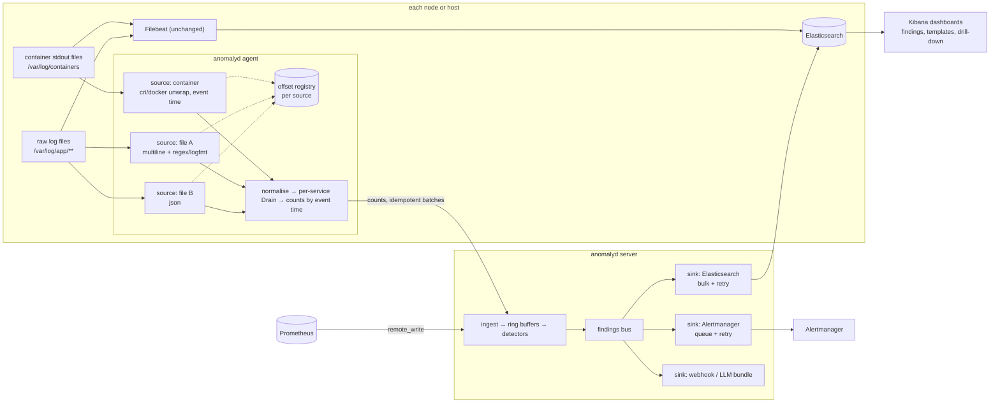

# Future improvements: anomalyd and the overall system

**In short:**

- This is a prioritised plan for what to build **after** the current anomalyd PoC. Items are grouped
  into **Now** (before the iteration-2 pilot on real logs), **Next** (during and right after the
  pilot) and **Later** (only with evidence).
- It targets our stack as it is: **Elasticsearch + Kibana** for logs, a file watcher that reads
  **container stdout** files, plus some **raw log files** that must be parsed.
- One rule shapes most of the plan: **sources and sinks are independent.** One source or sink that
  fails, stalls or is swapped must not affect the others. Today anomalyd is already a separate
  reader next to Filebeat, but *inside* anomalyd the agent has one shared read loop and the server
  sends alerts synchronously from the evaluation loop.
- The top Now items: a source abstraction for stdout vs raw files, persisted offsets with
  event-time bucketing, isolated sinks, a findings index in Elasticsearch with Kibana dashboards,
  and a replay harness for real logs.
- It does not repeat [roadmap.md](../roadmap.md). It says what each item changes there
  ([Changes to the roadmap](#changes-to-the-roadmap)).

Terms and abbreviations: [glossary](../glossary.md). Code references are to functions, not line
numbers, as of commit `a701af7`; the code is being edited in parallel.

Sections:
[Scope and assumptions](#scope-and-assumptions) ·
[Design principles](#design-principles) ·
[Gaps found in the current code](#gaps-found-in-the-current-code) ·
[Target shape](#target-shape) ·
[Plan at a glance](#plan-at-a-glance) ·
[Now](#now-before-the-pilot-on-real-logs) ·
[Next](#next-during-and-after-the-pilot) ·
[Later](#later-only-with-evidence) ·
[Not planned](#not-planned) ·
[Changes to the roadmap](#changes-to-the-roadmap) ·
[Open questions](#open-questions)

## Scope and assumptions

- **Logs** live in self-managed Elasticsearch + Kibana on the free Basic license. On Basic we have
  data streams, index lifecycle management (ILM), transforms, ES|QL, Lens dashboards, API keys and
  TLS. We do **not** have ML jobs, `CATEGORIZE`/`CHANGE_POINT`, or Kibana webhook/Slack connectors
  ([research/01](../research/01-logs-elastic-basic.md)).
- **Log collection:** a file watcher (Filebeat today) reads the container runtime's stdout files
  under `/var/log/containers`. Some sources are **raw log files** on hosts or in mounted volumes
  (for example legacy apps, nginx, Java apps writing to `/var/log/app/*.log`). These have their own
  formats, multi-line stack traces and logrotate schemes.
- **Metrics and alerts** stay on Prometheus + Alertmanager. Alertmanager stays the single alert
  bus; Kibana becomes a place to **look at** findings, not a second alert router.
- **Independence requirement:** each data-gathering path (Filebeat → ES, anomalyd agent → server,
  Prometheus remote_write → server) and each output (Alertmanager, Elasticsearch, `/metrics`,
  webhooks) fails alone. Swapping one (for example Filebeat for another shipper, or Alertmanager
  for Keep) needs no change in the others.

Effort: **S** ≤ 1 engineer-week, **M** 1–3 weeks, **L** > 3 weeks. Risk is the risk of the change
itself (breakage, wasted work), not of the problem it solves.

## Design principles

1. **Reduce before you detect** stays ([reference architecture](../reference-architecture.md#three-rules-the-design-follows)).
   The agent never becomes a log shipper. Raw lines stay on the node; Filebeat owns shipping.
2. **Bulkheads everywhere.** Every source and every sink has its own goroutine, its own bounded
   queue, its own retry/backoff, its own metrics and its own "degraded" state. A full queue drops
   and counts; it never blocks a neighbour.
3. **Event time, not read time.** Counts go into the bucket of the log's own timestamp, so a
   restart, a backlog or a slow sink cannot create fake spikes.
4. **Stable identifiers across systems.** A finding in Alertmanager, a document in Elasticsearch and
   a template in Kibana share IDs, so an operator can pivot between them.
5. **Only SLO burn rate pages** stays. Nothing here adds a pager.
6. **Keep the binary small.** Stay on the standard library where practical; each new dependency
   (a YAML parser, an ES client) must be justified in the item.

## Gaps found in the current code

These are the concrete reasons behind the Now items.

| Gap | Where | Effect on our stack |
|---|---|---|
| One `Config` for all paths: one `--container`, one `--format`, one set of field names | `agent.Config`, `agent.line` | Container stdout and raw files cannot run in one agent with different parsers. A second agent per format is the only workaround. |
| One sequential read loop over all files | `agent.pollAll`, `agent.read` (up to 8 MiB per file per pass) | A slow NFS mount or a very hot file delays every other file. No per-source health. |
| No multi-line handling | `agent.read` splits on `\n` only | Java/Python stack traces in raw files become dozens of `at <*>` templates and inflate counts. |
| Buckets use wall-clock read time | `agent.read`: `bucket := now / Step` | After a restart, `--from-start` or a backlog, old lines land in the current bucket: a fake spike. |
| The CRI/Docker timestamp is parsed away | `logparse.Envelope` has no time field | The event time we need is already on every stdout line, but is discarded. |
| No persisted file offsets | agent keeps offsets in memory only | Lines written while the agent is down are lost; `--from-start` would double-count. |
| At-least-once pushes with no dedupe | `agent.push` / `server.handlePush` | A retry after a timeout double-counts one push. |
| Alerts are sent synchronously at the end of `Evaluate`, 10 s timeout per URL | `server.Evaluate` → `sendAlerts` | A slow Alertmanager delays scoring. There is only one sink type. |
| Findings exist only in memory, `/api/v1/findings` and Alertmanager | `server.Finding` | Nothing lands in Elasticsearch, so Kibana users cannot see or correlate findings with raw logs. |
| `template_id` is a per-service Drain cluster number on the server | `server.globalTemplate` | Not stable after state loss, not joinable to anything in Elasticsearch. |
| No TLS or auth on any endpoint | `server.Handler` | Anyone on the network can push counts or remote-write series. |
| Readiness is a constant `OK` | `GET /-/healthy` | Kubernetes cannot tell "restoring state / backfilling" from "ready". |
| Tested only on synthetic data | [anomalyd README](../../anomalyd/README.md#verification-2026-09-15) | Template quality and masking leakage on our logs are unknown. |

## Target shape

Every box inside the agent and server with its own queue can fail without stopping its neighbours.
Filebeat and the agent never talk to each other.

## Plan at a glance

| ID | Item | Group | Effort | Risk | Depends on |
|---|---|---|---|---|---|
| N1 | Source abstraction in the agent (stdout vs raw files) | Now | M | Medium | none |
| N2 | Raw-file parsing: multi-line, header parsers, timestamp masks | Now | M | Medium | N1 |
| N3 | Event-time bucketing + persisted offsets | Now | M | Medium | N1 |
| N4 | Idempotent agent pushes | Now | S | Low | none |
| N5 | Isolated sinks in the server (findings bus) | Now | M | Low | none |
| N6 | Elasticsearch findings sink + index templates | Now | M | Low | N5 |
| N7 | Kibana dashboards, data views and drill-down links | Now | S | Low | N6, N9 |
| N8 | Replay and shadow-evaluation harness for real logs | Now | M | Low | N2 (for raw files) |
| N9 | Stable template identity + templates index | Now | S | Medium | N6 |
| N10 | Security baseline: TLS, auth, redaction, supply chain | Now | M | Low | N6 |
| N11 | Readiness, config validation, packaging | Now | S | Low | none |
| X1 | Kubernetes metadata for service identity | Next | M | Medium | N1 |
| X2 | Count detectors that fit logs: Poisson tail, rare-template burst | Next | M | Medium | N8 |
| X3 | Template-mix and error-ratio detectors per service | Next | M | Medium | N8 |
| X4 | Level-shift / change-point detector and deploy awareness | Next | M | Medium | N8 |
| X5 | Multi-season baselines, holiday and maintenance calendars | Next | M | Medium | N8 |
| X6 | Findings grouping into incident candidates | Next | M | Medium | N5 |
| X7 | Feedback loop: labels, suppressions, per-rule precision | Next | M | Low | N6, N7 |
| X8 | Score export to Elasticsearch for Kibana band charts | Next | S | Low | N6 |
| X9 | Self-observability and health alerts | Next | S | Low | N5 |
| X10 | Test and benchmark suite (fuzz, Loghub, soak, chaos) | Next | M | Low | N1–N5 |
| X11 | Per-service overrides and hot reload | Next | S | Low | N1 |
| X12 | Elasticsearch rollup as an input source (unify paths A and C) | Next | M | Medium | N5 |
| X13 | LLM bundle endpoint | Next | S | Low | N6, N9, X6 |
| X14 | Versioned state format and safe upgrades | Next | S | Low | none |
| L1 | High availability for the server | Later | M | Medium | N4, N5, X14 |
| L2 | Horizontal sharding and compact rings | Later | L | High | L1 |
| L3 | Trace-structure novelty | Later | M | Medium | X6 |
| L4 | Per-service health score (multivariate) | Later | L | High | X6, X7 |
| L5 | Pluggable detector interface + back-test for heavy models | Later | L | Medium | N8, X7 |
| L6 | Extra source kinds: OTLP logs, journald, syslog | Later | M | Low | N1 |
| L7 | Multi-tenancy and per-team caps | Later | M | Medium | N10, X11 |

## Now: before the pilot on real logs

These items turn the PoC into something we can run next to Filebeat on real nodes without
risking our logging path, and make its output visible in Kibana.

### N1. Source abstraction in the agent

- **Motivation.** We have two kinds of input: container stdout files (CRI or Docker envelope, one
  app per file) and raw files (arbitrary formats, several apps per directory). Today one agent
  applies one `--container`/`--format` to every path, and all files share one read loop. A bad
  source (permission denied, an NFS stall, a 1 GB line) affects all of them.
- **Design.**
  - A config file (`--config agent.json`; the CLI flags stay as a shortcut for one source) with a
    list of `sources`. Each source has: `name`, `kind` (`container` | `file`), `paths` (globs),
    `exclude`, `envelope` (`cri` | `docker` | `auto`, container only), `parser` (N2), `multiline`
    (N2), `service` (static, from path regex, or from a field), `level` mapping, `start_at`
    (`end` | `beginning` | `registry`), and limits (`max_line_bytes`, `max_files`,
    `read_budget_per_poll`).
  - Each source runs in its own goroutine with its own file set, poller and backoff. It emits
    normalised events `{time, service, level, message, source}` into a bounded channel to the
    miner stage. The miner stays one per service, shared across sources, so a service that logs to
    both stdout and a file still gets one template set.
  - Per-source state: `ok` / `degraded` (errors in the last N polls) / `stopped`. A panic in a
    parser is recovered, counted and the line skipped; the source keeps running.
  - Per-source metrics on the agent `/metrics`: `anomalyd_agent_source_lines_total{source}`,
    `_bytes_total`, `_errors_total{reason}`, `_files`, `_lag_seconds` (event time vs now),
    `_dropped_total{reason}`.
  - Format: JSON config keeps the single-dependency rule. If operators insist on YAML, adding
    `gopkg.in/yaml.v3` is acceptable; decide once.
- **Touched.** `internal/agent` (split into `source`, `tail`, `pipeline`), `cmd/anomalyd/main.go`,
  `deploy/agent-daemonset.yaml` (ConfigMap), README.
- **Effort** M. **Risk** Medium: refactor of the hot path; keep the benchmark in CI (X10) so
  throughput does not regress from ~1.5 M lines/s.
- **Depends on** nothing.

### N2. Raw-file parsing: multi-line, header parsers, timestamp masks

- **Motivation.** Raw files are where stdout assumptions break: stack traces span many lines, lines
  start with a timestamp and level in a custom layout, and some files are logfmt or nginx access
  format. Without this, a Java exception becomes 30 templates and the counts are meaningless.
- **Design.**
  - `multiline`: `start` regex (a line that begins a new record, for example `^\d{4}-\d{2}-\d{2}`
    or `^\[`) or `continuation` regex (`^\s+at |^\s+\.\.\.|^Caused by:`), plus `max_lines` (500)
    and `flush_after` (2 s idle). Only the **first line** of a record is mined; the record counts
    as one line. The exception class of `Caused by:` can optionally be appended as a token so
    different root causes stay separate templates.
  - `parser`: `json` (existing extractor), `logfmt`, `regex` with named groups (`time`, `level`,
    `service`, `message`), and presets for common layouts (nginx combined, Apache, syslog RFC 3164/
    5424, Log4j/Logback default patterns, Python `logging` default). The Go `regexp` package is
    linear-time, so a bad regex cannot hang a source, but it is slower than the hand-written
    scanners: presets should be hand-written where volume is high.
  - `time` parsing with a layout list; falls back to read time and counts
    `_errors_total{reason="no_timestamp"}`.
  - Masks: add `<TS>` (ISO 8601, syslog and epoch timestamps) before `<NUM>`, plus optional
    per-source extra masks (`masks: [{regex, token}]`) for IDs specific to one app.
  - Container stdout gets multi-line too: many apps print stack traces to stdout. The runtime's
    `P`/`F` joining (already implemented) happens first, then the multi-line rule.
- **Touched.** `internal/logparse` (new parsers), `internal/drain/mask.go`, `internal/agent`.
- **Effort** M. **Risk** Medium: parser presets need real samples (N8) to be right.
- **Depends on** N1.

### N3. Event-time bucketing and persisted offsets

- **Motivation.** Two problems with one fix. (1) Buckets use read time, so any backlog creates a
  fake spike and a gap. (2) Offsets are not saved, so an agent restart loses lines (or
  double-counts with `--from-start`). The CRI envelope already carries a nanosecond timestamp that
  `logparse.cri` throws away.
- **Design.**
  - Keep the envelope time in `logparse.Envelope` (`Time time.Time`); for raw files take it from the
    parser (N2). Bucket each line by event time. Clamp: lines older than the server's ring
    (`now − season`) or more than 5 min in the future are counted under `_dropped_total{reason=
    "too_old"|"future"}`.
  - A registry file per agent (`/var/lib/anomalyd-agent/registry.json`, hostPath, like Filebeat's
    `data` dir), keyed by device + inode + a fingerprint of the first 1 KiB (so inode reuse is
    detected). Values: offset, the partial-line flag, last event time. Written atomically (temp
    file + rename) **after** a successful push that covered those offsets, so a crash replays at
    most one flush interval.
  - On start: resume from the registry; files not in it follow `start_at`.
  - Rotation: keep the old handle open until it has been idle for `close_inactive` (default 1 min)
    instead of reading to EOF once. This closes the rotation race listed in the README's known
    limitations. Rotated `.gz` files stay unread (the plain file was already read before
    compression).
  - Server side: the log clock moves from wall clock to "newest event time seen per agent, minus
    grace", so a lagging agent does not close buckets it has not finished. Buckets older than the
    open one still accept late counts until the evaluator scored them; later ones are dropped and
    counted.
- **Touched.** `internal/logparse/container.go`, `internal/agent`, `internal/server` (log clock in
  `Evaluate`), DaemonSet (hostPath volume for the registry).
- **Effort** M. **Risk** Medium: the server's log clock change touches detection timing; cover it
  with replay tests (N8).
- **Depends on** N1.

### N4. Idempotent agent pushes

- **Motivation.** A push that times out after the server applied it is retried and double-counted.
  With N3 replay after a crash, this gets more likely.
- **Design.** The agent adds `agent_id` (stable per node, from the registry) and a monotonic
  `seq` to `wire.Push`, and keeps unacknowledged batches (not re-merged counts) in a bounded
  queue. The server keeps the last N `seq` per agent (N = 64, plus the gob snapshot) and answers
  `204` for a duplicate without applying it. Old agents without `seq` keep today's behaviour.
- **Touched.** `internal/wire`, `internal/agent.push`, `internal/server.handlePush`, `state.go`.
- **Effort** S. **Risk** Low.
- **Depends on** nothing (pairs with N3).

### N5. Isolated sinks in the server (findings bus)

- **Motivation.** `Evaluate` ends with `sendAlerts`, which posts to every Alertmanager URL in turn
  with a 10 s timeout. A slow Alertmanager delays scoring, and there is no way to add a second
  output without adding it to the same loop. This is the core of the "sinks are independent"
  requirement.
- **Design.**
  - `Evaluate` publishes finding events (`fire`, `update`, `resolve`, plus a periodic
    `heartbeat` snapshot of all active findings) to an in-process bus and returns.
  - `type Sink interface { Name() string; Send(ctx, []FindingEvent) error }`. Each configured sink
    gets a goroutine, a bounded queue (drop-oldest, counted), exponential backoff with jitter, a
    circuit breaker, and a `--sink.<name>.*` flag group or config block.
  - Sinks in this item: `alertmanager` (today's logic, one sink per URL so two Alertmanagers are
    independent too), `log` (JSON lines to stdout, so Filebeat ships findings to Elasticsearch
    even without N6), `webhook` (generic JSON POST, for Keep or the LLM triage service).
  - Alertmanager keeps its "resend while firing" semantics: the sink re-sends the active set on its
    own timer, so an outage heals without the evaluator's help.
  - Metrics per sink: `anomalyd_sink_queue_length`, `_sent_total`, `_errors_total`,
    `_dropped_total`, `_last_success_timestamp_seconds`, `_circuit_open`.
- **Touched.** `internal/server/eval.go` (split out `sink_*.go`), `server.Config`, `main.go`.
- **Effort** M. **Risk** Low: behaviour for Alertmanager stays the same; tests exist.
- **Depends on** nothing. Blocks N6, X6, X9, X13.

### N6. Elasticsearch findings sink and index templates

- **Motivation.** Our log users live in Kibana. On Basic, Kibana cannot receive webhooks, but it
  can read any index. Writing findings to Elasticsearch puts them next to the raw logs, in the tool
  people already use, without a new UI.
- **Design.**
  - Sink `elasticsearch`: `_bulk` API with the standard library HTTP client (no ES client
    dependency), API-key auth, custom CA, gzip, batch by size/time, retry per item on 429/5xx,
    dead-letter to the `log` sink after N attempts.
  - Two targets:
    - `anomalyd-findings` **data stream**: one append-only document per finding event
      (`fire`/`update`/`resolve`). Fields follow ECS where one exists: `@timestamp`, `event.kind:
      alert`, `event.action`, `event.id` (finding id), `service.name`, `log.level`, `rule.name`
      (alertname), `labels.*`, plus `anomalyd.score`, `.observed`, `.expected`, `.lower`,
      `.upper`, `.tier`, `.kind`, `.direction`, `.template.id`, `.template.hash`, `.template.text`,
      `.bucket`.
    - `anomalyd-findings-latest`: a **latest transform** (free on Basic) keyed by `event.id`, so
      Kibana can show "currently firing" without a scripted query. Alternative if transforms are
      off: the sink upserts a small `anomalyd-findings-state` index by `_id`.
  - Ship the index template, component templates and ILM policy (hot 7 d → delete 90 d) as JSON
    in `anomalyd/deploy/elasticsearch/`, applied by `anomalyd es-setup` or by `curl` from the README.
  - Volume is tiny: tens to hundreds of documents per day in normal operation.
- **Touched.** new `internal/server/sink_es.go`, `deploy/elasticsearch/*.json`, README.
- **Effort** M. **Risk** Low: an ES outage only fills this sink's queue (N5).
- **Depends on** N5.

### N7. Kibana dashboards, data views and drill-down

- **Motivation.** Give operators one screen: what is anomalous, where, since when, and one click to
  the raw lines. Kibana on Basic has Lens, dashboards, Discover and saved objects; that is enough.
- **Design.**
  - Saved objects in `anomalyd/deploy/kibana/*.ndjson` (data views, saved searches, Lens panels,
    one dashboard), imported with the saved objects API, pinned to a Kibana minor version and
    re-exported on upgrade.
  - Dashboard "Anomaly findings": firing now (from `-latest`), findings over time by `service` and
    `anomalyd.kind`, a service × hour heatmap, top new templates, top template-rate findings with
    observed vs expected, and an agent/sink health strip (X9, via the `log` sink documents or
    Prometheus data in Grafana).
  - **Drill-down**: the finding document carries `anomalyd.discover_url`, built by the sink from a
    configurable URL template: `service.name`, a time range of `bucket − step … bucket + 2 step`,
    and a query built from the template's constant tokens (`message: "Connection refused" and
    message: "upstream"`). A Kibana field formatter (URL) makes it clickable. The same URL goes into
    the Alertmanager annotation, so chat messages link straight to Kibana.
  - Optional: a Kibana "Elasticsearch query" rule on `anomalyd-findings` with the Index connector,
    only if a team wants Kibana's alert UI. Alertmanager stays the router.
- **Touched.** `deploy/kibana/`, `sink_es.go` (URL field), README.
- **Effort** S. **Risk** Low: the drill-down query is approximate for templates with few constant
  tokens; X12 or Path A's fingerprint key gives an exact match where it exists.
- **Depends on** N6, N9.

### N8. Replay and shadow-evaluation harness for real logs

- **Motivation.** Nothing has run on our real logs. The roadmap's iteration-2 exit criteria
  (template quality, agent CPU < 2 % of a core, event-level precision/recall) need a repeatable way
  to measure them before and after every detector change.
- **Design.**
  - `anomalyd replay --config agent.json --files <captured dir> --speed max` runs the agent
    pipeline and an in-process server on captured files, using event time (N3), and writes a
    report: lines/s, templates per service, the share of lines in the top-10 templates,
    templates that still contain likely-variable tokens (long digits-free words, base64-looking
    strings), unparsed-timestamp rate, multi-line merge rate, and all findings.
  - `--incidents incidents.csv` (the incident log from roadmap iteration 1) turns findings into
    event-level precision/recall per detector and per service. Never point-adjusted F1.
  - Capture tool: a script that copies one hour of files from a canary node through the redaction
    masks (N10), so samples can leave the node.
  - Shadow mode on the pilot: server with all sinks except `log` and `elasticsearch` disabled, so
    findings are recorded but notify nobody.
- **Touched.** `cmd/anomalyd` (new `replay`), `internal/agent` and `internal/server` in-process
  wiring, `test/replay/`.
- **Effort** M. **Risk** Low.
- **Depends on** N2 for raw files; useful for container stdout right away.

### N9. Stable template identity and a templates index

- **Motivation.** `template_id` is the server's Drain cluster number for a service. It changes if
  state is lost and means nothing outside anomalyd. Kibana, chat and the LLM bundle need a key that
  survives restarts and can be joined.
- **Design.**
  - Add `template_hash`: the first 8 bytes of SHA-256 over `service + "\x00" + template text at
    creation`, hex. It is kept when Drain later generalises the text (the id is the identity; the
    hash is its stable name). The label goes on every finding and export.
  - Sink `elasticsearch` also maintains `anomalyd-templates` (upsert by hash): service, hash, id,
    current text, first seen, last seen, dominant level, total lines, one redacted sample (N10,
    opt-in).
  - With ES|QL `LOOKUP JOIN` (available in recent 8.x/9.x; license level UNVERIFIED for our
    version, check in Step 0), Kibana can enrich findings with template text. Without it, the
    finding document already carries the text.
- **Touched.** `internal/server/ingest.go` (`globalTemplate`, `tmplMeta`), `state.go`, sinks.
- **Effort** S. **Risk** Medium: changing identity semantics needs a state migration (X14).
- **Depends on** N6 for the index; the hash itself does not.

### N10. Security baseline

- **Motivation.** The server takes writes from any host that can reach it, and N6 adds
  Elasticsearch credentials and puts template text into an index many people can read. Template
  text can carry user names or tokens ([known limitations](../../anomalyd/README.md#known-limitations)).
- **Design.**
  - TLS on the server listener (`--tls-cert`, `--tls-key`, reload on change), optional client
    certificates (mTLS) for agents, and bearer tokens per role: `agent-push`, `remote-write`,
    `read` (findings, templates). Tokens from files, not flags.
  - Agent: `--server-ca`, `--token-file`.
  - Elasticsearch: API key with `create_doc` on `anomalyd-*` only, plus `manage` on the templates
    index for upserts; documented role JSON.
  - Redaction masks applied **before** a template leaves the node: JWTs, bearer tokens,
    `password=`/`secret=`/`token=` values, card-number-like digit runs, and configurable regexes.
    Counted per mask, so leakage is visible in N8 reports.
  - Supply chain: `govulncheck` and `go vet` in CI, SBOM (`syft` or `go version -m`), signed images
    (cosign), pinned base image digest.
  - DaemonSet: keep `readOnlyRootFilesystem` and dropped capabilities; the registry volume (N3) is
    the only writable path. Add a lower `priorityClassName` than Filebeat, so under node pressure
    the agent is evicted first, never Filebeat.
- **Touched.** `internal/server/server.go`, `internal/agent`, `internal/drain/mask.go`, CI,
  `deploy/`.
- **Effort** M. **Risk** Low.
- **Depends on** N6 for the Elasticsearch role.

### N11. Readiness, config validation and packaging

- **Motivation.** Small things that decide whether an operator trusts the pilot.
- **Design.**
  - `/-/ready` returns 503 until state is restored and the backfill is done (or skipped);
    `/-/healthy` stays a liveness check.
  - `anomalyd check-config` for agent and server configs: globs match at least one file, regexes
    compile and have the `service` group, sinks are reachable (optional `--probe`).
  - Server manifests: a StatefulSet with a PVC for `--state-dir`, a Service, a PodDisruptionBudget,
    a ServiceMonitor or scrape annotations. Kustomize base, no Helm until there is a second
    consumer.
- **Touched.** `internal/server/server.go`, `cmd/anomalyd`, `deploy/`.
- **Effort** S. **Risk** Low.
- **Depends on** nothing.

## Next: during and after the pilot

These items improve detection quality and operator experience once N8 gives us real numbers to
tune against. Each detection item must beat the current detector on the incident log before it is
enabled by default.

### X1. Kubernetes metadata for service identity

- **Motivation.** The service comes from the container name in the file path. Generic names
  (`app`, `main`, `server`) merge unrelated services.
- **Design.** Optional `kubernetes` enrichment per container source: the agent watches pods on its
  own node only (field selector `spec.nodeName`) through the API server, or reads the kubelet
  `/pods` endpoint, and maps the container ID in the file name to namespace, pod labels and owner.
  Service = first non-empty of `app.kubernetes.io/name`, `app`, owner name, container name
  (configurable). Cache with TTL; if the API is down, fall back to the path regex (the source stays
  up).
- **Touched.** `internal/agent` (new `k8smeta`), DaemonSet RBAC (`get,list,watch pods`).
- **Effort** M. **Risk** Medium: RBAC and API load on large clusters; the node-scoped watch keeps
  it small. Adds either `client-go` (large) or a thin hand-written watch client; prefer the latter.
- **Depends on** N1.

### X2. Count detectors that fit log data

- **Motivation.** Log template counts are small integers, often zero. The z-score with a
  `√expected` floor is a rough fit: it over-alerts on rare templates and under-alerts on templates
  that go from 0 to 3 errors per bucket.
- **Design.**
  - Score count series with a Poisson (or negative binomial, when over-dispersed) upper-tail
    probability against the seasonal expected rate; fire when `p < 1e-6` for `--for` buckets.
    Report the equivalent z for dashboards.
  - **Rare-template burst**: a template seen on fewer than N days out of the last 7 that now
    exceeds M lines in a bucket. Today it is neither "new" nor "rate out of band".
  - Keep the current scorer as a fallback and A/B them in N8.
- **Touched.** `internal/detect` (new `poisson.go`), `internal/server/eval.go` (per-kind scorer).
- **Effort** M. **Risk** Medium: new thresholds need tuning.
- **Depends on** N8.

### X3. Template-mix and error-ratio detectors per service

- **Motivation.** Volume detectors miss "same volume, different content": a service that swaps
  normal lines for retries keeps its total. Error ratios are also robust to traffic changes.
- **Design.**
  - Per service and bucket, the share of `error`+`warn` lines: scored with the seasonal scorer on
    the ratio, with a minimum-lines guard. This matches the ElastAlert2 `error-ratio-per-service`
    rule so the paths can be compared.
  - Template distribution divergence: Jensen–Shannon distance between the current bucket's template
    distribution and the seasonal-expected distribution, over the top-K templates plus "other". A
    finding lists the templates that contribute most.
- **Touched.** `internal/server` (derived series), `internal/detect`.
- **Effort** M. **Risk** Medium.
- **Depends on** N8.

### X4. Level-shift detector and deploy awareness

- **Motivation.** After a deploy or a traffic migration, a series moves to a new level and stays
  there. The seasonal median keeps flagging it for up to one season, then slowly adapts. Operators
  also need to know if a finding started right after a deploy.
- **Design.**
  - A CUSUM (or two-sided Page–Hinkley) level-shift detector on the residuals: emits one
    `AnomalydLevelShift` finding and optionally re-baselines the series (use the post-shift window
    as a cold-start baseline until a season passes).
  - Change events: `POST /api/v1/events` (deploy, config change, feature flag) and an optional
    source that watches Kubernetes Deployment rollouts on the server. Findings within a window after
    an event for the same service carry `change_event` and a link. Also written to Elasticsearch, so
    Kibana can show deploys as annotations on the dashboard.
- **Touched.** `internal/detect`, `internal/server` (events API, finding enrichment), sinks.
- **Effort** M. **Risk** Medium: auto re-baselining can hide real regressions; default to "annotate
  only".
- **Depends on** N8.

### X5. Multi-season baselines and calendars

- **Motivation.** One season per source is a stated limitation. Daily and weekly patterns overlap;
  public holidays and maintenance windows cause known anomalies.
- **Design.**
  - `expected` as the median over both the daily and weekly lags that exist in the ring (for
    example weeks 1–2 at the same slot and days 1–3 at the same slot), weighted by which one had
    lower residual MAD last season. A cheap step before a full [MSTL](https://arxiv.org/abs/2107.13462).
  - Calendar file (ICS or JSON): holiday days are scored against the median of past holidays if
    present, otherwise muted to `info`; maintenance windows mute findings per service.
- **Touched.** `internal/detect/seasonal.go`, `internal/server`.
- **Effort** M. **Risk** Medium: parity with the Python scorer ends here; keep the old path under a
  flag and update the parity test to cover only it.
- **Depends on** N8.

### X6. Findings grouping into incident candidates

- **Motivation.** One incident produces a metric finding, a volume finding, several template-rate
  findings and a new template. Alertmanager groups by `service`, but only anomalyd knows these are
  the same event and which came first.
- **Design.** A correlator on the findings bus: findings for the same service (and, with X1, the
  same namespace) within a sliding window form a `candidate` with a combined score (max z,
  number of kinds, presence of error-level novelty), a first-seen order and a short summary. The
  candidate is its own finding kind (`AnomalydIncidentCandidate`, tier 2), and its members carry
  `candidate_id`. Alertmanager can then route candidates to chat and keep member findings for
  Kibana only.
- **Touched.** `internal/server` (new `correlate.go`), sinks, Alertmanager example config.
- **Effort** M. **Risk** Medium: window tuning.
- **Depends on** N5.

### X7. Feedback loop: labels, suppressions and per-rule precision

- **Motivation.** Roadmap iteration 1 asks for measured precision per rule and deleting rules
  below ~30 %. anomalyd has no way to record "useful" or "noise", or to silence a known-noisy
  template permanently.
- **Design.**
  - `POST /api/v1/findings/{id}/label` (`useful` | `noise` | `duplicate`, free-text note), stored in
    state and written to the ES findings stream as an event; a Kibana dashboard panel shows
    precision per `alertname` and `service` per week.
  - Suppression rules: `POST /api/v1/suppressions` with a matcher (service, template hash, kind)
    and an expiry, persisted, exported to Elasticsearch. Suppressed findings are still recorded with
    `suppressed=true` but not sent to Alertmanager.
  - Chat integration is out of scope; labels come from a small form linked in the alert annotation
    or from `curl`.
- **Touched.** `internal/server`, `state.go`, sinks, Kibana saved objects.
- **Effort** M. **Risk** Low.
- **Depends on** N6, N7.

### X8. Score export to Elasticsearch for band charts

- **Motivation.** Kibana users want to see observed vs expected for the series behind a finding.
  Today only Grafana can (from `/metrics`).
- **Design.** Optional sink target `anomalyd-scores` (a time series data stream, TSDS, which
  supports downsampling on Basic): per scored bucket, write service-level log volume series always,
  and other series only while `|z| ≥ 2` or while a finding is open, plus the bucket before and
  after. Rough volume: 200 services × 4 levels × 288 buckets/day ≈ 230 k docs/day; small next to
  the logs.
- **Touched.** `sink_es.go`, `deploy/elasticsearch/`, Kibana panels.
- **Effort** S. **Risk** Low.
- **Depends on** N6.

### X9. Self-observability and health alerts

- **Motivation.** A silent anomaly detector looks the same as a healthy system with no anomalies.
- **Design.**
  - Prometheus alert rules in `deploy/prometheus/anomalyd-health.yml`: agent not pushing
    (per node), source degraded, sink circuit open or queue > 80 %, dropped series/templates > 0,
    evaluation duration > 50 % of `--eval-interval`, state snapshot failures, backfill failed.
    Routed as `tier=ops`, never paging.
  - A dead-man's switch: the server fires `AnomalydWatchdog` continuously through every sink; the
    Alertmanager side uses the existing heartbeat pattern, and the Kibana dashboard shows the last
    watchdog document time.
  - `pprof` behind `--debug-listen` on localhost only.
  - Per-service ingestion lag and lines/s on `/metrics`, for "is this service really quiet, or are
    we not reading it?".
- **Touched.** `internal/server/metrics.go`, `internal/agent`, `deploy/`.
- **Effort** S. **Risk** Low.
- **Depends on** N5 (sink metrics), N1 (source metrics).

### X10. Test and benchmark suite

- **Motivation.** The PoC has good unit tests and one Docker end-to-end test. The new sources,
  parsers and sinks need broader coverage, and the independence requirement needs a test that
  proves it.
- **Design.**
  - Go fuzz tests for `logparse` (CRI, Docker, JSON extractor, new parsers), multi-line joining and
    `drain.Tokenizer`.
  - Golden tests on public [Loghub](https://github.com/logpai/loghub) datasets (HDFS, BGL,
    OpenStack, and others with labels): template counts vs published Drain results, and detection
    precision/recall with the N8 harness.
  - Performance gates in CI: `go test -bench` + `benchstat` against the main branch; fail on > 10 %
    regression in `tokenize`, `extract`, `AddLine`, `Score`.
  - Soak test: 24 h in `kind` with kubelet rotation at 10 MiB under load, agent restarts every hour,
    checking that counts match the generator exactly (N3 + N4).
  - **Isolation (chaos) tests**: with Toxiproxy or a fake server, make Elasticsearch hang, return 429,
    and go away; make one source's directory unreadable. Assert that Alertmanager still receives
    findings on time and other sources keep their line rates.
- **Touched.** `anomalyd/test/`, CI config.
- **Effort** M. **Risk** Low.
- **Depends on** N1–N5 for the new parts; fuzz tests can start now.

### X11. Per-service overrides and hot reload

- **Motivation.** One threshold, season and minimum count for all services does not fit a batch job
  and a checkout API at once.
- **Design.** A server config file with defaults and `overrides` matched by service glob or label
  (threshold, `for`, seasons, min count, novelty on/off, mute). Agent and server reload their
  config on SIGHUP or file change; a bad config is rejected and the old one kept (and counted).
  Changes to source definitions restart only the affected source.
- **Touched.** `cmd/anomalyd`, `internal/server/eval.go`, `internal/agent`.
- **Effort** S. **Risk** Low.
- **Depends on** N1.

### X12. Elasticsearch rollup as an input source

- **Motivation.** Some logs are shipped by tools the agent cannot run next to (VMs, managed hosts,
  other teams' shippers). Path A already produces `anomaly-logs-tmpl-1m` for them. Scoring that
  rollup with anomalyd gives one detector stack for paths A and C and lets us compare them on the
  same scorer.
- **Design.** A server-side source `es_rollup`: every minute, query the rollup index for the last
  closed minutes (`composite` aggregation on `service`, `template_key`, `level`) and feed the counts
  as a pseudo-agent (with `seq` from N4, so re-reads are idempotent). Its own goroutine and backoff;
  an ES outage stops only this source and raises its health alert.
- **Touched.** `internal/server` (new `source_es.go`).
- **Effort** M. **Risk** Medium: query load on ES; limited to the small rollup index.
- **Depends on** N5 (shared HTTP/ES plumbing with the sink), N4.

### X13. LLM bundle endpoint

- **Motivation.** Roadmap iteration 2 #3 needs a bundle per Alertmanager group. anomalyd already
  holds most of it.
- **Design.** `GET /api/v1/bundles?candidate=<id>` (or `?service=&from=&to=`): the candidate (X6),
  member findings, observed/expected around the finding, top template deltas with redacted text,
  change events (X4), and Kibana links. Hard size cap (≤ 20 k tokens, per the design in
  [research/04](../research/04-aiops-rca-llm-cost.md)). The triage service reads this instead of
  querying five systems.
- **Touched.** `internal/server`.
- **Effort** S. **Risk** Low.
- **Depends on** N6, N9, X6.

### X14. Versioned state format and safe upgrades

- **Motivation.** The gob snapshot has no version. N3, N4, N9 and X7 all add state. A server upgrade
  that cannot read the old snapshot causes a new warm-up and a burst of "new template" findings.
- **Design.** A header with format version and a migration function per version; the snapshot also
  records the config values that change ring shapes (step, seasons) and refuses to load a mismatch
  with a clear error instead of misreading buckets. On an unreadable snapshot, the server starts
  with novelty muted for `--novelty-warmup`.
- **Touched.** `internal/server/state.go`, `internal/series`.
- **Effort** S. **Risk** Low.
- **Depends on** nothing; do it before N9 lands.

## Later: only with evidence

### L1. High availability for the server

- **Motivation.** One server is a single point of failure for all findings. Acceptable for a pilot,
  not for long.
- **Design.** Active–active pair. Agents push to both servers through two independent push queues
  (one failing server does not slow the other); Prometheus gets two `remote_write` entries.
  Both evaluate independently. Alertmanager dedupes identical alerts; the ES sink uses
  deterministic document IDs (`finding id + event + bucket`) with `op_type=create`, so the second
  write is a harmless conflict. Template ids differ between replicas, so all cross-system joins use
  `template_hash` (N9).
- **Touched.** `internal/agent` (multi-target push), `internal/server` sinks, `deploy/`.
- **Effort** M. **Risk** Medium: replicas can disagree near thresholds; findings carry `replica`
  for debugging only.
- **Depends on** N4, N5, N9, X14.

### L2. Horizontal sharding and compact rings

- **Motivation.** Measured: 291 MB for 5 k metric + 30 k log series. At ≥ 200 k log series (more
  services, finer levels) one server gets large.
- **Design.** First compact: log counts as `uint16`/varint delta rings (2–4× smaller), metric rings
  as float32 with a shared timestamp base (already). Then shard by `hash(service)` across N servers
  with a static shard map in the agent config; Prometheus uses `hashmod` relabelling for metric
  series. No gossip or consensus.
- **Effort** L. **Risk** High: operational complexity; only if memory measurements demand it.
- **Depends on** L1.

### L3. Trace-structure novelty

- **Motivation.** The traces path gives RED metrics, which the metric scorer covers. What it misses
  is structural change: a new service-graph edge, a new error span name, a new downstream
  dependency.
- **Design.** Feed `traces_service_graph_request_total` edges and span names with `status=error`
  from the OTel tier-2 collector (already planned) into the novelty logic, the same way as log
  templates.
- **Effort** M. **Risk** Medium: needs the OTel tier (roadmap iteration 1 #3) in production first.
- **Depends on** X6.

### L4. Per-service health score

- **Motivation.** The research shows that operators who page on anomalies do it on a confirmed
  health model, not on single series ([research/05 §5](../research/05-methods-benchmarks.md)).
- **Design.** Combine per-service signals (RED z-scores, log volume, error ratio, novelty,
  candidate score) into one score with weights learned from X7 labels (logistic regression is
  enough). Only after two quarters of labels with precision above an agreed bar may it be proposed
  as a paging input, and that decision goes through the SLO owners.
- **Effort** L. **Risk** High.
- **Depends on** X6, X7.

### L5. Pluggable detectors and a back-test for heavy models

- **Motivation.** Roadmap iteration 3 keeps MSTL, Matrix Profile and time-series foundation models
  as options. They should plug in without forking the evaluator.
- **Design.** `Detector` interface over a series view (`Score(view, bucket) Result`), registered by
  name and selected per override (X11). Heavy models run out of process (a sidecar over gRPC or
  HTTP) on the top-K series only, so a slow model cannot stall the core evaluator. The N8 harness
  runs back-tests on the incident log and decides.
- **Effort** L. **Risk** Medium.
- **Depends on** N8, X7.

### L6. Extra source kinds

- **Motivation.** Not every log ends up in a file: systemd services log to journald, network gear
  to syslog, and some apps already emit OTLP logs.
- **Design.** Source kinds `journald` (read the journal files directly, or `journalctl -o json -f`
  as a child process), `syslog` (UDP/TCP listener, RFC 5424/3164) and `otlp` (HTTP logs receiver).
  Each is just another N1 source with its own goroutine and metrics.
- **Effort** M. **Risk** Low.
- **Depends on** N1.

### L7. Multi-tenancy and per-team caps

- **Motivation.** If several teams share one server, one noisy team can exhaust `--max-log-series`
  or `--drain-max-templates` for everyone.
- **Design.** A `tenant` derived from namespace (X1) with per-tenant series and template caps, and
  per-tenant tokens (N10) for read APIs. ES documents carry `tenant` for Kibana spaces.
- **Effort** M. **Risk** Medium.
- **Depends on** N10, X11.

## Not planned

| Idea | Why not |
|---|---|
| The agent ships raw lines to Elasticsearch | That is Filebeat's job. Two shippers would break the independence rule and double the ES ingest. |
| A Kibana plugin for anomalyd | Plugins are tied to exact Kibana versions and need their own release process. Dashboards, saved objects and URL fields cover the need. |
| Replacing Filebeat with the agent, or feeding the agent from Filebeat | Filebeat has one output; making it feed us couples the paths. Two independent readers of the same files cost only page cache reads. |
| Kafka as a copy point now | Roadmap iteration 3 keeps it for when several consumers need the raw stream. With independent readers and sink queues we do not need it yet. |
| Elastic ML / Platinum features | Not free ([README finding 1](../../README.md#findings)). |

## Changes to the roadmap

What this plan changes in [roadmap.md](../roadmap.md). The roadmap itself is not edited here.

| Roadmap item | Change |
|---|---|
| Iteration 1 #5, ElastAlert2 rules | Unchanged for Path A. For Path C, findings reach Kibana through N6 instead of an ElastAlert2 relay. |
| Iteration 2 #1, tier-2 scorer | Add N5 (independent sinks) and X14 (versioned state) before anomalyd runs longer than a trial. Add X2–X5 as candidate detectors, each judged with N8 on the incident log. |
| Iteration 2 #2, logs path B or C pilot | Preconditions for the anomalyd variant: N1–N4, N8, N10, N11. Extend "done when" with: raw-file sources parsed with < 1 % unparsed timestamps; no double counts across agent restarts in the soak test (X10); Elasticsearch outage does not delay Alertmanager alerts (X10 chaos test). |
| Iteration 2 #3, LLM triage webhook | The bundle source becomes anomalyd's bundle endpoint (X13) plus the templates index (N9), through the `webhook` sink (N5). |
| Iteration 2 #5, Keep OSS | If adopted, it is one more N5 sink; nothing else changes. X6 may make it unnecessary. |
| Iteration 3, Kafka | Stays deferred; see [Not planned](#not-planned). |
| Iteration 3, foundation models | Run behind the L5 detector interface, judged with N8. |
| New | A security baseline (N10) and self-observability (X9) are not in the roadmap; they become exit criteria for the anomalyd pilot. |

A suggested sequence for the Now group, for two engineers over about six weeks:

1. Week 1–2: N5, N4, N11, X14 (server side, low risk) in parallel with N1 (agent refactor).
2. Week 2–4: N6, N9, N10 (Elasticsearch path and security) in parallel with N2, N3.
3. Week 4–6: N7 dashboards, N8 replay on captured canary logs, then the shadow-mode pilot.

## Open questions

- **Which file watcher runs today?** The plan assumes Filebeat. If it is another shipper (Fluent
  Bit, Vector, a custom one), nothing here changes except the drill-down field names in N7.
- **Where do the raw files live?** Host paths, PVCs mounted into pods, or VMs outside Kubernetes?
  PVCs need the agent to mount `/var/lib/kubelet/pods` read-only; VMs need a systemd unit or X12.
- **Elasticsearch version and features:** transforms and `LOOKUP JOIN` availability (N6, N9) must
  be confirmed in roadmap Step 0.
- **Who labels findings (X7)?** Without an owner, precision will never be measured.
- **Retention:** 90 days of findings in Elasticsearch is a guess; align it with the incident-review
  cycle.
