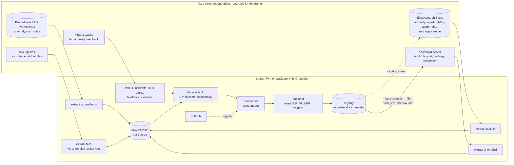
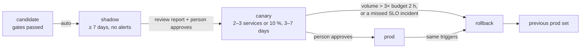

# Plan: a model trainer for anomalyd

**In short:**

- **What "training" means here.** The research says that simple statistics beat most neural
  networks on this kind of data ([research/05 §1, §3](../research/05-methods-benchmarks.md)).
  So the trainer mostly **tunes and calibrates the seasonal median + MAD detector that anomalyd
  already runs**. It picks the season, the number of seasons, the threshold, the floors, the
  direction and the `for` count per service and per series. The seasonal median re-learns its
  baseline every bucket on its own. What does not adapt on its own is the settings. Heavier
  models (isolation forest, PCA, LSTM/autoencoder, DeepLog) come later. They run only as a
  second stage on a short list of top series, and only if a backtest on our own incidents shows
  that they catch more.
- **Pipeline.** Separate extractors, one per sink (Prometheus, Elasticsearch, anomalyd, raw log
  files) → a Parquet dataset in 5-minute buckets → labels (incidents, SLO alerts, operator
  feedback, synthetic injections) → tuning under an **alert-volume budget** → backtest with
  **event-level** precision and recall (never point-adjusted F1) → a versioned **model set** →
  shadow → canary → prod, with a one-command rollback.
- **Artifact.** A model set is a plain JSON file of per-service and per-series overrides, plus a
  manifest with the data range, metrics and a checksum. JSON keeps anomalyd a static,
  standard-library Go binary. ONNX is used only for optional second-stage models, and those run
  in a separate Python sidecar, never inside anomalyd.
- **anomalyd side (design only).** A new `internal/model` package loads the JSON from a file,
  checks it, and swaps it in atomically. Each series re-resolves its settings on the next
  evaluation. A second "shadow" set can be scored next to prod without sending alerts.
- **Runs on CPU.** A weekly tuning run over 10 k series × 4 weeks fits in about one CPU-hour
  (estimate). It runs as Kubernetes CronJobs. Each data source has its own CronJob, so one
  broken sink never blocks the others.
- **Effort.** Phases 1–5 take about **27–41 person-days**. The optional second-stage models add
  8–12 days, and an optional deep-learning spike adds about 5.

Terms and abbreviations: [glossary](../glossary.md).

Status: DRAFT plan, 2026-09-24. Nothing here is built yet. All code in this file is a design
sketch. Figures marked "estimate" are not measured.

Sections:
[1. Goals and limits](#1-goals-and-limits) ·
[2. Architecture](#2-architecture) ·
[3. Training data: sources and extraction](#3-training-data-sources-and-extraction) ·
[4. Dataset building](#4-dataset-building) ·
[5. Labels](#5-labels) ·
[6. Model families, ranked by cost and benefit](#6-model-families-ranked-by-cost-and-benefit) ·
[7. Evaluation](#7-evaluation) ·
[8. Model artifact and registry](#8-model-artifact-and-registry) ·
[9. Loading models in anomalyd (Go design)](#9-loading-models-in-anomalyd-go-design) ·
[10. CPU-only budget](#10-cpu-only-budget) ·
[11. Scheduling](#11-scheduling) ·
[12. Drift and retraining](#12-drift-and-retraining) ·
[13. Shadow, canary, rollback](#13-shadow-canary-rollback) ·
[14. CLI and config](#14-cli-and-config) ·
[15. Directory layout](#15-directory-layout) ·
[16. Phased plan and effort](#16-phased-plan-and-effort) ·
[17. Open questions and risks](#17-open-questions-and-risks)

## 1. Goals and limits

**Goals:**

1. The user trains on **their own data** and deploys the result to anomalyd, with no vendor ML.
2. Fewer false findings on noisy series, and the same or better recall on real incidents.
3. Every deployed model set is versioned, can be reproduced from its manifest, and can be
   rolled back in under 2 minutes.
4. A change reaches production only after it passes a backtest, a shadow run and a canary.

**Limits we design around:**

- **Elasticsearch on the free Basic license.** ML anomaly jobs, log categorization,
  `CATEGORIZE`, `CHANGE_POINT`, `categorize_text`, `change_point`, data frame analytics,
  Watcher and the webhook/Slack connectors are all Platinum or Gold
  ([research/01 §2](../research/01-logs-elastic-basic.md#2-which-features-does-each-license-include)).
  So all training runs **outside** Elasticsearch. From Elasticsearch we only **read**, with
  features that Basic has: search, point in time (PIT), composite aggregations, ES|QL without
  those two commands, transforms, the Index connector, and the Case Management UI.
- **Independent data sinks.** The user's sinks are:
  - Filebeat → Elasticsearch
  - the file watcher on container stdout (`anomalyd agent`, or Filebeat)
  - raw log files that are parsed
  - Prometheus

  The trainer reads each one with its **own extractor, schedule, checkpoint and output
  folder**. A failed or slow sink makes the dataset lose coverage for that source. It never
  stops the other extractors, and the trainer never writes into another sink's data. It writes
  only its own stores and its own indices.
- **CPU only.** No GPU. Training must fit a few CPU-hours per week.
- **anomalyd stays small.** It is one static binary whose only dependency is
  `klauspost/compress`. The design adds no cgo and no ONNX runtime to it
  ([anomalyd README](../../anomalyd/README.md#what-it-is)).
- **No paging from the trainer's output.** The paging rule stays the same: only SLO burn-rate
  alerts page ([research/05 §5](../research/05-methods-benchmarks.md#5-industry-how-operators-keep-alerts-precise)).
  Trained settings change tier-1/2 findings only.

**What training cannot do.** With a few dozen labelled incidents, no method can prove a small
gain. The trainer therefore:

- tunes a few settings, not thousands of weights,
- prefers the global default unless a per-service override clearly helps (§6.1), and
- reports confidence intervals with every metric (§7.4).

## 2. Architecture



Rules for the whole design:

1. **The scorer used for training is the scorer used in production.** Tuning uses a fast Python
   port. Its parity with Go is tested to 1e-9, the same way as
   [testdata/parity.py](../../anomalyd/internal/detect/testdata/parity.py) does today. The final
   check of every candidate replays history through the **Go** scorer (`anomalyd replay`, §9.5).
2. **Everything is keyed by time bucket and series key**, with the same step as anomalyd
   (`--step`, default 5 m).
3. **Chronological splits only.** Random splits leak future data and inflate scores
   ([research/05 §3.3, Le & Zhang](../research/05-methods-benchmarks.md#33-does-deep-learning-beat-classical-methods-on-logs)).

## 3. Training data: sources and extraction

Each extractor writes Parquet under `raw/source=<name>/date=<YYYY-MM-DD>/`. It keeps its own
watermark (the last time it read up to) in `raw/source=<name>/_checkpoint.json`. The extractors
share no state.

| Source | What we read | How | Why | Load on the sink |
|---|---|---|---|---|
| **Prometheus** (AD Prometheus if present) | `anomaly:svc:*` and `slo:*` recording rules; the `ALERTS` series for SLO alerts | `query_range` in chunks | Metric history longer than anomalyd's ring (3 weeks at defaults) | Small: 3–5 k series |
| **Elasticsearch: template counts** | `anomaly-logs-tmpl-1m` (path A transform output) | Composite aggregation, or PIT + `search_after` | Log-count history for path A | Small index |
| **Elasticsearch: alerts** | `alerts-relay` (Kibana Index connector), ElastAlert2 writeback index | PIT + `search_after` | Weak labels | Tiny |
| **Elasticsearch: raw log sample** | 0.1–1 % of raw lines per service per day | PIT with `slice` + `random_sampler` or a `function_score` random filter | Mask review, and Drain settings per log family | Throttled, off-peak |
| **anomalyd** | Bucketed series (metric + log), template catalogue, findings, feedback | `GET /api/v1/export` (new, §9.5), `/api/v1/templates`, `/api/v1/findings` | The exact series anomalyd scores, including template counts from container stdout | Streaming read, low |
| **Raw log files** | Parsed application log files, rotated container stdout files | `anomalyd replay-logs` (new, §9.5), the same masks and Drain as the agent | Backfill log history (cold start), and replay past incidents | Offline, on a copy |
| **Incident records** | Service, start, end, severity | CSV/YAML in Git, or the tracker's API | Strong labels | – |
| **Kibana Cases** | Cases tagged `anomaly-feedback` | Kibana cases API `GET /api/cases/_find?tags=anomaly-feedback` | Operator feedback (§5.2) | Tiny |

### 3.1 Prometheus

- Use `query_range` with `step` = anomalyd's step. Split long ranges so that each request stays
  under Prometheus's 11,000 points per series. At 5 m that is ≤ 38 days per request. Use 7-day
  chunks.
- Read from the **AD Prometheus** (90-day retention) when it exists
  ([reference architecture](../reference-architecture.md#notes-on-the-diagram)). The main
  Prometheus often keeps only 15 days. That is too short for a weekly season with 2 seasons of
  history plus a test window.
- Query one metric name per request. Throttle to 2 requests in flight.
- Also read `ALERTS{alertname=~"SLO.*|.*BurnRate.*", alertstate="firing"}` at 1 m for the weak
  labels in §5.1.

### 3.2 Elasticsearch (Basic)

- **Counts first, documents last.** For counts, a composite aggregation
  (`service.name` × `log.template_id` × `date_histogram 5m`) over `anomaly-logs-tmpl-1m` returns
  the buckets directly. Page it with `after_key`, and set `missing_bucket: true`, because
  without it documents that lack the key are dropped silently
  ([research/01 §4.3](../research/01-logs-elastic-basic.md#43-how-to-get-counts-per-service-per-minute-cheaply)).
- **Document export** (alerts, raw sample): open a PIT (`POST /<index>/_pit?keep_alive=5m`),
  sort by `_shard_doc`, page with `search_after`, `size: 5000`, and `_source` includes only the
  needed fields. This is the fastest way to read everything. PIT supports `slice` for parallel
  readers. Use at most 2 slices.
- **Scroll** is only the fallback for clusters without PIT. PIT exists since 7.10. Whether the
  legacy OSS 7.10 build has it is UNVERIFIED
  ([roadmap: OSS 7.10 branch](../roadmap.md#branch-elasticsearch-is-the-legacy-oss-710-build)).
- **Access.** A dedicated API key with only `read` and `view_index_metadata` on the indices
  above. Security is part of Basic.
- **Never** read the raw 2 TB/day indices in full. The raw sample is for mask and Drain review
  only. It is stored for at most 14 days, because raw lines can hold personal data.

### 3.3 anomalyd

- anomalyd's ring holds `(seasons + 1)` seasons: 3 weeks for metrics and 4 days for logs at the
  defaults ([README: resource model](../../anomalyd/README.md#resource-model)). Log template
  counts from the agents exist **only** in anomalyd. So the extractor must **archive them daily**,
  or the history is lost.
- The state snapshot is Go `gob`. Python cannot read it easily, and parsing it would tie the
  trainer to anomalyd's internal structs. So we add an export endpoint that streams
  NDJSON.gz (§9.5).
- **Template identity.** The server's numeric `template_id` is stable only while the state
  lives. The trainer keys log series by `template_key = sha1(service + "\x00" + masked template
  text)[:16]` and keeps the text in a catalogue. The export returns both. anomalyd resolves
  overrides by `template_key` too (§9.2).
- Also archive `/api/v1/findings` every 10 minutes. It keeps only active and recently resolved
  findings. These are the predictions of the current prod set. We need them for the precision
  estimate and the drift job.

### 3.4 Raw log files and container stdout files

- `anomalyd replay-logs` (new, §9.5) reads files with the **agent's** parser: CRI/Docker
  envelope, JSON or text, service from path, masks, Drain. It writes bucketed counts per
  `(service, template_key, level)`. So training and serving use the same template keys.
- Use it for:
  - log history before anomalyd ran (cold start),
  - past incidents, when the log files are still kept, and
  - Drain setting checks (`--drain-sim-th`, `--drain-depth`) per log family.
- It runs on a **copy** or on a read-only mount. It never pushes to the live server, so
  replayed counts cannot pollute production series.

## 4. Dataset building

### 4.1 Canonical long table

All sources are aligned into one table per dataset:

| Column | Type | Notes |
|---|---|---|
| `series_key` | string | anomalyd's key: `name{labels}` for metrics; `anomalyd_log_template_lines{service,template_key,level}` for logs |
| `kind` | enum | `metric`, `log_template`, `log_volume` |
| `service` | string | from labels |
| `source` | enum | `prometheus`, `anomalyd`, `elastic_tmpl`, `files` |
| `bucket` | int64 | unix seconds / step |
| `value` | float32 | metric mean per bucket, or log line sum per bucket (0 when empty) |
| `coverage` | uint8 | share of the bucket covered by data (metrics), or 1/0 agent-up (logs) |

Partitioned by `service`. When two sources give the same series, the order of preference is:
anomalyd → Prometheus → files → elastic. The source that won is recorded per row.

### 4.2 Per-series profile

For each series the builder computes:

- **Length and gaps:** days of history, share of missing buckets.
- **Seasonality:** the autocorrelation at lags of 1 day and 1 week, and the seasonal strength
  `F_s = max(0, 1 − Var(remainder) / Var(seasonal + remainder))` from an STL fit on 2+ weeks
  (statsmodels MSTL). The season candidates are {none, 1 d, 1 w}. The builder also proposes 1 d
  + 1 w for the "profile" family in §6.2.
- **Count data:** integer-valued and mean < 50 → Poisson floor on.
- **Scale:** median level, 1.4826 × MAD of the first differences, and zero share.
- **Changes:** known deploy times from the deploy annotations (if available), which the
  evaluation excludes as "expected changes" (§5.1).

### 4.3 Feature windows (only for second-stage models)

Per service and bucket, a small vector:

- request rate, error ratio, p95 latency (their residuals from the seasonal median, divided by
  scale)
- log volume per level
- count of new templates in the last hour
- the top-N template residuals (N = 20)

Shingled over the last 6 buckets (30 min). This feeds isolation forest and PCA (§6.3). It is
built only for top-K services.

### 4.4 Splits

- **Warm-up:** the first `(seasons + 1) × season` of history. It is never scored, because the
  detector needs it for its baseline.
- **Tune:** the next part, for example weeks 3–6 of a 90-day window.
- **Test:** the last 2–4 weeks, never seen by the tuner.
- **Rolling origin** for the final report: slide the tune/test split in 1-week steps, 3 folds.
  This shows whether the settings stay good over time, not just on one lucky week.

## 5. Labels

We will never have a complete label set. So we combine four kinds of labels, and every metric
says which kinds it used.

### 5.1 Weak labels from incidents and alerts

| Label source | Label | Strength | Note |
|---|---|---|---|
| Incident records (postmortems) | positive window `[start, end]` per service | Strong | Map the incident to services, not to single series |
| SLO burn-rate alerts (tier 0) from `ALERTS` | positive window per service | Medium | Real user impact, but only on SLO-covered services |
| ElastAlert2 / Kibana `alerts-relay` hits acknowledged in chat | positive, weak | Weak | Only when acked. Unacked alerts are unlabelled, not negative |
| Deploy events, maintenance silences in Alertmanager | "expected change" | – | Excluded from both TP and FP counts |
| Quiet weeks confirmed by on-call ("no incidents") | negative | Medium | Gives an honest false-positive rate |

All windows get a **lead** of 30 min before the start, because early signs count as detection,
and a **tail** of 60 min after the end.

### 5.2 Operator feedback loop from Kibana

Kibana on Basic cannot call webhooks, and its Cases connector (a rule action) is Platinum. But
the **Case Management UI is Basic**
([research/01 §2](../research/01-logs-elastic-basic.md#2-which-features-does-each-license-include)).
So there are two feedback paths, and both work on Basic:

1. **One-click links in the alert (primary).** anomalyd adds `feedback_tp_url`,
   `feedback_fp_url` and `feedback_expected_url` annotations to each finding. They point to a
   small confirm page on anomalyd (`GET /feedback?id=…&verdict=fp` shows a form, and
   `POST /api/v1/feedback` saves it). The link shows in chat, Alertmanager and in Kibana
   Discover on the findings index. Feedback is kept in anomalyd's state and exported with
   `/api/v1/export?what=feedback`.
2. **Kibana Cases (for notes).** An operator opens a case with the tag `anomaly-feedback`, a
   verdict tag (`tp`, `fp`, `noise`, `expected-change`), and the finding ID in the title. The
   trainer reads them with the cases API. Cases are free text, so the trainer takes only the
   tags and the ID.

To make findings visible in Kibana, the trainer's own `extract anomalyd` job mirrors archived
findings into an index it owns, `anomaly-findings-YYYY.MM`, with a Kibana data view and a saved
search. It writes nothing else to Elasticsearch.

Feedback verdicts map to labels: `tp` → positive, `fp` and `noise` → negative for that series
and window, and `expected-change` → excluded. A `noise` verdict on the same series 3 times in
30 days also marks the series as a candidate for a higher threshold or for `disabled`.

### 5.3 Synthetic injection

Real incidents are few. So the trainer injects known anomalies **into real history** and
measures recall on them. The patterns follow `anomalyd/internal/gen` and add more shapes:

| Kind | Change | From `gen` |
|---|---|---|
| `spike` | × 3 for 2–6 buckets | yes (requests × 3) |
| `drop` | × 0.2 for 3–12 buckets | yes (requests × 0.2) |
| `errors` | error ratio set to 0.08 | yes |
| `level_shift` | + k × scale, from t on | new |
| `ramp` | linear rise to + k × scale over 1–3 h | new |
| `variance` | noise × 3 | new |
| `flatline` | constant value (stuck exporter) | new |
| `silence` | log series goes to 0 | yes (`--drop-service`) |
| `new_template` | a new template at 5–50 lines per bucket | yes (`AnomalyTemplate`) |

- Magnitudes are drawn per series in **scale units** (k = 3–10), so that recall is comparable
  across series.
- Rate: about 2 injections per series per test week, at random times with a fixed seed. No
  injections in warm-up, and none inside real incident windows.
- Two uses: (a) a recall curve per kind and magnitude, and (b) regression tests: a new model set
  must not lose recall on the fixed injection suite.
- **Limit:** synthetic recall is not real recall. Injections are cleaner than real incidents. So
  synthetic results can **block** a promotion, but they can never justify one alone.
- For end-to-end tests, `anomalyd gen` stays the source (the e2e run in the README). A proposed
  `gen inject` mode that writes injected copies of exported series is a small Go addition
  (§9.5). The trainer's Python injector covers the tuning loop.

## 6. Model families, ranked by cost and benefit

Ranked by expected benefit per unit of cost for **our** data, based on
[research/05 §6](../research/05-methods-benchmarks.md#6-method-tiers-for-our-stack). Only the
first three are in the core plan.

| Rank | Family | Where it runs | Artifact | Train cost | Serve cost | Evidence | Plan |
|---|---|---|---|---|---|---|---|
| 1 | **Tuned seasonal median + MAD** (per service / series settings) | anomalyd, today's scorer | JSON overrides | minutes | 9–110 µs/series (unchanged) | Statistical methods lead TSB-AD-U; seasonal-naive beat FMs on Huawei cloud data | **Phase 3** |
| 2 | **Robust statistics add-ons**: hour-of-week profile, EWMA for non-seasonal series, SPOT/EVT thresholds, holiday calendar | anomalyd (pure Go) | JSON (+ profile tables) | minutes | ≈ µs | Method tier 1 (MSTL, SPOT) | **Phase 3–5** |
| 3 | **Log statistics**: new template (exists), per-template and per-level rate bands (exist), rare-template and OOV scores | anomalyd | JSON | minutes | ≈ µs | Landauer FSE'24: novelty and counts capture most log anomalies | **Phase 3** |
| 4 | **Second-stage confirmers**: isolation forest, PCA / Sub-PCA, POLY on per-service feature windows, top-K only | anomalyd (pure Go eval of JSON trees and matrices) | JSON | minutes | ≈ 10–100 µs per service vector (estimate) | Sub-PCA 0.42, POLY 0.39 VUS-PR on TSB-AD-U; IForest only 0.20 on TSB-AD-M | Phase 6, optional, after 2–3 months of labels |
| 5 | **Supervised classifier on counts** (random forest) | sidecar or JSON trees | JSON | minutes | µs | Ali EMSE'25: supervised RF ≈ DL on logs; semi-supervised clearly worse | Only with ≥ 50 labelled incidents |
| 6 | **LSTM / autoencoder** (LSTMAD, USAD, AE) | Python ONNX sidecar | ONNX | CPU minutes–hours per model (estimate) | ms per window | TSB-AD-M: 0.30–0.31, tied with plain PCA (0.31); univariate LSTMAD 0.33 < Sub-PCA 0.42 | Research spike only |
| 7 | **Log-sequence models** (DeepLog, LogAnomaly) | sidecar | ONNX | hours | ms | Landauer: most anomalies are not sequence changes; results depend on the split (Le & Zhang). Needs session IDs that container stdout does not give | **Not planned** |
| 8 | **Foundation models, zero-shot** (TSPulse, Chronos-Bolt, Toto 2.0) | sidecar | downloaded weights | none (zero-shot) | 0.05–15 GFLOP/series | Not shown to beat tiers 1–2 on ops data; useful for cold-start series | Backtest candidate only (§7). Moirai and TimesFM 3.0 weights excluded by licence |

### 6.1 Family 1: what exactly gets tuned

These are the fields of `detect.Params` plus the finding logic around it
([seasonal.go](../../anomalyd/internal/detect/seasonal.go),
[eval.go](../../anomalyd/internal/server/eval.go)):

| Setting | Search space | Note |
|---|---|---|
| `season` | none (lookback median) / 1 d / 1 w | From the seasonality profile (§4.2). Must fit the ring (§9.3) |
| `seasons` | 1, 2, 3 | 3 resists one bad week, but needs more history |
| `threshold` | 3.0 … 8.0, step 0.5 | The main lever for alert volume |
| `for_buckets` | 1, 2, 3, 4 | 1 for fast drops, 3–4 for noisy series |
| `rel_floor` / `abs_floor` | from quantiles of the series level | Stops tiny wiggles on flat series |
| `poisson` | on/off | On for count data |
| `direction` | up / down / both | For example errors and latency: up only (the current rule) |
| `min_count` (logs) | 5, 10, 20, 50 | Ignores sparse templates |
| `disabled` | true/false | For series that no setting makes useful (for example constant noise) |

**Search, with shrinkage against overfitting.** Settings are resolved in levels: global default
→ per `anomaly_type` or log level → per service → per series. The tuner starts from the level
above. It adds an override only if the override improves the objective (§7.3) on the tune split
by a margin, for example +1 caught incident or −30 % findings at equal recall. It also needs
≥ 14 days of history on that series. So most series inherit their settings, and the model set
stays small and easy to review.

### 6.2 Family 2: robust statistics add-ons

- **Hour-of-week profile.** For series with both a daily and a weekly cycle, a fixed table of
  2,016 medians and scales (1 week at 5 m) is fitted from 4–8 weeks. anomalyd then scores
  `(observed − profile[slot]) / scale[slot]`. It is cheaper than the seasonal median and it does
  not echo last week's incident. But it does not adapt until the next training run. So it is
  only chosen when the backtest shows fewer false findings than the seasonal median.
- **EWMA** for series with no seasonality (F_s < 0.2).
- **SPOT / EVT thresholds.** Instead of a fixed |z| ≥ 4, fit a generalized Pareto tail to each
  series' residual scores and set the threshold at a chosen tail probability, for example
  1e-4 per bucket. This turns an alert budget into a threshold per series. The training side
  uses scipy for the fit (BSD) instead of the LGPL `libspot`, and anomalyd only receives the
  resulting threshold number.
- **Holiday and event calendar.** A list of dates per region. The seasonal median then skips
  those days in its history, or they are excluded from scoring. The calendar is part of the
  model set.

### 6.3 Family 4: second-stage confirmers (optional)

- They run **after** a family 1–3 candidate fires. They score the service's feature window
  (§4.3) and add `confirm_score` to the finding. They can drop the finding, or change its
  tier, only after a shadow period proves that they help. This is the Uber-style two-stage
  design ([research/05 §5](../research/05-methods-benchmarks.md#5-industry-how-operators-keep-alerts-precise)).
- Isolation forest (100 trees, 256 samples, depth ≤ 8) and PCA (components + mean + scale) are
  small, and it is easy to evaluate them in pure Go from JSON. There is no need for ONNX. Sub-PCA
  and POLY come from `tsb-ad` (Apache-2.0) for training. Their scoring is simple to port.
- Be honest about the evidence: IForest scores only 0.20 VUS-PR on TSB-AD-M, below PCA 0.31. So
  PCA / Sub-PCA are tried first.

### 6.4 Families 6–8: why they are not in the core plan

- **LSTM / autoencoder.** On TSB-AD-M they tie with plain PCA. On univariate data they trail
  Sub-PCA. They need a GPU-free runtime (ONNX Runtime in Python), a sidecar, and per-model
  training time. We do a time-boxed spike only if the phase-6 confirmers leave clear misses on
  labelled incidents.
- **DeepLog-style sequence models.** They need log sequences grouped by session or request. Our
  container stdout has no session key, and public evidence says counts and novelty catch most
  anomalies. Not planned.
- **Foundation models.** They need no training, so they are not a trainer feature. The backtest
  harness can score them as one more candidate for cold-start series. A Chronos-Bolt or TSPulse
  result would run in the sidecar.

## 7. Evaluation

### 7.1 Backtesting

- **Replay.** For each candidate model set and each series in the test split, the backtester
  replays buckets in time order through the scorer and the finding state machine (`for`
  buckets, resolve after 2 normal buckets, direction, min count). The output is a list of
  findings with start, end, series, service and peak score, the same as anomalyd would produce.
- **Two engines.** The Python vectorized port for the search (fast, §10). The Go
  `anomalyd replay` for the final check of the chosen candidate and of the current prod set.
  If the two disagree by more than 1 finding per 1,000, the run fails. This keeps parity
  honest.
- **Always compare three things on the same data:** the current prod set, the global defaults
  (today's flags), and the candidate.

### 7.2 Metrics

| Metric | Definition | Use |
|---|---|---|
| **Event recall** | Share of labelled incident windows (per service) with ≥ 1 finding on that service inside `[start − lead, end + tail]` | Main quality metric |
| **Event precision** | Share of finding events that overlap a positive window. Findings of one service within 30 min are merged into one event, the same as Alertmanager's grouping by service | Main quality metric. Reported two ways (below) |
| **Event F1** | Harmonic mean of the two above | Summary only |
| **Time to detect (TTD)** | Median minutes from incident start to first finding | Must not get worse |
| **Alert volume** | Finding events per day, per service and in total, at p50 and p95 days | Budget check (§7.3) |
| **Synthetic recall** | Per injection kind and magnitude | Regression suite |
| **VUS-PR / AUC-PR** | Threshold-free ranking quality of the raw score per series, on labelled series | Secondary; compares scorers, not settings |

**Precision with missing labels.** Unlabelled periods are not proven normal. So precision is
reported as:

- a **lower bound**, where every unlabelled finding counts as false, and
- a **feedback estimate**, over findings that operators rated (§5.2).

**Point-adjusted F1 (PA-F1) is not computed.** It lets random scores look state-of-the-art
([Kim et al.](https://arxiv.org/abs/2109.05257),
[research/05 §1.4](../research/05-methods-benchmarks.md#14-many-benchmarks-are-flawed)).
Event-level metrics with a lead and a tail give credit for a whole incident without rewarding
random scores. A single finding counts once, however long the incident is.

### 7.3 Alert-volume budgets

The tuner optimizes:

> maximize event recall (real + synthetic, weighted 0.7 / 0.3)
> subject to: finding events ≤ budget per service per week, total ≤ budget per day,
> precision lower bound ≥ the prod set's, TTD median ≤ prod + 5 min.

Ties go to the setting with fewer findings, then the higher threshold, then fewer overrides.
Budgets live in the config (§14.2). A service with no budget gets the default.

### 7.4 Promotion gates

A candidate may go to shadow only if, on the test split and all rolling folds:

- event recall ≥ prod recall (no incident that prod caught is lost, or each loss is listed in
  the report and accepted by a person),
- alert volume ≤ budget, and ≤ prod volume × 1.1,
- synthetic recall ≥ prod − 2 points on every kind,
- the Go replay agrees with the Python port, and
- there are ≥ 10 labelled incidents in the evaluation. With fewer, the report says
  "insufficient evidence", and only volume-reducing changes may go ahead.

Every rate carries a 95 % Wilson interval. With 20 incidents, one missed incident moves recall
by 5 points, so the report shows the counts as well as the rates.

## 8. Model artifact and registry

### 8.1 The model set

One model set = one directory, also shipped as `<id>.tar.gz`:

```text
modelsets/ms-2026-09-27-a1b2c3/
  manifest.json      # identity, data, metrics, compatibility, checksums
  params.json        # what anomalyd loads: defaults + rules + profiles + calendar
  confirmers/        # optional: iforest-checkout.json, pca-gateway.json (pure-Go evaluable)
  sidecar/           # optional: *.onnx for the Python sidecar (families 6, 8)
  report.md          # backtest report: metrics, per-service diffs, lost/gained incidents
  SHA256SUMS
```

`manifest.json`:

```json
{
  "schema": "anomalyd.modelset/v1",
  "id": "ms-2026-09-27-a1b2c3",
  "parent": "ms-2026-09-20-9f8e7d",
  "created": "2026-09-27T02:41:10Z",
  "trainer": {"version": "0.3.0", "git_sha": "a1b2c3d"},
  "dataset": {"id": "ds-2026-09-27", "from": "2026-06-29T00:00:00Z", "to": "2026-09-27T00:00:00Z",
              "sources": {"prometheus": 0.99, "anomalyd": 0.97, "elastic_tmpl": 0.0, "files": 0.12},
              "sha256": "4c1d…"},
  "requires": {"anomalyd_min": "0.4.0", "step": "5m", "prom_ring_buckets": 6050, "log_ring_buckets": 1154},
  "metrics": {"test": {"event_recall": 0.86, "event_recall_ci": [0.68, 0.95], "incidents": 21,
                       "precision_lb": 0.41, "precision_feedback": 0.72, "events_per_day_p50": 9,
                       "events_per_day_p95": 17, "ttd_median_min": 10},
              "prod_same_data": {"event_recall": 0.81, "precision_lb": 0.29, "events_per_day_p50": 15}},
  "files": {"params.json": "sha256:9a0b…"}
}
```

`params.json` (what anomalyd reads):

```json
{
  "schema": "anomalyd.params/v1",
  "id": "ms-2026-09-27-a1b2c3",
  "defaults": {
    "metric":       {"season": "168h", "seasons": 2, "threshold": 4, "for_buckets": 2, "rel_floor": 0.05},
    "log_template": {"season": "24h", "seasons": 3, "threshold": 4.5, "for_buckets": 2, "min_count": 10, "poisson": true},
    "log_volume":   {"season": "24h", "seasons": 3, "threshold": 4, "for_buckets": 2, "poisson": true}
  },
  "rules": [
    {"name": "errors-up-only", "kind": "metric", "match": {"anomaly_type": "errors"},
     "set": {"direction": "up", "abs_floor": 0.001}},
    {"name": "checkout-requests", "kind": "metric",
     "match": {"service": "checkout", "anomaly_name": "svc_requests"},
     "set": {"threshold": 5.5, "for_buckets": 3}},
    {"name": "search-daily", "kind": "metric", "match": {"service": "search"},
     "set": {"season": "24h", "seasons": 3}},
    {"name": "gateway-healthz-noise", "kind": "log_template",
     "match": {"service": "gateway", "template_key": "5e1f0c9a2b7d4e11"}, "set": {"disabled": true}},
    {"name": "worker-profile", "kind": "metric", "match": {"service": "worker", "anomaly_name": "svc_requests"},
     "set": {"scorer": {"type": "profile", "ref": "worker-requests-how"}}}
  ],
  "profiles": {
    "worker-requests-how": {"step": "5m", "period": "168h", "median": [/* 2016 floats */], "scale": [/* 2016 floats */]}
  },
  "calendar": {"skip_days": ["2026-12-25", "2027-01-01"]}
}
```

- `/* 2016 floats */` marks an array shortened for this page. The real file is plain JSON.
- Rules apply in order. A later rule overrides only the fields it sets. `match` is an exact
  match on labels, and `match_re` is an anchored regex.
- Size: 10 k series with 5 % overrides ≈ 500 rules ≈ 60 KB. A profile adds ≈ 32 KB. A typical
  set is well under 1 MiB, so it also fits in a ConfigMap.

### 8.2 JSON or ONNX?

| | JSON params / trees | ONNX |
|---|---|---|
| Runs in anomalyd | Yes, standard library only | No. It needs ONNX Runtime through cgo, which breaks the static distroless build |
| Review | Human-readable diffs in Git and in the report | Opaque |
| Fits families | 1–5 | 6, 8 (and 4–5 if ever needed there) |
| Where it runs | anomalyd | the optional `adconfirm` Python sidecar (ONNX Runtime CPU), called by anomalyd only for candidate findings, with a timeout and fail-open |

Decision: **JSON is the format anomalyd loads.** ONNX only exists inside `sidecar/` and only if
phase 7 happens.

### 8.3 Registry

- **Source of truth: object storage** (S3 API, for example self-hosted MinIO or the cloud's
  bucket), bucket `anomaly-models`:
  - `modelsets/<id>/…` is immutable. It is never overwritten.
  - `channels/{candidate,shadow,canary,prod}.json` are small pointer files:
    `{"id": "…", "sha256": "…", "promoted_at": "…", "by": "…", "canary": {"match_re": {"service": "checkout|search"}}}`.
    A promotion is one atomic PUT of a pointer. Object versioning on the bucket keeps the
    pointer history.
  - `channels/history.ndjson` is an append-only log of promotions and rollbacks.
- **Catalog mirror in Elasticsearch** (optional): the trainer writes each manifest to an index
  it owns, `anomaly-models`. So Kibana can list model sets, their metrics and which one is live.
  The index is not a source of truth.
- **Without object storage:** a PVC with the same layout, and a ConfigMap per channel for
  `params.json` (≤ 1 MiB). This is also the simplest GitOps path: the trainer opens a pull
  request that changes the ConfigMap, and a person merges it for prod.
- Keep the last 20 model sets. Keep all prod ones for 1 year.

**How the files reach anomalyd.** anomalyd reads only local files (§9). A small sync sidecar
(`rclone`/`mc mirror`, or a 30-line script) copies `channels/prod.json` → the pointed-to
`params.json` into a shared `emptyDir` every 60 s, after it checks the sha256. So anomalyd needs
no S3 client. A plain HTTP(S) source with ETag polling is an option for later.

## 9. Loading models in anomalyd (Go design)

This is a design only. No anomalyd code changes in this plan.

### 9.1 Where it plugs in

Today every series gets its `detect.Params` once, in `promInfo` / `logInfo`, from the server
flags ([ingest.go](../../anomalyd/internal/server/ingest.go)). `seriesInfo` already holds
`params` per series. So per-series settings need no change to the scorer. We only need:

1. a place to load and validate settings (`internal/model`),
2. a way for each series to notice a new version (a version counter in `seriesInfo`), and
3. the finding logic to read `for_buckets`, direction and min count from the resolved settings
   instead of the global config.

### 9.2 Package `internal/model`

```go
// Package model loads trained parameter sets ("model sets") and resolves them per series.
package model

import (
	"context"
	"sync/atomic"
	"time"

	"github.com/elvismanchkin/self-hosted-anomaly-detection/anomalyd/internal/detect"
	"github.com/elvismanchkin/self-hosted-anomaly-detection/anomalyd/internal/series"
)

type Kind string // "metric" | "log_template" | "log_volume"

type Channel string

const (
	Prod   Channel = "prod"
	Shadow Channel = "shadow"
)

// Override: nil fields inherit from the level above.
type Override struct {
	Season     *Duration  `json:"season,omitempty"`
	Seasons    *int       `json:"seasons,omitempty"`
	Lookback   *Duration  `json:"lookback,omitempty"`
	Threshold  *float64   `json:"threshold,omitempty"`
	AbsFloor   *float64   `json:"abs_floor,omitempty"`
	RelFloor   *float64   `json:"rel_floor,omitempty"`
	Poisson    *bool      `json:"poisson,omitempty"`
	ForBuckets *int       `json:"for_buckets,omitempty"`
	Direction  *string    `json:"direction,omitempty"` // up | down | both
	MinCount   *float64   `json:"min_count,omitempty"`
	Disabled   *bool      `json:"disabled,omitempty"`
	Scorer     *ScorerRef `json:"scorer,omitempty"` // nil = seasonal median + MAD
}

type Rule struct {
	Name    string            `json:"name"`
	Kind    Kind              `json:"kind,omitempty"`
	Match   map[string]string `json:"match,omitempty"`
	MatchRe map[string]string `json:"match_re,omitempty"`
	Set     Override          `json:"set"`
}

// Resolved is what one series uses until the next version.
type Resolved struct {
	Params     detect.Params
	ForBuckets int
	Dir        int // +1, -1, 0
	MinCount   float64
	Disabled   bool
	Scorer     Scorer   // detect.Score wrapper by default
	Rules      []string // names of the rules that matched, for /api/v1/model/explain
}

// Scorer lets a rule swap the seasonal scorer for another pure-Go one (e.g. a profile).
type Scorer interface {
	Score(s detect.Series, now int64, p detect.Params, scratch *[]float64, c *detect.Cache) (detect.Result, bool)
}

// Set is an immutable, validated model set.
type Set struct {
	ID       string
	Version  uint64 // assigned by the Registry, increases on every successful load
	LoadedAt time.Time
	// compiled rules, profiles, calendar (unexported)
}

// Resolve applies defaults and rules in order. base comes from the server flags, so an empty
// set behaves exactly like today.
func (s *Set) Resolve(kind Kind, ls series.Labels, base Resolved) Resolved

// Limits come from the running server; a rule that breaks them is dropped and counted.
type Limits struct {
	Step                        time.Duration
	PromRingBuckets, LogRingBuckets int
	MinThreshold, MaxThreshold  float64 // e.g. 2 and 20
	MaxRules                    int     // e.g. 50_000
	MaxFileBytes                int64   // e.g. 16 MiB
}

// Source returns the raw bundle when it changed since the last call.
type Source interface {
	Fetch(ctx context.Context, lastETag string) (data []byte, etag string, changed bool, err error)
}

// FileSource watches a path (ConfigMap mount or sync-sidecar emptyDir) by mtime + sha256.
func FileSource(path string) Source

// Parse validates schema, checksum, compatibility and limits. Rules that break a limit are
// dropped with a reason; a malformed file is rejected as a whole.
func Parse(data []byte, lim Limits) (set *Set, dropped []Dropped, err error)

// Registry holds the current set per channel and swaps it atomically.
type Registry struct {
	cur map[Channel]*atomic.Pointer[Set]
}

func (r *Registry) Get(ch Channel) *Set // never nil: an empty set until the first load
func (r *Registry) Reload(ctx context.Context) error // also on SIGHUP and POST /-/reload
func (r *Registry) Run(ctx context.Context, src map[Channel]Source, every time.Duration)
```

### 9.3 Validation rules

- `schema` is known, and the `params.json` sha256 matches the manifest when a manifest is
  present.
- Every `season` is a multiple of `--step`.
- **Ring fit:** `(seasons + 1) × season / step + 2 ≤ ring buckets` of that kind. The ring size is
  fixed at start-up from `--prom-season`/`--prom-seasons` and `--log-season`/`--log-seasons`
  ([server.go](../../anomalyd/internal/server/server.go)). So a weekly season on log series
  needs a larger log ring first. The trainer reads the ring sizes from `/api/v1/model` and writes
  them into `requires`. anomalyd drops a rule that does not fit and counts it.
- Threshold in `[MinThreshold, MaxThreshold]`, `for_buckets` in `[1, 12]`, floors ≥ 0, and the
  profile length = period / step.
- **Last known good.** If a file fails to parse, the old set stays live. anomalyd logs the error
  and sets `anomalyd_model_reload_failures_total`. At start-up with no valid file, anomalyd uses
  the flags, the same as today.

### 9.4 Hot reload in the evaluation loop

```go
// in seriesInfo (server package)
type seriesInfo struct {
	// … existing fields …
	setVer uint64
	res    model.Resolved
	shadow *shadowState // nil unless a shadow set is loaded
}

// at the top of evalSeries, under the shard lock that already guards seriesInfo
if set := s.models.Get(model.Prod); info.setVer != set.Version {
	info.res = set.Resolve(info.kindModel(), sr.Labels, s.baseFor(info.kind))
	info.setVer = set.Version
	info.cache = detect.Cache{} // scale may depend on new floors or season
	// keep firing/pending: a live finding resolves by the normal rule with the new settings
}
if info.res.Disabled {
	// resolve an open finding once, then skip scoring
}
r, ok := info.res.Scorer.Score(sr, b, info.res.Params, scratch, &info.cache)
```

- The swap costs one atomic load per series per evaluation. Re-resolving touches each series
  once per version. For 35 k series and a few hundred rules, that is a few ms once (estimate).
- The history in the ring does not change. So a new season or new seasons take effect at once,
  with no warm-up, as long as the ring holds enough history.
- **Shadow set.** When `shadow.json` is loaded, each series also keeps a `shadowState` with its
  own `Resolved`, cache and pending/firing counters. Shadow findings go to a separate list. They
  are **never sent to Alertmanager**. They are served at `/api/v1/findings?set=shadow` and
  counted in `anomalyd_shadow_findings_total{kind,service}`. The cost is a second score per
  series: about 9 µs with the cached scale, so about 0.3 s per evaluation for 35 k series on one
  core (estimate, from the README's benchmark figures).
- **Canary** is not a third set. The prod file of a canary promotion contains the candidate's
  rules limited to the canary services (the trainer builds it, §13). So anomalyd needs only
  prod and shadow.

### 9.5 New endpoints, flags and subcommands (design)

| Addition | Purpose |
|---|---|
| `--model-file /etc/anomalyd/models/prod.json`, `--model-shadow-file …`, `--model-poll 60s` | Enable loading. With no flag, behaviour is unchanged |
| `POST /-/reload`, SIGHUP | Reload now |
| `GET /api/v1/model` | Live set IDs, versions, load times, dropped rules, ring sizes, rule hit counts |
| `GET /api/v1/model/explain?series=…` | Which rules matched one series, and the final settings |
| `GET /api/v1/export?what=series\|templates\|findings\|feedback&kind=…&since=…` | Streams NDJSON.gz of bucketed series with `template_key`, for the trainer |
| `GET /feedback`, `POST /api/v1/feedback` | Operator verdicts (§5.2), kept in the state snapshot |
| `anomalyd replay --series in.ndjson.gz --model params.json --out findings.ndjson` | Offline replay through the Go scorer and finding logic, for parity and final checks |
| `anomalyd replay-logs --path … --container auto --format json --step 5m --out counts.ndjson.gz` | Raw/container log files → bucketed template counts with the agent's parser |
| `anomalyd gen inject --in series.ndjson.gz --kinds … --seed …` | Injected copies of exported series, for Go-side tests |
| Metrics `anomalyd_model_info{channel,set_id}`, `anomalyd_model_reloads_total{channel,result}`, `anomalyd_model_rules_dropped{channel,reason}`, `anomalyd_shadow_findings_total` | Monitoring the rollout |

A finding also gets a `model_set` label, so alerts and feedback can be traced to the set that
made them.

## 10. CPU-only budget

Sizes: 10 k metric series + 30 k log series, 90 days at 5 m ≈ 26 k buckets each.

| Step | Work | Estimate |
|---|---|---|
| Extract Prometheus | 5 k series × 90 d, 7-day chunks | 10–20 min wall, mostly waiting on Prometheus |
| Extract anomalyd | daily NDJSON.gz archive | < 1 min/day |
| Dataset build | ~1 G rows long format, Parquet with dictionary + zstd | ~ 2–4 GB on disk; 10–20 min on 4 cores with polars |
| Seasonality profile | STL on 2 weeks per series | 40 k × ~20 ms ≈ 15 min on 1 core (UNVERIFIED STL timing, research/05 §4.1 note 3) |
| Tuning search | vectorized scorer: the seasonal median of ≤ 3 lags is an element-wise median; the rolling MAD uses `bottleneck.move_median`. ~5–15 ms per series per setting (estimate); ~30 settings after pruning | 40 k × 30 × 10 ms ≈ 3.3 CPU-h → ~50 min on 4 cores |
| Go replay (final check) | 2 sets × 40 k series × 8 k test buckets at ~9 µs cached | ≈ 1.6 CPU-h, parallel across shards → ~25 min on 4 cores |
| Confirmers (phase 6) | IForest/PCA on top-K = 500 services | minutes |

Rules that keep it on CPU:

- The search is **coarse to fine**: settings are first pruned per `anomaly_type` on a 20 %
  sample, then searched per service, and per series only where the service level misses the
  budget.
- Log series with fewer than 10 lines per bucket at p95 are not tuned per series. They inherit
  the service settings.
- The trainer image has no PyTorch. Families 6–8 get a separate `trainer[deep]` extra and
  image, CPU wheels only.
- Memory: process one service partition at a time. Peak about 2–4 GB (estimate).

Weekly total: ≈ 3–6 CPU-hours (estimate). That fits one CronJob with 4 CPUs overnight.

## 11. Scheduling

One CronJob per extractor keeps the sinks independent. Only `train` depends on the others, and
it runs on whatever data is there, recording the coverage per source in the manifest.

| CronJob | Schedule (UTC) | Does | Needs |
|---|---|---|---|
| `adtrain-extract-prometheus` | `15 * * * *` hourly | new buckets since the watermark | Prometheus |
| `adtrain-extract-anomalyd` | `*/10 * * * *` | findings, feedback; daily series archive at 00:20 | anomalyd |
| `adtrain-extract-elastic` | `30 1 * * *` daily | template counts, alerts-relay, cases, raw sample | Elasticsearch, Kibana |
| `adtrain-extract-files` | `0 2 * * *` daily | `anomalyd replay-logs` on yesterday's rotated files | file mount |
| `adtrain-drift` | `0 */6 * * *` | drift checks (§12); may create a `train` Job | the stores |
| `adtrain-train` | `0 3 * * 0` weekly, Sunday | build → tune → evaluate → publish to `candidate` → shadow if gates pass | the stores |
| `adtrain-shadow-review` | `0 6 * * *` daily | compares shadow vs prod findings, updates the report, proposes canary | anomalyd |

Example (train):

```yaml
apiVersion: batch/v1
kind: CronJob
metadata: {name: adtrain-train, namespace: monitoring}
spec:
  schedule: "0 3 * * 0"
  timeZone: "Etc/UTC"
  concurrencyPolicy: Forbid
  startingDeadlineSeconds: 3600
  successfulJobsHistoryLimit: 3
  failedJobsHistoryLimit: 5
  jobTemplate:
    spec:
      backoffLimit: 1
      activeDeadlineSeconds: 21600       # 6 h hard stop
      ttlSecondsAfterFinished: 604800
      template:
        spec:
          restartPolicy: Never
          securityContext: {runAsNonRoot: true, seccompProfile: {type: RuntimeDefault}}
          containers:
            - name: adtrain
              image: registry.internal/adtrain:0.3.0
              args: ["run", "weekly", "--config", "/etc/adtrain/trainer.yml"]
              resources:
                requests: {cpu: "4", memory: 6Gi}
                limits: {memory: 8Gi}
              envFrom: [{secretRef: {name: adtrain-credentials}}]   # ES API key, S3 keys
              volumeMounts:
                - {name: config, mountPath: /etc/adtrain, readOnly: true}
                - {name: work, mountPath: /work}
          volumes:
            - {name: config, configMap: {name: adtrain-config}}
            - {name: work, emptyDir: {sizeLimit: 20Gi}}
```

Each run writes `adtrain_last_success_timestamp_seconds{job}` to a Pushgateway or a textfile, and
an alert fires (tier 2, no page) if a job has not succeeded in 2 schedule periods.

## 12. Drift and retraining

The seasonal median already follows slow changes on its own. Drift matters when the **settings**
stop fitting: the noise level changes, the season changes, or templates churn.

| Drift | Signal | Threshold (start values) | Action |
|---|---|---|---|
| Scale drift | live 1.4826 × MAD of residuals ÷ scale at training time, per series | outside [0.5, 2] for 3 days on > 10 % of a service's series | retrain that service |
| Seasonality drift | F_s now vs at training, or the best season changes | Δ F_s > 0.3 | re-profile, retrain |
| Alert volume | finding events per day vs budget | > 1.5 × budget for 2 days, or < 0.2 × for 7 days | retrain; auto-rollback if > 3 × (§13) |
| Feedback precision | rated precision, rolling 14 days | drops 15 points below the manifest value | retrain; flag in the report |
| Template churn | share of log lines in templates unseen at training | > 20 % for a service, usually after a deploy | rebuild the template catalogue; log rules for that service fall back to defaults until retrained |
| Missing coverage | a source's coverage in the last 7 days | < 80 % | no retrain; alert the owner of that sink |
| Distribution shift | PSI of value distributions, week vs training | PSI > 0.25 | retrain |

Retraining:

- **Scheduled:** weekly (§11).
- **Triggered:** the drift job creates a one-off Job from the `adtrain-train` CronJob
  (`kubectl create job --from=cronjob/…`, through a ServiceAccount allowed only that). The Job
  is limited to the drifting services, with `--services checkout,search`. At most one triggered
  run per day.
- Every retrain goes through the same gates and shadow period. Drift never pushes a set straight
  to prod.

## 13. Shadow, canary, rollback



- **Shadow** (automatic after the gates): at least 7 days, so every weekday is covered.
  `adtrain-shadow-review` compares shadow and prod findings every day:
  - shadow-only findings: are they incidents or noise (from the feedback and labels)?
  - prod-only findings: did shadow miss a real one?
  - volume per service against the budget.
- **Canary** (a person approves, `adtrain promote <id> --to canary --services checkout,search`):
  the trainer builds a prod file = the current prod rules + the candidate's rules with an added
  `match_re` on the canary services. Default: 2–3 services with active owners, or a stable 10 %
  by hash of the service name.
- **Prod** (a person approves): `adtrain promote <id> --to prod`. With the GitOps variant, this
  opens a pull request to the ConfigMap instead.
- **Rollback:** `adtrain rollback --channel prod` points `prod.json` at the previous prod ID
  from `history.ndjson`. The sync sidecar copies it within 60 s, and anomalyd reloads within
  `--model-poll`. Total < 2 min. anomalyd also keeps the last good set in memory if a new file
  is broken.
- **Auto-rollback** (on by default only for canary): if canary-service volume exceeds 3 × budget
  for 2 h, or an SLO burn-rate alert fires on a canary service with no anomalyd finding in its
  window, `adtrain-drift` rolls back and posts the reason to the chat channel.
- **Emergency:** delete the model file, or start anomalyd without `--model-file`. anomalyd falls
  back to its flags, which is exactly today's behaviour.

## 14. CLI and config

### 14.1 CLI

The package is `adtrain`, a Python 3.12 CLI with sub-commands:

```bash
# extract: one sink per command; each has its own checkpoint
adtrain extract prometheus --config trainer.yml                 # since the watermark
adtrain extract prometheus --config trainer.yml --since 90d     # first backfill
adtrain extract elastic   --config trainer.yml --what tmpl-counts,alerts,cases,sample
adtrain extract anomalyd  --config trainer.yml --what findings,feedback,series,templates
adtrain extract files     --config trainer.yml --path '/mnt/logs/app/*/*.log' --date 2026-09-26

# labels
adtrain labels import incidents.csv                              # service,start,end,severity,id
adtrain labels sync --config trainer.yml                         # SLO alerts, cases, feedback
adtrain labels list --service checkout --since 30d

# dataset
adtrain dataset build --config trainer.yml --as-of 2026-09-27 --days 90   # → ds-2026-09-27
adtrain dataset profile ds-2026-09-27 --service checkout                   # seasonality, scale, gaps

# synthetic
adtrain inject ds-2026-09-27 --kinds spike,drop,level_shift,ramp,flatline,silence,new_template \
    --per-series-week 2 --k 3:10 --seed 7

# train and evaluate
adtrain tune ds-2026-09-27 --config trainer.yml --services all        # → ms-… (candidate, local)
adtrain evaluate ms-2026-09-27-a1b2c3 --against prod --folds 3 --engine python,go
adtrain report ms-2026-09-27-a1b2c3 --format md > report.md

# registry
adtrain publish ms-2026-09-27-a1b2c3                                  # → modelsets/, channels/candidate.json
adtrain promote ms-2026-09-27-a1b2c3 --to shadow
adtrain promote ms-2026-09-27-a1b2c3 --to canary --services checkout,search
adtrain promote ms-2026-09-27-a1b2c3 --to prod
adtrain rollback --channel prod                                        # previous prod
adtrain rollback --channel prod --to ms-2026-09-13-77aa01
adtrain ls --channel prod --history

# operations
adtrain drift --config trainer.yml --window 24h [--trigger]
adtrain run weekly --config trainer.yml     # build → inject → tune → evaluate → publish → shadow
```

Exit codes: 0 ok, 2 gates failed (not an error for the CronJob, but reported), 3 data coverage
too low, 1 other errors.

### 14.2 `trainer.yml`

```yaml
step: 5m                       # must equal anomalyd --step
store:
  url: s3://anomaly-training   # or file:///data/adtrain
  endpoint: http://minio.monitoring:9000
registry:
  url: s3://anomaly-models
  catalog_es_index: anomaly-models        # optional mirror for Kibana

sources:                       # each one is optional and independent
  prometheus:
    url: http://ad-prometheus.monitoring:9090
    selectors:
      - '{__name__=~"anomaly:svc:.+"}'
      - '{__name__=~"slo:.+"}'
    slo_alerts: 'ALERTS{alertname=~".*BurnRate.*",alertstate="firing"}'
    chunk: 7d
    max_inflight: 2
  elastic:
    url: https://es.internal:9200
    api_key_env: ADTRAIN_ES_API_KEY
    tmpl_counts: {index: anomaly-logs-tmpl-1m, service_field: service.name, template_field: log.template_id}
    alerts: {indices: [alerts-relay, elastalert_status]}
    sample: {indices: ["logs-*"], rate: 0.002, max_docs_per_service_day: 20000, retention: 14d}
    pit_keep_alive: 5m
    page_size: 5000
    slices: 2
  kibana:
    url: https://kibana.internal
    api_key_env: ADTRAIN_KIBANA_API_KEY
    feedback_case_tag: anomaly-feedback
  anomalyd:
    url: http://anomalyd.monitoring:9400
    findings_every: 10m
  files:
    anomalyd_bin: /usr/local/bin/anomalyd
    container: auto
    format: json
    service_from_path: '/mnt/logs/app/(?P<service>[^/]+)/'

labels:
  incidents_file: /etc/adtrain/incidents.csv
  lead: 30m
  tail: 60m
  merge_gap: 30m

dataset:
  days: 90
  test_days: 21
  folds: 3
  min_history_days: 14

tuning:
  thresholds: [3.5, 4, 4.5, 5, 5.5, 6, 7, 8]
  for_buckets: [1, 2, 3, 4]
  seasons: [1, 2, 3]
  season_candidates: [none, 24h, 168h]
  levels: [global, anomaly_type, service, series]
  override_margin: {incidents: 1, volume_drop: 0.3}
  weights: {real_recall: 0.7, synthetic_recall: 0.3}
  families: [seasonal, profile, spot]      # add: confirmers (phase 6)

budgets:                        # finding events (after merge)
  default: {per_service_week: 3}
  total_per_day: 40
  services:
    checkout: {per_service_week: 5}
    batch-reports: {per_service_week: 1}

gates:
  min_incidents: 10
  max_volume_vs_prod: 1.1
  max_synthetic_recall_drop: 0.02
  go_python_max_mismatch: 0.001

promotion:
  shadow_min_days: 7
  canary: {services: [checkout, search], min_days: 3, auto_rollback_volume_x: 3}

anomalyd_limits:               # read from /api/v1/model if reachable, else these
  prom_ring_buckets: 6050
  log_ring_buckets: 1154
```

## 15. Directory layout

```text
trainer/
  pyproject.toml                 # adtrain; deps: numpy, polars, pyarrow, bottleneck, scipy,
                                 # statsmodels, requests, pyyaml, boto3 (optional: scikit-learn, tsb-ad)
  Dockerfile                     # python:3.12-slim, non-root, no torch
  README.md
  src/adtrain/
    cli.py                       # argparse entry point, subcommands of §14.1
    config.py                    # trainer.yml schema + validation
    store.py                     # s3:// or file:// Parquet I/O, checkpoints
    extract/
      prometheus.py              # query_range chunks, ALERTS
      elastic.py                 # PIT + search_after, composite aggs, scroll fallback
      kibana.py                  # cases API (feedback)
      anomalyd.py                # /api/v1/export, findings, templates
      files.py                   # wraps `anomalyd replay-logs`
    dataset/
      build.py                   # align, dedupe by source preference, coverage
      profile.py                 # gaps, scale, STL/MSTL seasonality strength
      features.py                # per-service windows (phase 6)
      splits.py                  # warm-up / tune / test, rolling folds
    labels/
      incidents.py  alerts.py  feedback.py  synth.py
    models/
      seasonal.py                # vectorized port of detect.Score + finding state machine
      profile.py  spot.py  ewma.py
      confirm_iforest.py  confirm_pca.py   # phase 6, export to pure-Go JSON
    tune/
      search.py                  # coarse-to-fine, levels, shrinkage
      objective.py               # recall under budget
    evaluate/
      backtest.py  metrics.py  budget.py  gates.py  report.py
      go_replay.py               # runs `anomalyd replay`, compares with Python
    registry/
      artifact.py                # manifest, params.json, checksums
      channels.py                # publish / promote / rollback / history
      catalog_es.py              # optional Kibana catalog mirror
    drift/
      checks.py  trigger.py
  schemas/
    modelset-manifest.v1.json
    params.v1.json               # shared with anomalyd's model package tests
  tests/
    test_parity.py               # reuses anomalyd/internal/detect/testdata fixtures
    test_metrics.py  test_splits.py  test_synth.py  test_artifact.py
    fixtures/                    # small generated series (from `anomalyd gen`)
  deploy/
    cronjobs.yaml  configmap.yaml  rbac.yaml  sync-sidecar.yaml
```

Proposed anomalyd side (later, by whoever owns anomalyd):

```text
anomalyd/internal/model/         # §9.2: parse, validate, resolve, registry, file source
anomalyd/internal/replay/        # offline replay for `anomalyd replay` and `replay-logs`
anomalyd/internal/server/export.go, feedback.go
```

## 16. Phased plan and effort

Effort is in person-days for one engineer who knows Python and some Go. Ranges cover the
unknowns in the real data.

| Phase | Scope | Deliverables | Effort | Exit criterion |
|---|---|---|---|---|
| **1. Data foundation** | trainer skeleton, config, store; extractors for Prometheus, anomalyd findings, Elasticsearch counts and alerts; daily archive; CronJobs | `adtrain extract …`, `dataset build`, `dataset profile` | 6–9 | 30 days of aligned data for all available sources; one sink down does not stop the others (tested by stopping each) |
| **2. Evaluation harness** | incident import, SLO-alert labels, synthetic injection, vectorized scorer with parity tests, event metrics, budget check, report | `labels`, `inject`, `evaluate` (Python engine) | 6–9 | A report on **today's default flags**. This alone tells the user how noisy the current setup is |
| **3. Tuning + artifacts + registry** | family 1 search with shrinkage, profile + SPOT (family 2), log settings (family 3), model set format, S3/PVC registry, publish/promote/rollback | `tune`, `publish`, `promote`, `rollback`, `params.v1` schema | 5–8 | A candidate that meets the budget on the test split, with a readable report |
| **4. anomalyd integration** (Go) | `internal/model`, file source, hot reload, per-series resolve, shadow set, `/api/v1/model`, export endpoint, `replay`, `replay-logs`, metrics | anomalyd changes behind `--model-file` | 6–9 | Go replay = Python within 0.1 %; reload under load in the e2e test; empty set behaves exactly like today |
| **5. Feedback + drift + rollout** | feedback endpoint and links, Kibana Cases reader, findings index + Kibana data view, drift job, triggered retrain, shadow review, auto-rollback | full loop | 4–6 | First model set through shadow → canary → prod; a rollback drill under 2 min |
| **Subtotal (core)** | | | **27–41** | |
| 6. Second-stage confirmers (optional) | feature windows, PCA / Sub-PCA / IForest, pure-Go JSON evaluators, `confirm_score` annotation in shadow | family 4 | 8–12 | Only after 2–3 months of labels; must add recall or cut volume on labelled incidents |
| 7. Deep / foundation-model spike (optional) | LSTM-AE or TSPulse in an ONNX sidecar, backtest only | a research note | ~5 | Go on only if it catches incidents that phases 3 and 6 miss |

Order: 1 → 2 → 3 run in Python with no anomalyd changes. The phase-2 report on today's
settings, and a phase-3 model set applied **by hand** as flags, give value before phase 4
exists. Phase 4 can run in parallel with phase 3 once `params.v1` is frozen.

## 17. Open questions and risks

- **Labels.** If there are fewer than ~10 incidents with times and services, event recall is too
  uncertain. Then the trainer should only reduce volume (budget-driven thresholds), and the
  report must say so. The first task is to collect 3–6 months of incident records.
- **Template identity across paths.** Path A's `log.template_id` (Filebeat fingerprint) and
  anomalyd's Drain templates are different keys. The trainer keeps them apart as separate
  sources and does not join them. Rules for log series use anomalyd's `template_key`.
- **anomalyd state loss.** If the anomalyd snapshot is lost, the template catalogue restarts
  with new numeric IDs. The `template_key` (hash of the text) keeps rules valid. But
  Drain may generalize a template differently after a restart. Such rules then match nothing,
  and the report lists them as "stale".
- **Personal data.** Template texts can carry unmasked words
  ([README: known limitations](../../anomalyd/README.md#known-limitations)). The raw sample is
  kept 14 days, stays in-cluster, and is never sent to an LLM from the trainer.
- **ES load.** Even PIT reads cost cluster resources. The raw sample is capped per service per
  day and runs at night. If the cluster is busy, the Elasticsearch extractor skips a day.
  Coverage then drops, and the other sources are unaffected.
- **Single anomalyd server.** Shadow scoring doubles the evaluation CPU. At the measured ~1 ms
  warm evaluation this is fine, but it should be checked at real series counts.
- **UNVERIFIED:** PIT on the legacy OSS 7.10 build; STL and vectorized scorer timings (§10);
  confirmer latency in Go; the claim that Kibana Discover shows annotation URLs as clickable
  links (if not, the links come through chat and Alertmanager only).
