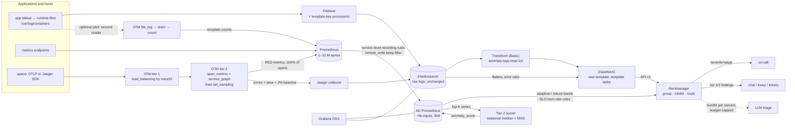

# Reference architecture: tiered anomaly detection on our stack

**In short:**

- We build our own anomaly-detection engine from open-source parts plus a little of our own
  code. This page shows how the parts connect.
- We reduce the data before we detect. No detector reads raw log lines or the 1–10 M raw series.
- Cheap detectors run on every aggregate. Expensive ones run only on candidates.
- Only Service Level Objective (SLO)
  [burn-rate alerts](https://sre.google/workbook/alerting-on-slos/) page a person. All other
  findings go to chat or tickets.
- In iteration 1, Elasticsearch counts the log lines per template (path A). Paths B and C are
  pilots.
- The extra series for detection are less than 1 % to about 9 % of Prometheus' active series.

Terms and abbreviations: [glossary](glossary.md).

Sections: [Scope](#scope) ·
[Three rules](#three-rules-the-design-follows) ·
[How the data flows](#how-the-data-flows) ·
[Notes on the diagram](#notes-on-the-diagram) ·
[What each tier does](#what-each-tier-does) ·
[Three ways to turn logs into counts](#three-ways-to-turn-logs-into-counts) ·
[Series and storage budget](#series-and-storage-budget)

## Scope

This page covers our stack:

- Filebeat → Elasticsearch/Kibana, self-managed, on the free Basic license;
- Prometheus, Alertmanager and Grafana OSS (the free open-source edition of Grafana);
- Jaeger.

Scale: 200 GB – 2 TB/day of logs, 1–10 M active Prometheus series.

Apps log to stdout. The container runtime writes each container's stdout/stderr to a file on the
node. Filebeat tails those files, that is, it reads new lines as they are written.

Iteration 1 only adds components. Nothing in the core path is replaced.

The design has four **detection tiers**. A tier is a group of detectors with the same cost and
the same alert route:

- **T0:** rules and SLO burn-rate alerts. It is the only tier that pages a person.
- **T1:** cheap statistics on all aggregates.
- **T2:** a seasonal scorer on the top-K series (a short list of the most useful series), as a
  second-stage check.
- **T3:** large language model (LLM) summaries of alert groups.

Do not confuse them with **OTel tier 1** and **OTel tier 2** in the diagram. Those are two layers
of OpenTelemetry (OTel) Collectors in the trace path.

## Three rules the design follows

1. **Reduce before you detect.** No detector ever reads raw log lines or the 1–10 M raw series.
   - Logs become counts per minute, per `(service, template, level)`. A template is the fixed
     text of a log line, with the variable parts masked.
   - Traces become [RED metrics](https://grafana.com/blog/2018/08/02/the-red-method-how-to-instrument-your-services/)
     (rate, errors, duration).
   - Metrics become a few thousand service-level recording rules. A recording rule is a query
     that Prometheus runs on a schedule and stores as a new series.

   The evidence is in [research/05 §1, §3](research/05-methods-benchmarks.md):
   - Simple statistical methods top the original
     [TSB-AD](https://github.com/TheDatumOrg/TSB-AD) univariate ranking. On multivariate data
     they tie neural nets.
   - On the [public labelled log datasets](https://github.com/logpai/loghub), novelty and count
     detectors find most anomalies. Their rates are competitive with deep learning.
2. **Cheap detectors run everywhere. Expensive ones run only on candidates.**
   - PromQL bands cover every metric aggregate. PromQL is the Prometheus query language. A band
     is the normal range of a series, learned from its own history.
   - ElastAlert2 rules cover every log aggregate. ElastAlert2 is an open-source alert tool for
     Elasticsearch.
   - The Python scorer looks only at the top-K series.
   - The LLM sees only bundles that Alertmanager has already grouped. A bundle is the context of
     one alert group (see [note 4](#what-each-tier-does)).
3. **Only SLO burn rate pages.**
   - Anomaly findings go to chat or tickets, grouped per service.
   - They are muted while a page for that service is firing.
   - No operator cited in the research pages on raw per-series anomalies. Uber and Netflix page
     on anomaly detection, but only after a confirmation stage or a per-application health model
     ([research/05 §5](research/05-methods-benchmarks.md)).

## How the data flows

Read the diagram from left to right. Three data streams come in. One alert bus goes out.

- **Logs.**
  - Filebeat reads the runtime files and adds a template key to each line. It sends the lines
    to Elasticsearch unchanged.
  - An Elasticsearch transform counts lines per template per minute, into the index
    `anomaly-logs-tmpl-1m`. We call this index the log rollup.
  - ElastAlert2 checks those counts for new templates and template spikes. It also checks the raw
    log indices for flatlines (a source that stops) and error ratios.
  - An optional pilot reads the same files a second time. It uses OTel (`file_log` → `drain` →
    `count`) and sends template counts to Prometheus. The `drain` step runs
    [Drain](https://github.com/logpai/Drain3), a log template mining algorithm.
- **Metrics.** Prometheus collects the apps' metrics endpoints: 1–10 M series.
- **Traces.** Apps send spans with the OpenTelemetry Protocol (OTLP) or with a Jaeger client
  library. A span is one timed operation inside a trace.
  - OTel tier 1 sends all spans of one trace to the same tier-2 collector
    (`load_balancing` by trace ID).
  - OTel tier 2 computes [span metrics](https://raw.githubusercontent.com/open-telemetry/opentelemetry-collector-contrib/v0.160.0/connector/spanmetricsconnector/README.md)
    and a service graph (metrics about calls between services). Then it applies
    [tail sampling](https://opentelemetry.io/docs/concepts/sampling/).
  - It sends RED metrics from 100 % of spans to Prometheus.
  - It sends errors, slow traces and a 2 % baseline to the Jaeger collector. Jaeger stores them in
    Elasticsearch.
- **Detection.**
  - Prometheus computes service-level recording rules. It pushes them with `remote_write` to a
    small anomaly-detection Prometheus: about 5 k inputs, kept 90 days. The diagram calls it
    `AD Prometheus`.
  - There, PromQL bands and SLO burn-rate rules run.
  - The tier-2 scorer reads the top-K series and computes a
    [seasonal median](../anomalyd/README.md) and
    [median absolute deviation (MAD)](https://en.wikipedia.org/wiki/Median_absolute_deviation).
    It writes an `anomaly_score` back.
- **Alerts.** All alerts go to Alertmanager. It groups them, inhibits (mutes) some and routes
  them.
  - `severity=page` goes to on-call.
  - Tier 1 and tier 2 findings go to chat, Keep (an open-source alert-correlation tool) or
    tickets.
  - Optionally, one budget-capped bundle per service goes to LLM triage.
- Grafana OSS reads both the anomaly-detection Prometheus and Elasticsearch.

## Notes on the diagram

These notes explain the main choices in the diagram.

**The anomaly-detection Prometheus is optional.**

- It is a small second Prometheus. It receives only the service-level recording rules, by
  `remote_write` with a keep-filter. It holds them for 90 days.
- We need the long history for two reasons. Weekly seasonal bands need at least 7 days of
  history. SLO windows need 30 days.
- A second server avoids raising global retention on the 1–10 M-series server
  ([research/02 §0, §7](research/02-metrics-prometheus.md)).
- If the main Prometheus already keeps data long enough, everything can run there.

**Why Filebeat processors add the template key.**

- Filebeat allows exactly one output. So only three places can add a template key: Filebeat
  itself, an Elasticsearch ingest pipeline, or a second reader on the hosts.
- Reading 2 TB/day back out of Elasticsearch would be a second workload as large as ingest
  ([research/01 §5](research/01-logs-elastic-basic.md)).

**"Filebeat reads stdout" means that Filebeat reads files.**

- kubelet has the runtime write each container's stdout/stderr to
  `/var/log/pods/<ns>_<pod>_<uid>/<container>/N.log`.
- The files use the Container Runtime Interface (CRI) format. Each line has an envelope:
  `<time> <stream> <P|F> <text>`.
- kubelet links the files as `/var/log/containers/<pod>_<ns>_<container>-<id>.log`.
- By default it rotates them at 10 MiB and keeps 5 files
  ([Kubernetes logging](https://kubernetes.io/docs/concepts/cluster-administration/logging/#log-rotation)).
- Filebeat's DaemonSet reads them with a `filestream` input and the `container` parser
  ([filebeat-kubernetes.yaml, v9.5.3](https://github.com/elastic/beats/blob/v9.5.3/deploy/kubernetes/filebeat-kubernetes.yaml)).
  A DaemonSet runs one copy of a pod on every node.

So a second reader is just another DaemonSet with the same read-only `hostPath` mounts. It reads
through the page cache and needs no change to Filebeat. It never sees Filebeat's output.

Two format rules apply ([poc/README.md](../poc/README.md#gotchas-found-while-validating)):

- Apps that log JSON need the `ndjson` parser after `container`. Otherwise the template is
  computed on the JSON text.
- Plain-text apps need a timestamp mask.

**Sampling happens after span metrics.**

- The collectors compute span metrics on 100 % of spans, before tail sampling. So the RED metrics
  stay exact.
- Elasticsearch then stores roughly 3–5 % of traces
  ([research/03 §3–4](research/03-traces-jaeger.md)).

## What each tier does

The table gives each tier's detectors, inputs, alert route and proof-of-concept (PoC) files. The
notes under it give the details.

| Tier | What runs | Inputs | Output and route | PoC file |
|---|---|---|---|---|
| **T0: rules and SLOs** | SLO burn-rate alerts, heartbeat/flatline, `predict_linear` (note 1) | spanmetrics or app RED metrics | `severity=page` → on-call. The only tier that pages. | [anomaly-alerts.yml](../poc/prometheus/anomaly-alerts.yml) |
| **T1: cheap statistics on aggregates** | PromQL bands for metrics; ElastAlert2 rules and a novelty alert for logs (note 2) | ~3–5 k service-level series; the rollup index and the raw log indices | warning/info → chat, grouped per service, inhibited by T0 pages | [anomaly-inputs.yml](../poc/prometheus/anomaly-inputs.yml), [elastalert2/rules](../poc/logs/elastalert2/rules/), [transform](../poc/logs/elastic/transform-logs-tmpl-1m.json) |
| **T2: ML on top-K** | Seasonal-median + MAD scorer, as a second-stage check (note 3) | a few hundred to a few thousand series | `anomaly_score` → `SeasonalAnomalyScoreHigh` (warning), or anomalyd alert (note 3) | [prom_anomaly_job.py](../poc/ml/prom_anomaly_job.py), [anomalyd](../anomalyd/README.md) |
| **T3: LLM, only on alert groups** | One LLM call per Alertmanager group, on a bundle (note 4) | ≤ 20 k tokens per bundle | summary and hypotheses posted to the chat thread | design only: [research/04 §2](research/04-aiops-rca-llm-cost.md), webhook route in [alertmanager.yml](../poc/prometheus/alertmanager.yml) |

Notes:

1. **T0.**
   - Multi-window, multi-burn-rate SLO alerts: 14.4× over 1 h/5 m, and 6× over 6 h/30 m. Each
     alert checks a long and a short window.
   - Heartbeat and flatline alerts fire when a source stops sending data.
   - `predict_linear` warns early about disks and quotas.
2. **T1.**
   - Metrics: `grafana/promql-anomaly-detection` computes
     [adaptive bands](https://grafana.com/blog/2024/10/03/how-to-use-prometheus-to-efficiently-detect-anomalies-at-scale/)
     and robust bands. Adaptive bands are the mean ± 2σ, with a daily or weekly look-back. σ is
     the [standard deviation](https://en.wikipedia.org/wiki/Standard_deviation). Robust bands are
     the median ± 2·MAD.
   - Logs: ElastAlert2 runs `new_term` and `spike_aggregation` rules on the 1-minute rollup.
   - Logs: ElastAlert2 runs `flatline` and `percentage_match` rules as terms aggregations on the
     raw indices.
   - Logs: a log-novelty alert runs on template counts in Prometheus.
3. **T2.** ML means machine learning.
   - The Python PoC scores the top-K series. The Go port in anomalyd scores every remote-written
     input in memory.
   - anomalyd sends `AnomalydMetricAnomaly` (tier 2) to Alertmanager directly.
   - Upgrade path (statsforecast and PyOD are Python libraries):
     - statsforecast [MSTL](https://arxiv.org/abs/2107.13462) residuals, that is, what is left
       after removing trend and seasons;
     - [Matrix Profile](https://stumpy.readthedocs.io/en/latest/Tutorial_STUMPY_Basics.html)
       discords, that is, the parts of a series least like the rest;
     - PyOD on per-service vectors.
   - Use T2 as a second-stage confirmer, not as a pager.
4. **T3.** This tier stays outside the path that every alert takes. On an Alertmanager group it:
   - builds a bundle: alert labels, 5–10 related series (pre-summarised), top-20 template deltas
     with 1–2 redacted samples, top-5 error/slow trace IDs, and recent deploys;
   - makes one LLM call with capped output.

   An agent (HolmesGPT, an open-source LLM investigation agent) runs on demand only.

## Three ways to turn logs into counts

Every path turns log lines into counts per template. They differ in where the template key is
made and where the counts live. The table is short. The notes under it (A1–C6) give the details.

| Aspect | Path A: in Elasticsearch | Path B: at the edge, into Prometheus | Path C: anomalyd agent → server |
|---|---|---|---|
| Status | recommended for iteration 1 | pilot | Go PoC, pilot |
| Template key | Filebeat processors or an ingest pipeline; stateless (A1) | OTel `drain` processor or `drain3_exporter.py` (B1) | `anomalyd agent`: masks + Drain per service (C1) |
| Where counts live | `anomaly-logs-tmpl-1m` index, built by a transform | `log_template_lines_total{service, …}` in Prometheus | anomalyd's memory, snapshotted to disk (C2) |
| Detectors | ElastAlert2 on the rollup; Grafana week-over-week ratios (A2) | the same PromQL bands as metrics (B2) | seasonal median + MAD; new-template detection (C3) |
| Strengths | no new data path; one-query drill-down (A3) | real Drain clustering; one detector stack (B3) | fast; only counts leave the host (C4) |
| Weaknesses | coarse regex masks; seeding; host CPU (A4) | second fleet of readers; alpha parts (B4) | our own code; one server; no stored offsets (C5) |
| Validated here | Filebeat + Elasticsearch 9.5.3 Basic (A5) | otelcol-contrib 0.160.0 (B5) | Go tests + Docker end-to-end run (C6) |

**Path A: in Elasticsearch**

- **A1.** Filebeat uses the `container` + `ndjson` parsers, then `copy_fields` → `replace` masks
  (`<TS>` first) → `fingerprint`. An Elasticsearch ingest pipeline can do the same. The key is
  stateless: the id is identical on every node and after every restart.
- The transform is continuous and free on Basic.
- **A2.** Grafana uses its Elasticsearch data source for the week-over-week ratios.
- **A3.** The template id is stored on every raw log line. So drill-down from an alert to the
  lines is one query.
- **A4.** Regex masking is coarser than Drain. The masks need seeding from an offline Drain3 run
  on a sample. Regex CPU on the hosts must be measured.
- **A5.** Filebeat 9.5.3 + Elasticsearch 9.5.3 Basic:
  - 300k synthetic lines → 24 template ids → 116 rollup rows.
  - All 6 ElastAlert2 rules alert with `service` and `tier` labels. New template, template spike,
    error spike and ratio fire on the injected burst. Flatline fires once logging stops.
  - On 40k CRI container-stdout lines: 24 ids for JSON apps and 24 for text apps.

**Path B: at the edge (on each host), into Prometheus**

- **B1.** An OTel Collector DaemonSet runs `file_log` on `/var/log/pods` → `container` operator →
  `drain` processor (alpha) → `count` connector. The other option is `drain3_exporter.py`, fed
  with a copy of the log stream.
- **B2.** The OTel variant exports the same names as `drain3_exporter.py`: `log_lines_total` and
  `log_template_lines_total{service, template_id}`. The template text is the id. Only the novelty
  alerts need the exporter's `log_templates_created_total`.
- **B3.** Real Drain clustering handles free-text words. Logs and metrics share one detector
  stack.
- **B4.** It needs a second fleet of readers, and it uses alpha components. Template text as a
  label needs a cardinality cap.
- **B5.** We ran otelcol-contrib 0.160.0 on 40k CRI lines in the `/var/log/pods` layout. After
  three fixes, it counted every line in 10 of 10 runs. The fixes:
  - record time cleared;
  - `batch` + `groupbyattrs` before `count`;
  - per-pod resource dropped.

  Before the fixes it counted only 8–36k of 40k lines. The drain path mines ≈ 92k lines/s on one
  core with the `container` operator, and 138k without it
  ([compare.sh](../anomalyd/test/bench/compare.sh)).

**Path C: anomalyd agent → server**

- **C1.** The `anomalyd agent` DaemonSet unwraps the CRI/Docker envelope. Then it masks in a
  single pass and runs Drain per service, with the same rules as Drain3. The server re-clusters
  the agents' template texts into one `template_id` per service.
- **C2.** Agents send 1-minute counts. The server sums them into `--step` buckets in memory and
  snapshots them to disk. Only scores and bands are exported to Prometheus.
- **C3.** The server scores every template series and every per-level volume series. It also
  detects new templates. Findings go straight to Alertmanager (tier 1/2).
- **C4.** It mines 1.3–1.5 M lines/s per core on synthetic data, ≈ 15× the Drain3 exporter.
  Only counts leave the host: 68 KB per 160 MB of logs in the end-to-end run. It adds no template
  cardinality to Prometheus.
- **C5.** It is in-house code that we must own. It runs as a single server, with no high
  availability (HA) yet. Agents push at least once and do not persist file offsets.
- **C6.** Go tests + a Docker end-to-end run with Prometheus 3.14.0 and Alertmanager 0.34.0. The
  logs were written as CRI container stdout: 997k lines in 13.5 min. The injected error template
  and a service going silent both reach Alertmanager
  ([anomalyd/README.md](../anomalyd/README.md#verification-2026-09-15)).

## Series and storage budget

How many extra series and rows does the design add? "Head series" are the active series that
Prometheus holds in memory.

| Item | Estimate | Basis |
|---|---|---|
| Anomaly-detection input series | 3–5 k (≤ 15 k) service-level series | [research/02 §7](research/02-metrics-prometheus.md) |
| Series derived by the upstream band rules | ~9 per input (adaptive), ~17 per input (robust) → roughly 30–85 k | [research/02 §1.1](research/02-metrics-prometheus.md) |
| Share of the 1–10 M head series | < 1 % (at 10 M) to ≈ 9 % (at 1 M) | arithmetic on the two rows above |
| Log rollup rows per day | ≈ 13 M rows/day, a few GB/day (note 1) | assumption (note 1) |
| Trace storage in Elasticsearch | ~95–97 % fewer spans written (note 2) | [research/03 §3.3](research/03-traces-jaeger.md) |
| Span-metric series | ≈ 80 × operations × collector replicas (note 3) | [research/03 §2.4, tool cards](research/03-traces-jaeger.md) |

Notes:

1. Rows per day = services × templates present per minute × 1,440. Example: 200 services × 150
   templates × 30 % present ≈ 13 M rows/day (a few GB/day). Compare this with 200 GB–2 TB of raw
   logs. The synthetic test compressed 300,000 lines into 116 rows.
2. Elasticsearch stores the 2 % baseline plus all error and slow traces. Size Elasticsearch for
   the incident case, or add a `rate_limiting`/`composite` cap.
3. The factor 80 holds with default buckets. With the PoC's 11 buckets it is 60. Multiply also by
   the number of app pods, unless you set `resource_metrics_key_attributes: [service.name]`.
   Guard with `aggregation_cardinality_limit`.

CPU, memory and money are in [cost-sizing.md](cost-sizing.md).
