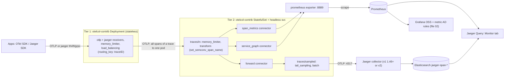

# 03 — Trace-based anomaly detection with Jaeger

**In short:**
- Jaeger v1 reached end of life on Dec 31 2025. The current release is Jaeger v2.20.0 (2026-07-20). Moving to v2 upgrades a component we already run. It is not a swap.
- For trace anomaly detection, first turn 100% of spans into [RED metrics](https://grafana.com/blog/2018/08/02/the-red-method-how-to-instrument-your-services/) (rate, errors, duration). Sample only after that. Then our metric anomaly rules from [02-metrics-prometheus.md](02-metrics-prometheus.md) work on traces too.
- We add an OpenTelemetry (OTel) Collector tier in front of Jaeger: otelcol-contrib v0.160.0 (2026-09-02). It builds [span metrics](https://raw.githubusercontent.com/open-telemetry/opentelemetry-collector-contrib/v0.160.0/connector/spanmetricsconnector/README.md) and a service graph from all spans. Then [tail sampling](https://opentelemetry.io/docs/concepts/sampling/) keeps all error traces, all slow traces and a 1–5% baseline (our proof of concept uses 2%). This works with Jaeger v1 and v2. The core stack does not change.
- Sampling cuts the trace data written to Elasticsearch by about 95% or more. Error and slow traces stay at 100%, so you can still click from a metric to a trace.
- Direct queries on the Elasticsearch span indices are for drill-down only, because sampled data is biased. The Grafana Jaeger datasource has no metrics and no alerting.
- Models that learn trace structure (TraceAnomaly, TraceVAE) are research-only. Tools we can use today: the [critical path](https://www.uber.com/blog/crisp-critical-path-analysis-for-microservice-architectures/) view in the Jaeger user interface (UI), CRISP, and the Jaeger v2 MCP tools. MCP is the Model Context Protocol. It lets a large language model (LLM) read a small bundle of trace data at low cost.

Terms and abbreviations: [glossary](../glossary.md).

We want our own anomaly detection, built from open-source parts plus a little of our own code. This file covers traces: what Jaeger and the OpenTelemetry Collector give us, and how to connect them.

**Status:** draft complete (2026-09-14). We checked versions with the GitHub API or raw sources at tagged versions, unless marked `UNVERIFIED`. On 2026-09-14 we re-checked the facts against sources at the pinned tags. We also ran otelcol-contrib 0.160.0 to check metric names, `collector.instance.id`, the series split and the tail-sampling heap. Corrections are marked in place.

## Key terms used in this file

- **Span:** one unit of work, for example one HTTP request handled by one service. A span has a name, a start time, a duration and attributes (also called tags). See [OpenTelemetry: traces](https://opentelemetry.io/docs/concepts/signals/traces/).
- **Trace:** all spans of one request, as it moves through our services. All spans of a trace share one trace ID.
- **Span kind:** the role of a span:
  - `server` receives a call.
  - `client` makes a call.
  - `producer` sends a message, and `consumer` reads it.
  - `internal` is work inside one service.
- **RED metrics:** request **R**ate (requests per second), **E**rrors (failing requests) and **D**uration (how long requests take). See [the RED method](https://grafana.com/blog/2018/08/02/the-red-method-how-to-instrument-your-services/).
- **Span metrics:** RED metrics that the OTel `span_metrics` connector computes from spans ([README](https://raw.githubusercontent.com/open-telemetry/opentelemetry-collector-contrib/v0.160.0/connector/spanmetricsconnector/README.md)).
- **Tail sampling:** the collector waits until a trace is complete. Then it keeps or drops the whole trace. So it can keep every error trace and every slow trace. **Head sampling** decides at the start of a request, before the result is known. See [OpenTelemetry: sampling](https://opentelemetry.io/docs/concepts/sampling/).
- **Collector tier:** a group of identical OpenTelemetry Collector pods that do one job. In our design, tier 1 routes spans. Tier 2 computes metrics and samples (section 4).
- **Service graph:** a map of which service calls which. Each edge is one caller → callee pair.
- **Exemplar:** a trace ID stored next to a metric value. You can click from a graph to that example trace. See [Grafana: exemplars](https://grafana.com/docs/grafana/latest/fundamentals/exemplars/).
- **Stability level:** how mature an OTel component is ([component stability](https://github.com/open-telemetry/opentelemetry-collector/blob/main/docs/component-stability.md)):
  - development: not ready for production.
  - alpha: for limited, non-critical use. The config may change often.
  - beta: the config is stable, and breaking changes are rare.
  - stable: ready for production.
- **Feature gate:** a named switch that turns a new behaviour on or off. Alpha gates are off by default. Beta gates are on by default, but you can turn them off ([feature gates](https://raw.githubusercontent.com/open-telemetry/opentelemetry-collector/main/featuregate/README.md)).

**Sections:**
1. [Which Jaeger do we run, and is it still supported?](#1-which-jaeger-do-we-run-and-is-it-still-supported)
2. [How do traces become RED metrics?](#2-how-do-traces-become-red-metrics-jaeger-monitor-tab-and-the-span-metrics-connector)
3. [How do we keep only the useful traces?](#3-how-do-we-keep-only-the-useful-traces-otel-tail_sampling-and-the-load_balancing-exporter)
4. [Why must span metrics come before sampling?](#4-why-must-span-metrics-come-before-sampling-pipeline-order-and-topology) (topology and configs)
5. [Which collector components do we use, and how stable are they?](#5-which-collector-components-do-we-use-and-how-stable-are-they)
6. [Can we analyse traces directly in Elasticsearch or Grafana?](#6-can-we-analyse-traces-directly-in-elasticsearch-or-grafana)
7. [Can we detect anomalies from trace structure?](#7-can-we-detect-anomalies-from-trace-structure-research-vs-production)
8. [What we recommend](#8-what-we-recommend)

After section 8: [tool cards](#tool-cards), one short card per tool.

## 1. Which Jaeger do we run, and is it still supported?

| Item | Fact | Source |
|---|---|---|
| v1 end of life | Ends Dec 31 2025. No new v1 binaries from Jan 01 2026 (note 1). | https://github.com/jaegertracing/jaeger/issues/6321 |
| Last v1 release | **v1.76.0 / v2.13.0, 2025-12-03** | https://api.github.com/repos/jaegertracing/jaeger/releases?per_page=40 |
| v1 parts removed | v2.14.0 (2026-01-01/02) stops publishing v1 `query`, `collector`, `ingester` (note 2). | https://raw.githubusercontent.com/jaegertracing/jaeger/v2.20.0/CHANGELOG.md |
| Latest v2 | **v2.20.0, published 2026-07-20**. UI v2.20.0 the same day. About monthly (note 3). | https://api.github.com/repos/jaegertracing/jaeger/releases/latest |
| v2.20.0 changes | Elasticsearch v6 removed, MCP merged into `jaeger_query` (note 4) | same |
| v2 design | One `jaeger` binary built on the OTel Collector. Pins OTel contrib **v0.155.0** (note 5). | https://raw.githubusercontent.com/jaegertracing/jaeger/v2.20.0/cmd/jaeger/internal/components.go , https://raw.githubusercontent.com/jaegertracing/jaeger/v2.20.0/go.mod |
| Migration guide | The docs page only links to a Google Doc. It has no steps of its own. | https://www.jaegertracing.io/docs/latest/migration/ |

Notes:
1. The issue says: "Jaeger 1.x end-of-life is going to be Dec 31 2025" and "From Jan 01 2026 there will be no new releases of Jaeger v1 binaries."
2. The changelog says: "legacy v1 components `query`, `collector`, and `ingester` are no longer published". The pull requests are "Remove v1 collector, query, and all-in-one" and "Remove v1/ingester and all kafka related code". Kafka support now comes from the OTel Kafka receiver and exporter, which v2 bundles.
3. Recent releases: v2.19.0 on 2026-06-03, v2.18.0 on 2026-05-13.
4. All notable v2.20.0 changes:
   - Elasticsearch v6 support is removed.
   - `max_trace_duration` is now configurable for Elasticsearch.
   - The Elasticsearch rotation and index-cleaner feature gates move to beta.
   - The MCP extension is merged into `jaeger_query`.
   - It adds native Elasticsearch trace summaries.
5. What the v2 binary bundles:
   - receivers: `otlp`, `jaeger`, `kafka`, `zipkin`
   - processors: `batch`, `memory_limiter`, **`tail_sampling`**, `attributes`, `filter`, `adaptive_sampling`
   - connector: **`spanmetrics`**
   - exporters: `prometheus`, `otlp`, `kafka`
   - extensions: `jaeger_storage`, `jaeger_query`, `remote_sampling`

   **Not bundled:** the `load_balancing` exporter and the `transform` processor. For those we need `otelcol-contrib`.

**Which storage backends does v2 support? (docs v2.20)**
- Supported: Cassandra, Elasticsearch, OpenSearch, Badger, Memory.
- **ClickHouse: experimental** (behind a feature gate).
- Kafka: a streaming buffer, not a real store.
- Custom backends: the gRPC Remote Storage API v2.
- The docs recommend OpenSearch over Cassandra at scale.

Source: https://www.jaegertracing.io/docs/latest/storage/ . v2.20.0 drops Elasticsearch v6 (release notes). The v2 Elasticsearch template ships for Elasticsearch 7, Elasticsearch 8–9 and OpenSearch 1–3. The files are `span.es7.json`, `span.es8-9.json` and `span.os1-3.json` (the 8–9 one: https://raw.githubusercontent.com/jaegertracing/jaeger/v2.20.0/internal/storage/elasticsearch/esclient/testdata/create_template/span.es8-9.json).

**How to tell which Jaeger we run**
- **Images:**
  - v1: `jaegertracing/jaeger-collector`, `jaeger-query`, `jaeger-agent`, `all-in-one`, `jaeger-ingester`. The last Docker Hub tag of `jaeger-collector` is **1.76.0, 2025-12-03**.
  - v2: one image, `jaegertracing/jaeger:2.x` (latest 2.20.0), started with `--config <yaml>`.
  - Sources: https://hub.docker.com/v2/repositories/jaegertracing/jaeger-collector/tags , https://hub.docker.com/v2/repositories/jaegertracing/jaeger/tags
- **Command line:** the v2 binary has a `jaeger version` subcommand and a cobra `--version` flag (https://raw.githubusercontent.com/jaegertracing/jaeger/v2.20.0/cmd/jaeger/internal/command.go). v1 binaries also had a `version` subcommand. Its exact output format is UNVERIFIED.
- **Config style:** v1 uses command-line flags and environment variables (`SPAN_STORAGE_TYPE`, `ES_SERVER_URLS`, `--es.*`). v2 uses OTel-style YAML with `extensions: jaeger_storage / jaeger_query` and `exporters: jaeger_storage_exporter`.
- **Storage:** v1 and v2 share the Elasticsearch index names `jaeger-span-YYYY-MM-DD`. v2 also reuses the v1 Elasticsearch data model. The v2 Elasticsearch tracestore uses the `dbmodel` package (https://raw.githubusercontent.com/jaegertracing/jaeger/v2.20.0/internal/storage/v2/elasticsearch/tracestore/to_dbmodel.go). So an in-place upgrade is possible on Elasticsearch. End to end, this is UNVERIFIED. Read the Google Doc migration guide before the cut-over.
- **Rollover:** v1 may use rollover or index lifecycle management (ILM) with `--es.use-aliases` or `--es.use-ilm`. Then v2.20 needs the new `indices.<type>.rotation` settings. By default, v2.20 refuses to start with the old `use_aliases`/`use_ilm` keys (section 6.1).

**What this means for us**

If we run v1, it has had no support since 2026-01-01, so no security patches. Moving to v2 is a *version upgrade of a component we already run*, not a swap. v2 also brings `tail_sampling` and `spanmetrics` inside the Jaeger binary.

Iteration 1 (section 8) still works on v1. All new logic lives in a separate OTel Collector tier in front of Jaeger. That tier sends data to the v1 collector in the OpenTelemetry Protocol (OTLP). The v1 collector has an OTLP receiver since v1.35.0, on by default since v1.46.0 (Jaeger CHANGELOG). The contrib `jaeger` exporter was removed in contrib v0.86.0, so OTLP is the only path (https://raw.githubusercontent.com/open-telemetry/opentelemetry-collector-contrib/v0.160.0/CHANGELOG.md).

## 2. How do traces become RED metrics? (Jaeger Monitor tab and the span metrics connector)

### 2.1 How does Jaeger's Monitor tab (SPM) work?

Jaeger calls this feature Service Performance Monitoring (SPM). It is the Monitor tab in the Jaeger UI.

- The tab shows RED per service and per operation: request rate, error rate and duration. Duration comes as P95, P75 and P50 [percentiles](https://en.wikipedia.org/wiki/Percentile). P95 means that 95% of requests were faster than this value.
- The tab also shows "Impact" (= latency × request rate). A click opens the trace search with the filters filled in. Source: https://raw.githubusercontent.com/jaegertracing/documentation/main/content/docs/v2/2.20/architecture/spm.md
- **v2 has two modes** (same doc):
  1. **Pre-computed:** the `spanmetrics` connector writes metrics to a Prometheus-compatible store. `jaeger_query` reads them with PromQL, the Prometheus query language.
  2. **Direct from storage (Elasticsearch or OpenSearch):** `jaeger_query` computes RED when you open the tab. It runs Elasticsearch aggregations over the span indices. No connector and no Prometheus. Added in v2.8–v2.9 (2025-07/08), per the CHANGELOG (pull requests #7209…#7390). A ClickHouse SPM reader also exists (CHANGELOG v2.18), but ClickHouse itself is experimental.
- **v1:** SPM worked with `METRICS_STORAGE_TYPE=prometheus` plus an external OTel Collector that ran spanmetrics. Jaeger v1.4x added "Support spanmetrics connector by default" and "Deprecate support for spanmetrics processor naming convention" (CHANGELOG #4704, #4741). The old `spanmetrics` **processor was removed in contrib v0.96.0**: "Remove spanmetrics processor … use the spanmetrics connector as a replacement" (https://raw.githubusercontent.com/open-telemetry/opentelemetry-collector-contrib/v0.160.0/CHANGELOG.md).
- By default the Monitor tab shows only `SPAN_KIND_SERVER` spans. This avoids counting one call twice. Services that emit only client or unspecified spans will be missing (spm.md, "Service/Operation missing").
- SPM ignores custom dimensions, that is extra metric labels: "Querying custom dimensions are not supported by SPM and will be aggregated over" (spm.md). Extra dimensions help only our own anomaly detection in Prometheus and Grafana, not the Monitor tab.

### 2.2 Which settings does the span metrics connector have? (contrib v0.160.0)

Source for this whole table unless noted: https://raw.githubusercontent.com/open-telemetry/opentelemetry-collector-contrib/v0.160.0/connector/spanmetricsconnector/README.md , plus `metadata.yaml` and `factory.go` in the same folder. A *dimension* is a span attribute that becomes a metric label.

| Key | Default / fact |
|---|---|
| Component type | **Renamed `spanmetrics` → `span_metrics` in v0.151.0**. The old name is a deprecated alias (note 1). |
| Stability | **alpha** (traces → metrics) |
| `namespace` | `traces.span.metrics` (since v0.109.0). Gate `connector.spanmetrics.legacyMetricNames` restores bare `calls`/`duration`. |
| Default dimensions | `service.name`, `span.name`, `span.kind`, `status.code`, **`collector.instance.id`** (note 2) |
| `dimensions` | List of `{name, default}` or `{glob}` (glob since v0.154.0). Applies to calls, duration and events. |
| `calls_dimensions`, `histogram.dimensions` | Extra dimensions only on calls, or only on duration |
| `exclude_dimensions` | Drops default dimensions (for example `collector.instance.id`). **Never exclude `status.code`** (note 3). |
| `histogram` | `explicit` (default) or `exponential` (`max_size` 160). `unit` default **`ms`**. `disable: false`. Buckets: note 4. |
| `metrics_flush_interval` | **60s** (changed from 15s in v0.98.0) |
| `metrics_expiration` / `series_expiration` | 0 = never. `series_expiration` (since v0.153.0) removes stale dimension combinations. |
| `aggregation_cardinality_limit` | **Exists** (since v0.125.0). Default 0 = unlimited. Overflow → series with `otel.metric.overflow="true"`. |
| `dimensions_cache_size` | Deprecated. Use `aggregation_cardinality_limit`. |
| `exemplars` | `enabled: false`, `max_per_data_point: 5`. Kept for one flush interval. |
| `events` | `enabled`, `dimensions` → `traces.span.metrics.events` |
| `aggregation_temporality` | `AGGREGATION_TEMPORALITY_CUMULATIVE` (default) or `…_DELTA` |
| `resource_metrics_key_attributes` | Set to stable attributes, for example `service.name` (note 5) |
| `add_resource_attributes` | false (note 6) |
| `enable_metrics_sampling_method` | Adds `sampling.method` = `extrapolated`/`counted` (note 7) |
| Upcoming breaking gates (alpha, off) | `connector.spanmetrics.useSecondAsDefaultMetricsUnit`, `spanmetrics.statusCodeConvention.useOtelPrefix` (note 8) |

Notes:
1. The README says the alias "will be removed in a future release".
2. Gate `connector.spanmetrics.includeCollectorInstanceID` adds `collector.instance.id`. The gate is **beta, so on by default, since v0.152.0**.
3. Jaeger uses `status.code` for the error rate (spm.md).
4. Default explicit buckets: `[2ms,4ms,6ms,8ms,10ms,50ms,100ms,200ms,400ms,800ms,1s,1400ms,2s,5s,10s,15s]`.
5. Stable key attributes avoid counter resets caused by short-lived resource attributes.
6. Resource attributes are excluded only with gate `connector.spanmetrics.excludeResourceMetrics` (alpha, off).
7. v0.148.0 added support for the adjusted count in the `tracestate` header. This header comes from the [W3C Trace Context](https://www.w3.org/TR/trace-context/) standard of the World Wide Web Consortium (W3C). The adjusted count says how many spans one sampled span stands for.
8. The two upcoming breaking changes:
   - `connector.spanmetrics.useSecondAsDefaultMetricsUnit` changes the unit from ms to s. The README says it will flip "after one release cycle". It is still off in v0.160.0. When it flips, Jaeger needs `latency_unit: s`.
   - `spanmetrics.statusCodeConvention.useOtelPrefix` writes `otel.status_code=ERROR` instead of `status.code=STATUS_CODE_ERROR`. This gate **breaks Jaeger error rates**. Jaeger v2.20.0 hard-codes `status_code = "STATUS_CODE_ERROR"` in its PromQL (https://raw.githubusercontent.com/jaegertracing/jaeger/v2.20.0/internal/storage/metricstore/prometheus/metricstore/reader.go).

### 2.3 Which Prometheus metric names do we get?

This assumes the `prometheus` exporter or remote-write normalization, the default namespace and the ms unit.

- `traces_span_metrics_calls_total`: a counter. Errors have `status_code="STATUS_CODE_ERROR"`.
- `traces_span_metrics_duration_milliseconds_bucket` / `_sum` / `_count`: a histogram with an `le` label ([Prometheus histograms](https://prometheus.io/docs/practices/histograms/)).
- `traces_span_metrics_events_total`, if events are on. We derived the name from the README's `traces.span.metrics.events`. The exact suffix is UNVERIFIED.
- Labels: `service_name`, `span_name`, `span_kind` (`SPAN_KIND_SERVER`…), `status_code`, `collector_instance_id`, plus custom dimensions (dots become underscores).
- The `service_graph` connector adds `traces_service_graph_request_total`, `…_failed_total` and `…_unpaired_spans_total` (queries in section 8.2).
- Sources:
  - Runtime check on 2026-09-14 (otelcol-contrib 0.160.0 `prometheus` exporter, default translation). It exposed exactly these names and labels. It also added `job` (= resource `service.name`), `instance` (= resource `service.instance.id`, if set) and `otel_scope_*` labels.
  - spm.md, section "Query Prometheus", lists exactly `traces_span_metrics_duration_milliseconds_bucket` and `traces_span_metrics_calls_total`.
  - README example: `calls_total{span_name=…, service_name=…, span_kind="SPAN_KIND_SERVER", status_code="STATUS_CODE_UNSET"}`.
- Warning: Prometheus may ingest through its native OTLP receiver, with UTF-8 names or a non-default translation strategy. Then names may keep their dots. This is UNVERIFIED for our Prometheus version: check `otlp.translation_strategy`. The safest setup is the `prometheus` exporter on the collector plus a scrape, as in Jaeger's official config.

### 2.4 How many time series will this create?

Jaeger's formula: `num_status_codes * num_span_kinds * (1 + num_latency_buckets) * num_operations`. The typical default is **72 × operations**, the maximum 324 × operations (spm.md).

When `collector.instance.id` is on (the default), multiply by the number of collector instances. Example: 2,000 server operations × 72 × 4 collectors ≈ 576k series. With `exclude_dimensions: [collector.instance.id]` it is ≈ 144k.

But excluding it is safe only when all spans of a service reach exactly one connector instance (`load_balancing routing_key: service`). That conflicts with the trace-ID routing that tail sampling and the service graph need. So in the section 4 topology we keep the dimension and budget for the multiplier.

The arithmetic comes from the formula. The `collector.instance.id` multiplier is our inference from the README text "unique UUID to all metrics" (UUID = universally unique identifier).

Two corrections from a runtime check (otelcol-contrib 0.160.0 + telemetrygen, Prometheus exporter, 2026-09-14). telemetrygen is an OTel tool that generates test spans.
- **`_sum` and `_count` add series.** Jaeger's formula counts calls and buckets only. But each combination also exports `_sum` and `_count`. So real series per combination = 1 + (buckets + 1) + 2:
  - **20 with the 16 default buckets (≈ 80 × operations, not 72)**
  - 15 with the 11-bucket list in section 4 (≈ 60 × operations)

  So the example with 2,000 operations × 4 collectors is ≈ 640k with default buckets, and ≈ 480k with the section 4 buckets. Without the collector multiplier: ≈ 160k / 120k.
- **Resource attributes split series.** Suppose each app pod has its own `service.instance.id` value. Spans with different values become separate series (`instance="pod-a"`, `instance="pod-b"`). This multiplies the budget by the number of app pods per service. In the same test, `resource_metrics_key_attributes: [service.name]` (as in section 4) collapsed them to one series per combination. The `instance` label then shows whichever pod was seen first.

### 2.5 How do we point Jaeger Query at Prometheus? (v2.20.0 official `config-spm.yaml`)
```yaml
extensions:
  jaeger_query:
    storage:
      traces: some_storage
      metrics: some_metrics_storage
  jaeger_storage:
    metric_backends:
      some_metrics_storage:
        prometheus:
          endpoint: http://prometheus:9090
          normalize_calls: true        # look for calls_total
          normalize_duration: true     # look for duration_milliseconds_bucket
connectors:
  spanmetrics:
    metrics_flush_interval: ${env:SPANMETRICS_FLUSH_INTERVAL:-60s}
```
Source: https://raw.githubusercontent.com/jaegertracing/jaeger/v2.20.0/cmd/jaeger/config-spm.yaml .

Note: the docs page snippet puts `traces:` / `metrics_storage:` directly under `jaeger_query`. That is out of date compared with the repo config (`storage.traces` / `storage.metrics`). Trust the repo file.

All Prometheus backend keys (https://raw.githubusercontent.com/jaegertracing/jaeger/v2.20.0/internal/config/promcfg/config.go):
- `endpoint`
- `connect_timeout` (30s)
- `tls`
- `token_file_path`
- `token_override_from_context`
- `metric_namespace` (default `traces_span_metrics`)
- `latency_unit` (`ms`|`s`, default `ms`)
- `normalize_calls`, `normalize_duration`
- `extra_query_parameters`

In the UI, set `monitor.menuEnabled=true`.

### 2.6 Can Jaeger compute RED straight from Elasticsearch? (`config-spm-elasticsearch.yaml`)

Yes, without Prometheus:
```yaml
extensions:
  jaeger_query:
    storage: {traces: es_main, metrics: es_main}
  jaeger_storage:
    backends:
      es_main: &es
        elasticsearch:
          server_urls: [http://elasticsearch:9200]
          tags_as_fields: {include: "span.kind,error"}   # see gotcha below
    metric_backends:
      es_main: *es
```
Source (without the `tags_as_fields` line, which we added): https://raw.githubusercontent.com/jaegertracing/jaeger/v2.20.0/cmd/jaeger/config-spm-elasticsearch.yaml

Gotchas (hidden limits) found in the source code (query_builder.go v2.20.0):
- It filters on **`tag.error`** and **`tag.span@kind`** (elevated tag fields), plus `process.serviceName` and `startTimeMillis`. Latency is an Elasticsearch `percentiles` aggregation on `duration` (in µs, microseconds). The per-operation view is a `terms` aggregation on `operationName` with **size 10**. So it shows only the top 10 operations.
- Jaeger copies tags into `tag.*` fields ("elevates" them) only when `tags_as_fields.all` or `include` is set (writer.go `splitElevatedTags`). So on a default Elasticsearch setup, the error and kind filters probably match nothing. → **Set `tags_as_fields.include: "span.kind,error"`.** We inferred this from the code. The docs do not say it, so it is UNVERIFIED in practice.
- It computes over **stored spans only, that is after sampling**. It also runs aggregations over TB-scale span indices at every Monitor-tab refresh. So it is biased by sampling and heavy for Elasticsearch. It is fine as a quick win with no add-on at low sampling rates. It is not an anomaly detection signal.

## 3. How do we keep only the useful traces? (OTel `tail_sampling` and the `load_balancing` exporter)

### 3.1 Which sampling policies exist? (v0.160.0 README)

Source: https://raw.githubusercontent.com/open-telemetry/opentelemetry-collector-contrib/v0.160.0/processor/tailsamplingprocessor/README.md

A policy is one rule that votes to keep (sample) or drop a trace.

| Policy | Config shape | Use for anomaly detection |
|---|---|---|
| `status_code` | `status_code: {status_codes: [ERROR]}` (values `OK`, `ERROR`, `UNSET`) | Keep 100% of error traces |
| `latency` | `latency: {threshold_ms: 1000, upper_threshold_ms: …}` (note 1) | Keep slow traces |
| `probabilistic` | `probabilistic: {sampling_percentage: 2, hash_salt: …}` (note 2) | Healthy baseline |
| `rate_limiting` | `rate_limiting: {spans_per_second: N, burst_capacity: M}` (note 3) | Hard budget |
| `bytes_limiting` | `bytes_limiting: {bytes_per_second, burst_capacity}` | Hard budget in bytes |
| `string_attribute` / `numeric_attribute` / `boolean_attribute` | `{key, values, enabled_regex_matching}` / `{key, min_value, max_value}` / `{key, value}` | Rules per service or route, or a force-sample flag |
| `ottl_condition` | `{error_mode, span: [...], spanevent: [...]}` (note 4) | For example `span.attributes["http.response.status_code"] >= 500` |
| `span_count`, `trace_state`, `trace_flags`, `always_sample` | Not listed here | Structural rules, or pass everything |
| `and` | `and: {and_sub_policy: [...]}` | "service X AND 1%" |
| `not` / `drop` | `not: {not_sub_policy: {...}}` / `drop: {drop_sub_policy: [...]}` (note 5) | Drop health checks |
| `composite` | `{max_total_spans_per_second, policy_order, composite_sub_policy, rate_allocation: [{policy, percent}]}` | Split a global budget |

Notes:
1. `latency` measures the **trace** duration: from the earliest span start to the latest span end. With no upper threshold, `threshold_ms` is an exclusive lower bound (a v0.157.0 change).
2. `probabilistic` hashes the trace ID with [FNV-1a](https://en.wikipedia.org/wiki/Fowler%E2%80%93Noll%E2%80%93Vo_hash_function), the Fowler–Noll–Vo hash. A W3C `tracestate` mode exists behind the alpha gate `processor.tailsamplingprocessor.usetracestate` (added in v0.157.0).
3. `rate_limiting` is a [token bucket](https://en.wikipedia.org/wiki/Token_bucket). `burst_capacity` exists since v0.153.0.
4. Path-context names are supported. OTTL is the [OpenTelemetry Transformation Language](https://raw.githubusercontent.com/open-telemetry/opentelemetry-collector-contrib/v0.160.0/pkg/ottl/README.md), a small language for conditions and edits on telemetry.
5. `drop` wins over sample. `invert_match` is deprecated.

Decision rule (README "Policy Decision Flow"):
- If any policy says `drop`, the trace is dropped.
- Else, if any policy says `sample`, the trace is kept.
- Else, it is not sampled.

### 3.2 How much memory does tail sampling need?

| Key | Default | Note |
|---|---|---|
| `decision_wait` | **30s** | How long spans stay in the buffer before the decision |
| `num_traces` | **50000** | Circular buffer. Overflow → `otelcol_processor_tail_sampling_sampling_trace_dropped_too_early` |
| `expected_new_traces_per_sec` | 0 | Hint for memory pre-allocation |
| `decision_wait_after_root_received` | 0s | Decide early once the root span arrives |
| `decision_cache.sampled_cache_size` / `non_sampled_cache_size` | 0 / 0 | Set ≫ `num_traces`, so late spans follow the original decision |
| `sampling_strategy` | `trace-complete` | `span-ingest` (v0.149.0) decides per batch and rejects stateful policies |
| `num_shards` | 1 (max 256) | Parallel event loops by trace-ID hash, since v0.159.0 (note 1) |
| `maximum_trace_size_bytes` | none | Drops giant traces to protect memory |
| `tail_storage` | none | Disk-backed buffer (note 2) |
| `sample_on_first_match`, `drop_pending_traces_on_shutdown` | false | Both off by default |
| `block_on_overflow` | false | Wait for buffer space instead of evicting the oldest trace (note 3) |

Notes:
1. `num_shards` divides the limits across the shards. It does not work together with `tail_storage`.
2. `tail_storage` uses the `pebble_tail_storage` extension (alpha, in otelcol-contrib). It sits behind gate `processor.tailsamplingprocessor.tailstorageextension`.
3. `block_on_overflow` is in config.go, not in the README. At `num_traces` it waits for space instead of evicting the oldest trace. Elastic's benchmark sets it. Source: https://raw.githubusercontent.com/open-telemetry/opentelemetry-collector-contrib/v0.160.0/processor/tailsamplingprocessor/config.go

**How to size it** (our own arithmetic, not from the docs):
- `num_traces ≥ 2 × new_traces_per_sec_per_instance × decision_wait`. Example: 2,000 traces/s per instance × 15 s × 2 = 60k.
- Memory ≈ spans/s × decision_wait × in-memory span size. At 40k spans/s × 15 s × ~1–5 KB, that is ≈ 0.6–3 GB per instance, plus headroom. The two data points below give this span-size range.
- The in-memory size per span is **UNVERIFIED**. Measure it with `otelcol_process_memory_rss`.

Two data points bracket the span size (2026-09-14):
- **Our runtime test** on otelcol-contrib 0.160.0: `tail_sampling` only, `decision_wait` 180 s, ~99k minimal telemetrygen spans in the buffer. Go heap grew by ≈ 64 MB, so ≈ **0.6 KB/span**. This is a lower bound, because real spans carry many more attributes.
- **Elastic's benchmark:** OTel demo spans, 699 MiB heap at ~29k traces ≈ ~128k spans in the buffer. We derived this from their 257,804 spans over ~10 min with a 5-min `decision_wait` (our arithmetic). It implies **≈ 5 KiB/span**, including headroom for garbage collection (GC).

So plan for 1–5 KB/span (40k spans/s × 15 s ≈ 0.6–3 GB) until we measure our own spans. Always put `memory_limiter` first in the pipeline.

**Disk-backed option:** Elastic measured `span-ingest` + Pebble storage at **−65.4% Go heap (699→242 MiB), −51.7% RSS, ~2× CPU**. RSS (resident set size) is the memory the process really holds. Their settings: `decision_wait` 5 min, `num_traces` 5,000,000, 1% sampling (https://www.elastic.co/observability-labs/blog/tail-sampling-memory-opentelemetry , 2026-07-21).

**Metrics to watch** (README):
- `otelcol_processor_tail_sampling_sampling_trace_dropped_too_early`
- `…_sampling_trace_removal_age`
- `…_sampling_decision_timer_latency` (over 1 s is a problem)
- `…_sampling_late_span_age`
- `…_global_count_traces_sampled{sampled="true"}`
- `…_count_traces_sampled{policy,decision}`

Gate `processor.tailsamplingprocessor.recordpolicy` writes `tailsampling.policy` on kept spans. Later you can filter in Jaeger or Elasticsearch by "why was this trace kept".

### 3.3 How much does sampling save? (cited)

- OTel docs: "For high-volume systems, it is quite common for a sampling rate of 1% or lower to very accurately represent the other 99% of data." — https://opentelemetry.io/docs/concepts/sampling/
- Datadog worked example. It keeps 100% of errors and 100% of traces with latency > 750 ms. It keeps 5% of healthy traffic and 1% of high-volume traffic, and drops health checks. The result "reduces exported trace volume by about 98% while Span Metrics continue to reflect all traffic" (1.87 M → ~27 k traces). Source: https://www.datadoghq.com/blog/control-trace-volume-with-opentelemetry-tail-based-sampling/ (2026-08-21, vendor blog, example workload).
- **What we expect for our stack:** kept volume ≈ baseline % + error-trace % + slow-trace %. With a 2% baseline and ~1–3% error or slow traces, we get **~95–97% fewer spans written to Elasticsearch**. This is an estimate, and it depends on the error rate. During an incident the kept volume jumps. So size Elasticsearch for the incident case, or add a `rate_limiting`/`composite` cap.

### 3.4 How do we scale out? (all spans of a trace must reach one collector)

- The tail_sampling README: "All spans for a given trace MUST be received by the same collector instance". It recommends "two layers of collectors … one with the load balancing exporter, and one with the tail sampling processor". One layer with two pipelines is possible, but "we recommend separating the layers in order to have better failure isolation".
- OTel scaling docs: "deploy a layer of Collectors containing the load-balancing exporter in front of your Collectors doing the tail-sampling or the span-to-metrics processing" — https://opentelemetry.io/docs/collector/scaling/
- **The `load_balancing` exporter.** Its type was renamed from `loadbalancing` in **v0.153.0**. The old name is a deprecated alias. Settings:
  - `routing_key`: `traceID` (default for traces), `service`, `attributes`, `resource`, `metric`, `streamID`.
  - `resolver`: `static`, `dns` (`hostname`, `port` 4317, `interval` 5s, `timeout` 1s), `k8s` or `aws_cloud_map`. The `k8s` resolver takes `service` and `ports`. It needs role-based access control (RBAC) rights on EndpointSlices.
  - `protocol.otlp`: a template for the OTLP exporter to each backend.
  - Exporter-level `sending_queue`, `retry_on_failure` and `timeout` are **disabled by default**. Turn them on, so data is re-routed when the ring changes.
  - The ring uses [consistent hashing](https://en.wikipedia.org/wiki/Consistent_hashing). When backends scale, ~R/N routes move. A route is one trace ID (or service) mapped to a backend. R is the number of routes and N the number of backends.
  - Metrics: `otelcol_loadbalancer_num_backends`, `…_num_resolutions`, `…_backend_latency`.
  - Source: https://raw.githubusercontent.com/open-telemetry/opentelemetry-collector-contrib/v0.160.0/exporter/loadbalancingexporter/README.md
- The Jaeger v2 binary does not include this exporter (components.go). So run `otelcol-contrib` v0.160.0 for the load-balancing tier. Its manifest includes `loadbalancingexporter`, `tailsamplingprocessor`, `spanmetricsconnector`, `transformprocessor` and `forwardconnector` (https://raw.githubusercontent.com/open-telemetry/opentelemetry-collector-releases/v0.160.0/distributions/otelcol-contrib/manifest.yaml).

## 4. Why must span metrics come before sampling? (pipeline order and topology)

If we sample first, the metrics count only the kept traces, not the real traffic. The sources:
- Elastic OTel reference architectures: "If you're deriving span metrics (RED metrics) from traces using the `spanmetrics` connector, the derivation must happen **before** sampling. Otherwise, your metrics only reflect the sampled subset, not the true traffic." — https://www.elastic.co/observability-labs/blog/opentelemetry-collector-reference-architectures (2026-03-31)
- Datadog: "Because Span Metrics are computed before sampling, request, error, and latency data continue to reflect all traffic." (URL above)
- Jaeger's own SPM docs put `spanmetrics` next to the storage exporter, in the same unsampled traces pipeline (spm.md).
- The `service_graph` connector has the same need. Both spans of an edge, the `client` span and the `server` span, must reach one instance. Source: https://raw.githubusercontent.com/open-telemetry/opentelemetry-collector-contrib/v0.160.0/connector/servicegraphconnector/README.md
  - The README warns: "If spans of a trace are spread out over multiple instances, spans are not paired up reliably."
  - As a fix, it suggests "using the load balancing exporter in a layer on front" of these collectors.

A *connector* links two collector pipelines. It is the exporter of one pipeline and the receiver of the next. The `forward` connector passes spans on unchanged.

**The topology we recommend**

- Tier 1 runs as a Kubernetes Deployment: stateless pods that can scale freely.
- Tier 2 runs as a StatefulSet with a headless service. The pods have stable names, and the cluster DNS (Domain Name System) returns the address of each pod. So tier 1 can send each trace to one fixed pod.



**Tier 2 config (otelcol-contrib v0.160.0)**

We checked the key names against the READMEs above. This block passes `otelcol-contrib 0.160.0 validate` (re-checked 2026-09-14). An earlier flat `trace_statements` form failed context inference. The values are starting points, not benchmarks.
```yaml
receivers:
  otlp:
    protocols:
      grpc: {endpoint: 0.0.0.0:4317}

processors:
  memory_limiter: {check_interval: 1s, limit_percentage: 80, spike_limit_percentage: 20}
  transform/sanitize:                      # tame span-name cardinality before metrics
    error_mode: ignore
    trace_statements:
      - context: span                      # required: a path-less function call can't infer its context
        statements:
          - set_semconv_span_name("1.37.0", "unsanitized_span_name")   # supports semconv 1.37.0-1.43.0
  tail_sampling:
    decision_wait: 15s
    num_traces: 200000
    expected_new_traces_per_sec: 5000
    decision_cache: {sampled_cache_size: 1000000, non_sampled_cache_size: 2000000}
    policies:
      - name: drop-probes
        type: drop
        drop:
          drop_sub_policy:
            - name: probe-routes
              type: string_attribute
              string_attribute: {key: http.route, values: ["/health.*", "/ready", "/live", "/metrics"], enabled_regex_matching: true}
      - {name: errors,   type: status_code,       status_code: {status_codes: [ERROR]}}
      - {name: slow,     type: latency,           latency: {threshold_ms: 1000}}
      - {name: forced,   type: boolean_attribute, boolean_attribute: {key: app.force_sample, value: true}}
      - {name: baseline, type: probabilistic,     probabilistic: {sampling_percentage: 2}}
  batch: {}

connectors:
  span_metrics:                             # alias `spanmetrics` still accepted (deprecated)
    histogram:
      unit: ms
      explicit: {buckets: [5ms, 10ms, 25ms, 50ms, 100ms, 250ms, 500ms, 1s, 2s, 5s, 10s]}
    dimensions:
      - name: deployment.environment.name   # low-cardinality only
    # keep default dims incl. status.code (Jaeger error rate) and collector.instance.id (single-writer)
    aggregation_cardinality_limit: 100000   # overflow -> otel.metric.overflow="true"
    metrics_flush_interval: 30s
    series_expiration: 15m
    resource_metrics_key_attributes: [service.name]
    exemplars: {enabled: true, max_per_data_point: 2}
  service_graph:                            # alias `servicegraph`
    latency_histogram_buckets: [10ms, 50ms, 100ms, 250ms, 500ms, 1s, 2500ms, 5s, 10s]
    store: {ttl: 10s, max_items: 100000}
  forward/sample: {}

exporters:
  prometheus:
    endpoint: 0.0.0.0:8889
    enable_open_metrics: true               # needed for exemplars
    metric_expiration: 15m
  otlp_grpc/jaeger:                         # `otlp` = deprecated alias since core v0.144.0
    endpoint: jaeger-collector.observability.svc:4317
    tls: {insecure: true}
    sending_queue: {enabled: true, num_consumers: 20, queue_size: 20000}

service:
  pipelines:
    traces/in:
      receivers: [otlp]
      processors: [memory_limiter, transform/sanitize]
      exporters: [span_metrics, service_graph, forward/sample]
    traces/sampled:
      receivers: [forward/sample]
      processors: [tail_sampling, batch]
      exporters: [otlp_grpc/jaeger]
    metrics/red:
      receivers: [span_metrics, service_graph]
      exporters: [prometheus]
```
Tier 1 (load-balancing) exporter:
```yaml
exporters:
  load_balancing:
    routing_key: traceID
    timeout: 10s
    retry_on_failure: {enabled: true}
    sending_queue: {enabled: true, queue_size: 10000}
    protocol:
      otlp: {tls: {insecure: true}, timeout: 5s}
    resolver:
      k8s: {service: otel-sampler-headless.observability, ports: [4317]}
      # or dns: {hostname: otel-sampler-headless.observability.svc.cluster.local, port: 4317}
```
Notes:
- The Jaeger v1 collector accepts OTLP since **1.35.0** and turns it on by default since **1.46.0** (`--collector.otlp.enabled`) — Jaeger CHANGELOG. Some apps may still use Jaeger software development kits (SDKs) or agents. For them, add the `jaeger` receiver on tier 1 (beta, ports: `grpc` 14250, `thrift_http` 14268, `thrift_compact` 6831).
- If we upgrade to Jaeger v2, tier 2 can *be* the Jaeger v2 collectors. They bundle `tail_sampling`, `spanmetrics` and the `prometheus` exporter. Use `jaeger_storage_exporter` instead of `otlp_grpc/jaeger`. But `transform` and `service_graph` are not bundled (components.go). So a separate otelcol-contrib tier 2 is simpler.
- Put context processors like `k8sattributes` before `tail_sampling`. Tail sampling re-batches spans and loses that context (README).
- Exemplars are attached before sampling. So exemplar trace IDs for healthy, fast requests usually point to **dropped** traces. Exemplars in high-latency or error buckets point to kept traces, because the `slow`/`errors` policies keep them. (Our inference from the pipeline order.)
- `batch` is still beta. Core v0.158.0 added the `queuebatch` processor "to replace the legacy `batchprocessor`" (https://raw.githubusercontent.com/open-telemetry/opentelemetry-collector/v0.160.0/CHANGELOG.md). But `queuebatch` is not in the otelcol-contrib 0.160.0 image (`otelcol-contrib components`), so keep `batch` there.
- The OTLP exporter type is `otlp_grpc` since core v0.144.0 (and `otlphttp` → `otlp_http`). `otlp` still loads but logs `"otlp" alias is deprecated; use "otlp_grpc" instead` (runtime, 0.160.0). The `otlp` *receiver* and the `load_balancing` `protocol.otlp` sub-key did not change.

## 5. Which collector components do we use, and how stable are they?

| Component | Type name (v0.160.0) | Stability | Notes | Source |
|---|---|---|---|---|
| Collector contrib | n/a (release) | n/a (release) | **v0.160.0, 2026-09-02** (core v1.66.0/v0.160.0 same day). Minimum Go 1.26. | https://api.github.com/repos/open-telemetry/opentelemetry-collector-contrib/releases/latest |
| Span metrics connector | `span_metrics` (alias `spanmetrics`, deprecated since v0.151.0) | **alpha** | Owners are "seeking more code owners" | …/connector/spanmetricsconnector/metadata.yaml |
| Tail sampling processor | `tail_sampling` | **beta** (traces) | Warning in metadata: Statefulness. Distributions: `contrib`, `k8s`. | …/processor/tailsamplingprocessor/metadata.yaml |
| Load balancing exporter | `load_balancing` (alias `loadbalancing`, deprecated since v0.153.0) | **beta** traces/logs, **alpha** metrics | Distributions: `contrib`, `k8s` | …/exporter/loadbalancingexporter/metadata.yaml |
| Adaptive tail sampling processor | `adaptive_tail_sampling` (renamed from `dynamic_sampling` in v0.160.0, no alias) | **development** | Not in the otelcol-contrib image: `distributions: []` (note 1) | …/processor/adaptivetailsamplingprocessor/metadata.yaml |
| Service graph connector | `service_graph` (alias `servicegraph`, deprecated since v0.151.0) | **alpha** | Needs trace-ID routing | …/connector/servicegraphconnector/metadata.yaml |
| Exceptions connector | `exceptions` | **alpha** (traces→metrics, traces→logs) | Optional: exception counts by type | …/connector/exceptionsconnector/metadata.yaml |
| Transform processor | `transform` | **beta** (traces/metrics/logs) | `set_semconv_span_name` supports semconv 1.37.0–1.43.0 (note 2) | …/processor/transformprocessor/metadata.yaml |
| Prometheus exporter | `prometheus` | **beta** | `enable_open_metrics: true` for exemplars. `metric_expiration` default 5m. | …/exporter/prometheusexporter/metadata.yaml |
| Forward connector (core) | `forward` | **beta** (traces/metrics/logs) | Passes the unsampled pipeline into the sampled one | https://raw.githubusercontent.com/open-telemetry/opentelemetry-collector/v0.160.0/connector/forwardconnector/metadata.yaml |
| OTLP gRPC exporter (core) | `otlp_grpc` (alias `otlp`, deprecated since core v0.144.0) | **stable** | Tier 2 → Jaeger collector | https://raw.githubusercontent.com/open-telemetry/opentelemetry-collector/v0.160.0/CHANGELOG.md and `otelcol-contrib components` |
| Jaeger receiver | `jaeger` | **beta** | For old Jaeger SDK/agent traffic | …/receiver/jaegerreceiver/metadata.yaml |
| Pebble tail storage extension | `pebble_tail_storage` | **alpha** | Disk buffer for tail sampling (behind a gate) | …/extension/tailstorage/pebbletailstorageextension/metadata.yaml |

(base path: https://raw.githubusercontent.com/open-telemetry/opentelemetry-collector-contrib/v0.160.0/)

Notes:
1. `adaptive_tail_sampling` turns rules into adaptive samplers. It writes the `ot=th` tracestate.
2. semconv means the OpenTelemetry semantic conventions: the standard names for span names and attributes.

## 6. Can we analyse traces directly in Elasticsearch or Grafana?

Jaeger stores spans in the Elasticsearch indices `jaeger-span-*`. Grafana can show the traces through its Jaeger datasource, which asks Jaeger for them.

### 6.1 Which index names does Jaeger use?

Source: Jaeger v2.20 Elasticsearch docs, https://raw.githubusercontent.com/jaegertracing/documentation/main/content/docs/v2/2.20/storage/elasticsearch.md

- **Default (time-based):** daily `jaeger-span-YYYY-MM-DD`, plus `jaeger-service-*`, `jaeger-dependencies-*` and `jaeger-sampling-*`. With `index_prefix: foo` the name becomes `foo-jaeger-span-…`.
- **Rollover / ILM:** `jaeger-span-000001` plus the aliases `jaeger-span-read` / `jaeger-span-write`. `jaeger-es-rollover init` creates the templates and aliases. The ILM policy name is `jaeger-ilm-policy`.
- **New rollover settings in v2.20:** use `indices.<type>.rotation.manual_rollover` for an external rollover job. Or use `rotation.auto_rollover: {policy_name: …}` for ILM, or for ISM (Index State Management, the OpenSearch version).
- **Old rollover keys fail in v2.20.** The legacy keys `use_aliases: true` / `use_ilm: true` still appear on the v2.20 docs page. But the code marks them "Deprecated: superseded by indices.<type>.rotation…". The gate `es.config.rejectLegacyRotationFlags` is **beta, so on by default,** in v2.20.0. It turns the old keys into a validation error. To bypass it: `--feature-gates=-es.config.rejectLegacyRotationFlags`.
  - Sources: https://raw.githubusercontent.com/jaegertracing/jaeger/v2.20.0/internal/storage/elasticsearch/config/config_legacy.go , https://raw.githubusercontent.com/jaegertracing/jaeger/v2.20.0/internal/storage/elasticsearch/config/config_rotation.go . Also the CHANGELOG v2.20.0 breaking change "promote es.* rotation and index-cleaner feature gates to beta" (#9018).
  - We did not run this against a Jaeger binary.
- **Data streams:** Elasticsearch data streams for spans (`indices.spans.rotation.data_stream.policy_name`) are **experimental** in v2.20.0 (CHANGELOG "🚧 Experimental Features", #8833). The example file is an end-to-end test config: https://raw.githubusercontent.com/jaegertracing/jaeger/v2.20.0/cmd/jaeger/config-elasticsearch-data-stream.yaml
- **Kibana data view:** `jaeger-span-*` (or `*jaeger-span-*` with prefixes). Time field: `startTimeMillis`.

### 6.2 Which fields does a span document have? (template `span.es8-9.json`, v2.20.0)

| Field | Type | Notes |
|---|---|---|
| `traceID`, `spanID`, `parentSpanID` | keyword | `parentSpanID` is filled on write since v2.20 |
| `operationName` | keyword (ignore_above 256) | = span name |
| `process.serviceName` | keyword | Service |
| `startTime` | long (**µs**) | Epoch microseconds, not a date type |
| `startTimeMillis` | date (epoch_millis) | Use as the time field |
| `duration` | long (**µs**) | Latency |
| `tags` / `process.tags` / `logs.fields` / `references` | **nested** {key, type, value(keyword)} | Numeric tag values are stored as keyword strings (note 1) |
| `tag.*` / `process.tag.*` | object → dynamic keyword | Only with `tags_as_fields` set (note 2) |
| `flags`, `scopeTag(s)` | int / nested | Sampling flags / instrumentation-scope attributes |

Notes:
1. *Nested* is an Elasticsearch field type. Each tag is stored as its own hidden sub-document, so queries need a special `nested` clause.
2. `tag.*` fields exist only if `tags_as_fields.all` or `include` is set. Dots are replaced by `dot_replacement`, for example `tag.span@kind`.

How Jaeger writes status and kind (to_dbmodel.go):
- Span kind → tag `span.kind` = `server` / `client` / `producer` / `consumer` / `internal`.
- ERROR status → tag `error` = `true` (bool).
- OK → tag `otel.status_code` = `OK`.

Source: https://raw.githubusercontent.com/jaegertracing/jaeger/v2.20.0/internal/storage/elasticsearch/esclient/testdata/create_template/span.es8-9.json , https://raw.githubusercontent.com/jaegertracing/jaeger/v2.20.0/internal/storage/v2/elasticsearch/tracestore/to_dbmodel.go

### 6.3 Is Elasticsearch a good free source for anomaly detection?

- **It works with the Elasticsearch query DSL** (domain-specific language, the JSON query format). You can get the count, p95 duration and error count per service, operation and minute. Tags need a nested query:
```json
GET jaeger-span-*/_search
{ "size": 0,
  "query": { "bool": { "filter": [
    { "range": { "startTimeMillis": { "gte": "now-15m" } } },
    { "nested": { "path": "tags", "query": { "bool": { "filter": [
        { "term": { "tags.key": "span.kind" } }, { "term": { "tags.value": "server" } } ] } } } } ] } },
  "aggs": { "svc": { "terms": { "field": "process.serviceName", "size": 100 },
    "aggs": { "op": { "terms": { "field": "operationName", "size": 50 },
      "aggs": { "m": { "date_histogram": { "field": "startTimeMillis", "fixed_interval": "1m" },
        "aggs": {
          "p95_us": { "percentiles": { "field": "duration", "percents": [95] } },
          "errors": { "filter": { "nested": { "path": "tags", "query": { "bool": { "filter": [
              { "term": { "tags.key": "error" } }, { "term": { "tags.value": "true" } } ] } } } } } } } } } } } }
}
```
  We built this query from the template fields with standard Elasticsearch DSL. We did not run it against a live cluster, so the output is UNVERIFIED.
- **Kibana Lens cannot use nested fields:** "While they are visible and searchable in Discover, they cannot be used to build visualizations in Lens." — https://www.elastic.co/docs/reference/elasticsearch/mapping-reference/nested
  - Fix: elevate a *short allow-list* with `tags_as_fields.include: "span.kind,error,http.response.status_code,http.route"`.
  - Avoid `all: true`: it makes every attribute key a mapped field. The Elasticsearch default `index.mapping.total_fields.limit` is 1000 (https://www.elastic.co/docs/reference/elasticsearch/index-settings/mapping-limit).
- **Free pre-aggregation:** an Elasticsearch **transform** (Basic license, see [01-logs-elastic-basic.md](01-logs-elastic-basic.md)) can pivot `jaeger-span-*` into a 1-minute RED index.
  - It groups by `date_histogram` + `terms`. `percentiles`, `filter` and `value_count` are in the list of supported pivot aggregations (https://www.elastic.co/docs/api/doc/elasticsearch/operation/operation-transform-put-transform).
  - A nested *query* inside a `filter` aggregation in a transform is UNVERIFIED.
  - For alerts, use the Basic "Elasticsearch query" or "Index threshold" rules. Basic has only the Index and Server-log connectors (file 01). Or use Grafana's Elasticsearch datasource.
- **Verdict:** technically possible and free, but **not the main anomaly detection source**:
  - (a) After tail sampling, Elasticsearch holds a biased subset: errors and slow traces are over-represented. So rates and error ratios from Elasticsearch are wrong by design.
  - (b) Aggregating TB-scale span indices every minute costs Elasticsearch CPU that the logs cluster needs.
  - Use Elasticsearch for exemplar lookup and ad-hoc drill-down ("which tag values dominate the slow kept traces"). Also use it for trace-level features that metrics do not carry (span count, depth).
  - Use span_metrics (before sampling) for RED anomaly detection.
- Jaeger's built-in SPM from Elasticsearch (section 2.6) has the same bias. It also shows only the top 10 operations per service.

### 6.4 What does the Grafana Jaeger datasource offer? (Grafana OSS)

Grafana OSS is the free, open-source software (OSS) edition of Grafana.

- **Query types** (https://grafana.com/docs/grafana/latest/datasources/jaeger/query-editor/):
  - **Search:** service, operation, tags in logfmt (for example `error=true`), min/max duration, limit.
  - **TraceID.**
  - **Dependency graph:** needs dependency data in Jaeger. With distributed storage, Spark/Flink jobs build that data (https://raw.githubusercontent.com/jaegertracing/documentation/main/content/docs/v2/2.20/features.md).
  - **Import trace** (JSON).
- **Features** (https://grafana.com/docs/grafana/latest/datasources/jaeger/):
  - Supported: traces, node graph, trace-to-logs, and trace-to-metrics (maps span attributes to PromQL labels).
  - Not supported: **metrics**, logs, **alerting**, annotations.
  - "The standalone plugin requires Grafana 12.3.0 or later."
- **Trace-to-logs:**
  - The Jaeger datasource docs say "You can select Loki or Splunk logs data sources" (https://grafana.com/docs/grafana/latest/datasources/jaeger/configure/).
  - The Tempo datasource's trace-to-logs also lists Elasticsearch/OpenSearch (https://grafana.com/docs/grafana/latest/datasources/tempo/configure-tempo-data-source/configure-trace-to-logs/).
  - **Linking Jaeger → Elasticsearch logs: UNVERIFIED.** Test it in our Grafana.
  - Fallback: go the other way, from logs to a trace. The Elasticsearch datasource can put a data link on the trace-ID field that points at the Jaeger datasource. This is a standard Grafana Elasticsearch datasource feature, not re-checked here.
- So Grafana + the Jaeger datasource is a drill-down UI only. Anomaly detection runs on Prometheus metrics (span_metrics / service_graph). Exemplars let you click through to Jaeger traces.

## 7. Can we detect anomalies from trace structure? (research vs production)

Honest summary: **no production-grade open-source "trace anomaly detector" plugs into Jaeger today.** In production, teams sum traces into metrics (RED per operation and per edge). Then they run metric anomaly detection on them. Trace structure is used only for investigation.

The [critical path](https://www.uber.com/blog/crisp-critical-path-analysis-for-microservice-architectures/) of a request is the longest chain of dependent calls in it. A shorter critical path means a faster request.

Model terms in the table:
- [VAE](https://en.wikipedia.org/wiki/Variational_autoencoder) (variational autoencoder): a neural network that learns what normal data looks like.
- [LSTM](https://en.wikipedia.org/wiki/Long_short-term_memory) (long short-term memory): a neural network for sequences.
- NLL (negative log-likelihood): a score that is high for unusual traces.
- [F1](https://en.wikipedia.org/wiki/F-score): one score that combines precision and recall.

| Method / tool | What it does | Status for us | Source |
|---|---|---|---|
| **TraceAnomaly** (ISSRE 2020) | Service Trace Vectors (call path × response time) → deep Bayesian net / VAE. Flags traces with low likelihood. | Research code. Not deployable (note 1). | https://github.com/NetManAIOps/TraceAnomaly |
| **TraceVAE** (WWW 2023) | Dual-variable graph VAE on trace graphs. Score = NLL (note 2). | Research code. Not deployable (note 2). | https://github.com/NetManAIOps/TraceVAE , https://dl.acm.org/doi/fullHtml/10.1145/3543507.3583215 |
| ChainLSTM (arXiv 2607.10156, 2026-07-11) | (endpoint, invocation-chain) tokens → LSTM. Catches a "skipped validation step" and similar (note 3). | Paper only, code not stated | https://arxiv.org/abs/2607.10156 |
| Surveys | Taxonomy of anomaly detection and root cause analysis (RCA) on traces, metrics and logs | Background | https://arxiv.org/pdf/2105.12378 (Soldani & Brogi, CSUR), https://arxiv.org/pdf/2407.01710 |
| **CRISP** (Uber, USENIX ATC '22) | Critical paths over many Jaeger traces of one service/operation (note 4) | **Most usable open-source piece** (note 5) | https://github.com/uber-research/CRISP |
| **Jaeger UI critical path** | Highlights the critical path of one trace. `criticalPathEnabled` default `true`. Since UI v1.33.0 (2023-08-06). | Built in, one trace at a time, manual | https://raw.githubusercontent.com/jaegertracing/documentation/main/content/docs/v2/2.20/deployment/frontend-ui.md , https://raw.githubusercontent.com/jaegertracing/jaeger-ui/v2.20.0/CHANGELOG.md |
| **Jaeger UI trace comparison** | Structural diff of two traces: a DAG with added, removed and changed nodes (note 6). Since the Jaeger 1.8-era UI. | Built in, manual (pick a good and a bad trace) | same CHANGELOG ("Trace diffs" #228) |
| **Jaeger trace statistics / Deep Dependency Graph** | Self-time stats per trace by service/op/tag (UI v1.10.0, 2020). Transitive dependency graph, built from search results only. | Built in, manual | same CHANGELOG, https://raw.githubusercontent.com/jaegertracing/documentation/main/content/docs/v2/2.20/features.md |
| **Jaeger MCP server** | Tools for an LLM (note 7). Added in v2.15.0 (2026-02-06). Merged into `jaeger_query` in v2.20.0. | **v2 only.** Ideal for bounded LLM triage of an anomaly bundle (note 8). | https://raw.githubusercontent.com/jaegertracing/jaeger/v2.20.0/docs/adr/002-mcp-server.md , https://raw.githubusercontent.com/jaegertracing/jaeger/v2.20.0/cmd/jaeger/internal/extension/jaegerquery/internal/mcptools/INSTRUCTIONS.md , Jaeger CHANGELOG |
| **service_graph connector** | Edge-level RED (`client`, `server`, `connection_type`) → structural change detection as metrics (note 9) | Usable in production as an add-on (alpha) | section 8 / servicegraph README |
| Tail-sampler counters as a signal | `otelcol_processor_tail_sampling_count_traces_sampled{policy=~"slow\|errors"}` rate = "slow/error traces per sec" | Free by-product | tail_sampling README |

Notes:
1. TraceAnomaly: Python **3.6**, last commit **2020-12-02**, **no LICENSE file**, Train-Ticket dataset.
2. TraceVAE: last commit **2023-05-02**, no LICENSE file. Its sample dataset "cannot be used to evaluate model performance".
3. ChainLSTM finds structural anomalies. It reaches 94.3% F1 on TrainTicket.
4. CRISP output: a heatmap, flame graphs per percentile, a calling-context tree, and CSVs. It has `--errorAnalysis`. Input: JSON files from the Jaeger HTTP API.
5. CRISP status: Apache-2.0, Python 3.11+, active (last commit **2026-07-31**), no release or PyPI package yet. It is an offline batch tool. Run it on demand for an anomaly window. The P50 vs P95 critical-path diff shows "where did the latency come from".
6. DAG = directed acyclic graph: the calls are nodes, and there are no loops.
7. MCP tools: `get_services`, `get_span_names`, `search_traces`, `get_trace_topology`, `get_critical_path` (a Go port of the UI algorithm), `get_span_details`, `get_trace_errors`. v2.18 added `get_service_dependencies`. v2.20 added `read_skill` with the skills `detect-n-plus-one` and `error-root-cause`. Defaults: max 100 search results, 20 span details per request.
8. The LLM gets the topology and the critical path instead of raw spans. Since the v2.20 merge, the MCP server is off by default. Turn it on with `jaeger_query` → `ai: {enable_mcp: true}`. It is served (Streamable HTTP) at `<basePath>/api/ai/mcp/` on the query port. This replaces the old standalone `:16687` listener (…/v2.20.0/cmd/jaeger/internal/extension/jaegerquery/internal/flags.go). `read_skill` is listed under v2.20.0 "Experimental Features".
9. It detects new or vanished edges and edge error spikes. `unpaired_spans` shows broken context propagation: a service did not pass the trace ID on.

ISSRE, WWW, USENIX ATC and CSUR are the conferences and the journal where the work appeared.

## 8. What we recommend

### 8.1 Minimal add-on topology (iteration 1, no core swap)

See the mermaid diagram and the configs in section 4. In words:
1. **Tier 1:** `otelcol-contrib` v0.160.0 as a stateless Deployment, scaled by a Horizontal Pod Autoscaler (HPA). Flow: `otlp` (+ `jaeger` receiver if apps use Jaeger SDKs or agents) → `memory_limiter` → `load_balancing` with `routing_key: traceID`. It uses the `k8s` or `dns` resolver on a headless service.
2. **Tier 2:** `otelcol-contrib` v0.160.0 as a StatefulSet.
   - After `transform` (`set_semconv_span_name`), the pipeline sends a copy of 100% of spans to each of `span_metrics`, `service_graph` and `forward`.
   - `forward` → `tail_sampling`. It drops probes, keeps ERROR, keeps latency > threshold, and keeps a 1–5% baseline. Our proof of concept uses 2% ([tier-2 config](../../poc/otel/traces-tier2-spanmetrics-tailsampling.yaml)).
   - Then `otlp` into the **existing Jaeger collector** (v1 ≥ 1.35 with OTLP on, or v2) → existing Elasticsearch.
3. **Prometheus** scrapes tier 2 on `:8889` (RED + service graph) and `:8888` (collector self-metrics). We keep the existing Grafana OSS dashboards and alerts. We add the metric anomaly detection rules from [02-metrics-prometheus.md](02-metrics-prometheus.md). `grafana/promql-anomaly-detection` already uses `traces_span_metrics_*` in its example.
4. **Jaeger Query:** point the Monitor tab at Prometheus (`metric_backends.prometheus`, `normalize_calls/duration: true`). For v1, the v1.76 docs list: `METRICS_STORAGE_TYPE=prometheus`, `PROMETHEUS_SERVER_URL` / `--prometheus.server-url`, `PROMETHEUS_QUERY_NORMALIZE_CALLS=true`, `PROMETHEUS_QUERY_NORMALIZE_DURATION=true`, optional `PROMETHEUS_TOKEN_FILE` (https://www.jaegertracing.io/docs/1.76/spm/).
5. Start without tier 1 if the volume allows: one tier-2 replica, sized vertically. Add tier 1 when you need more than one replica.

### 8.2 Which anomalies do traces give us?

All signals are Prometheus series. So we reuse the metric anomaly detection from file 02, for example its [seasonal bands](https://grafana.com/blog/how-to-use-prometheus-to-efficiently-detect-anomalies-at-scale/).

| Signal | PromQL sketch | Detects |
|---|---|---|
| Request rate per operation | `sum by (service_name, span_name) (rate(traces_span_metrics_calls_total{span_kind="SPAN_KIND_SERVER"}[5m]))` | Traffic drops/spikes (seasonal bands) |
| Error ratio per operation | `sum by (service_name, span_name) (rate(traces_span_metrics_calls_total{status_code="STATUS_CODE_ERROR"}[5m])) / sum by (service_name, span_name) (rate(traces_span_metrics_calls_total[5m]))` | Error bursts |
| p95/p99 latency per operation | `histogram_quantile(0.95, sum by (le, service_name, span_name) (rate(traces_span_metrics_duration_milliseconds_bucket[5m])))` | Latency regressions |
| Edge errors / latency | Errors: `rate(traces_service_graph_request_failed_total[5m]) / rate(traces_service_graph_request_total[5m])`. Latency: `traces_service_graph_request_server_seconds_bucket` (note 1) | Failures of one dependency |
| New / vanished dependency | `count by (client, server, connection_type) (traces_service_graph_request_total) unless count by (client, server, connection_type) (traces_service_graph_request_total offset 7d)` (note 2) | Topology change after a deploy |
| Broken propagation | `rate(traces_service_graph_unpaired_spans_total[5m])` | Context loss, missing instrumentation |
| Slow/error trace flux | `sum by (policy) (rate(otelcol_processor_tail_sampling_count_traces_sampled{decision="sampled"}[5m]))` | Cheap global "something is slow" |

Notes:
1. The `_seconds_bucket` suffix was verified at runtime on 0.160.0 + telemetrygen (2026-09-14). There is also `…_client_seconds_bucket`.
2. Aggregate first. Every tier-2 replica exports each edge with its own `instance`/`job` labels. So a raw `unless` fires on pod churn.

Then use exemplars on the latency and error panels to click to a Jaeger trace. The `slow`/`errors` policies keep those traces.

### 8.3 How do we use an LLM at low cost?

On an alert, build a bundle:
- the alert series and its baseline (numbers only)
- the top 3 kept error or slow trace IDs (from exemplars or the `tailsampling.policy` attribute)
- per trace, the **topology, critical path and error spans**. On v2, use the MCP tools `get_trace_topology`, `get_critical_path` and `get_trace_errors`. On v1, fetch `/api/traces/{id}` and trim it first.

Optionally add the CRISP P50-vs-P95 critical-path diff for the operation. A bundle of a few KB per incident keeps the LLM cost negligible. Never stream spans to the LLM.

### 8.4 What does it cost, and how does it scale?

- **Collector CPU/RAM is the new cost.** Elasticsearch ingest for traces drops by about the sampling ratio: ~95%+ with a 2% baseline (estimate from section 3.3). The net saving is usually large, because Elasticsearch storage and indexing of spans is the largest cost.
- **Prometheus series** ≈ 80 × (server + client operations) × tier-2 replicas (`collector.instance.id`), with default buckets. With the section 4 buckets the factor is 60 (section 2.4).
  - Multiply by app pods per service, unless `resource_metrics_key_attributes: [service.name]` is set.
  - Add service-graph edges × (buckets + counters).
  - Set a budget with `aggregation_cardinality_limit` and watch `prometheus_tsdb_head_series`.
- **Size tier 2 for incident traffic,** because error storms raise the kept volume. Cap it with `rate_limiting`/`bytes_limiting` or `composite` (`max_total_spans_per_second`).
- **`decision_wait` limits what "slow" can mean.** Traces longer than `decision_wait` get partial decisions. Set it above the p99.9 trace duration you care about (README semantics). The right value depends on our traffic.

### 8.5 Pitfalls, and how to avoid them

1. **Span-name cardinality** (`GET /users/123`, raw SQL). Cardinality is the number of distinct values. Here the problem is too many different span names.
   - Put `transform` with `set_semconv_span_name("1.37.0", "unsanitized_span_name")` before the connector, and set `aggregation_cardinality_limit`.
   - Long term, fix the instrumentation (span_metrics README "Troubleshooting span metrics high cardinality").
   - This also protects Jaeger's `jaeger-service-*` operation list.
2. **High-cardinality dimensions.** Never add `http.url`/`url.full`, `user.id`, `trace_id`, `k8s.pod.name`, `host.name` or `net.peer.port` as span_metrics `dimensions`. Prefer `http.route`, `deployment.environment.name`, `http.request.method`.
3. **`collector.instance.id`** is on by default (beta gate since v0.152.0). It multiplies series by replicas and creates new series on every restart.
   - Why: factory.go reads the resource attribute `collector.instance.id` (not `service.instance.id`). The collector does not set it, so each start gets a random UUID. Runtime 0.160.0 showed `collector_instance_id` ≠ the collector's `service.instance.id`.
   - Keep it for single-writer safety with trace-ID routing. But aggregate with `sum by (...)` and set `series_expiration`/`metric_expiration`.
   - Stable value: under `service.telemetry.resource`, set `collector.instance.id: ${env:POD_NAME}`. Use block-style YAML, because `${env:…}` inside a `{…}` flow map fails to parse. Runtime-verified 2026-09-14 (`collector_instance_id="tier2-0"`). The block form passes `validate`. StatefulSet pod names keep it stable across restarts.
4. **Never `exclude_dimensions: [status.code]`**, because Jaeger SPM needs it. Watch the upcoming breaking gates:
   - `useSecondAsDefaultMetricsUnit`: then set Jaeger `latency_unit: s`. The metric becomes `…duration_seconds_bucket`.
   - `statusCodeConvention.useOtelPrefix`: the Jaeger error rate would break.
5. **Component renames:** `span_metrics` (v0.151.0), `load_balancing` (v0.153.0), `service_graph` (v0.151.0), OTLP exporter `otlp_grpc` (core v0.144.0). Old names still work but are deprecated. Pin the collector version and use the new names in new configs. Jaeger's own example config still says `spanmetrics`.
6. **Tail sampling memory:** watch `sampling_trace_dropped_too_early` and `decision_timer_latency`. Set the `decision_cache` sizes ≫ `num_traces`. Consider `num_shards` (v0.159.0) or `pebble_tail_storage` (alpha).
7. **The Monitor tab shows only `SPAN_KIND_SERVER`** by default. Services with only client or internal spans appear missing.
8. **Head sampling upstream biases everything after it.** Examples: SDK `parentbased_traceidratio`, Jaeger remote or adaptive sampling. When moving to tail sampling, switch the SDKs to `always_on` (or 100%). Or turn on `enable_metrics_sampling_method`/tracestate adjusted counts (contrib v0.148.0), and verify the extrapolation.
9. **SPM from Elasticsearch** (Jaeger v2) needs `tags_as_fields` for `span.kind`,`error` (inferred from code). It runs heavy aggregations on sampled data. Do not use it as the anomaly detection source.

### 8.6 Later iterations (swap candidates, not iteration 1)

- We strongly advise the Jaeger v1 → v2 upgrade anyway (v1 end of life 2025-12-31). It unlocks the MCP tools and tail sampling inside the binary.
- Swap the trace backend for native trace metrics and anomaly detection only if trace cost in Elasticsearch is still a problem after sampling. Candidates: Tempo metrics-generator / TraceQL metrics, SigNoz, or ClickHouse-based Jaeger storage once it leaves experimental.

## Tool cards

One card per tool, with the same fields each time.

### OTel `span_metrics` connector (traces → RED metrics)
- **License:** Apache-2.0
- **What's free:** everything
- **Anomaly detection method:** none of its own. It produces `traces_span_metrics_calls_total` + `traces_span_metrics_duration_milliseconds_*` per service, operation, kind and status. These feed the metric anomaly detection in file 02.
- **Scale fit:** good if span names have low cardinality. Series ≈ 80 × operations × collector replicas with default buckets. Jaeger's "72" omits `_sum`/`_count` (section 2.4). Multiply by app pods, unless `resource_metrics_key_attributes: [service.name]` is set. Guard with `aggregation_cardinality_limit`.
- **Add-on, no swap?** Yes. It runs in an OTel Collector in front of Jaeger (v1 or v2). It is also bundled inside the Jaeger v2 binary.
- **Ops effort:** low to medium: a collector tier, a Prometheus scrape, and cardinality hygiene.
- **Maturity:** contrib v0.160.0 (2026-09-02), stability **alpha**. The type was renamed to `span_metrics` in v0.151.0. Breaking gates are pending (ms→s unit, `otel.status_code`).
- **Gotchas:** it must sit before sampling. `collector.instance.id` is a default dimension. Never exclude `status.code`. Jaeger expects `normalize_calls/duration: true` with the Prometheus exporter.
- **Sources:** https://raw.githubusercontent.com/open-telemetry/opentelemetry-collector-contrib/v0.160.0/connector/spanmetricsconnector/README.md , https://raw.githubusercontent.com/jaegertracing/documentation/main/content/docs/v2/2.20/architecture/spm.md

### Jaeger SPM / Monitor tab
- **License:** Apache-2.0
- **What's free:** everything
- **Anomaly detection method:** none. It shows RED and an "Impact" ranking, with no thresholds or alerts.
- **Scale fit:** Prometheus mode scales with Prometheus. Elasticsearch mode runs aggregations on the span indices at query time. That is heavy at TB/day, and it shows the top 10 operations only.
- **Add-on, no swap?** Yes. v1: Prometheus metrics store flags. v2: `jaeger_storage.metric_backends` + `jaeger_query.storage.metrics`. UI: `monitor.menuEnabled=true`.
- **Ops effort:** low once span metrics exist.
- **Maturity:** Jaeger v2.20.0 (2026-07-20). SPM exists since v1.x. Elasticsearch/OpenSearch mode since v2.8–2.9 (2025).
- **Gotchas:** it shows the server span kind by default. It ignores custom dimensions. Elasticsearch mode needs `tags_as_fields` for `span.kind`,`error` (inferred), and it sees only sampled spans.
- **Sources:** spm.md (above), https://raw.githubusercontent.com/jaegertracing/jaeger/v2.20.0/cmd/jaeger/config-spm.yaml , https://raw.githubusercontent.com/jaegertracing/jaeger/v2.20.0/internal/storage/metricstore/elasticsearch/query_builder.go

### OTel `tail_sampling` processor + `load_balancing` exporter
- **License:** Apache-2.0
- **What's free:** everything
- **Anomaly detection method:** rules that "keep anomalous traces": ERROR status, a latency threshold, attributes or OTTL. Plus a probabilistic baseline. Counters per policy come as a by-product.
- **Scale fit:** stateful. Scaling out needs a trace-ID routing tier. Memory is proportional to spans/s × `decision_wait`. For big buffers, use `num_shards` or the disk-backed `pebble_tail_storage` (alpha).
- **Add-on, no swap?** Yes: a collector tier between the apps and Jaeger. Jaeger v2 bundles `tail_sampling` but not `load_balancing`.
- **Ops effort:** medium to high: two tiers, sizing, late spans, incident bursts.
- **Maturity:** contrib v0.160.0 (2026-09-02). `tail_sampling` is **beta**. `load_balancing` is **beta** (traces/logs), renamed from `loadbalancing` in v0.153.0.
- **Gotchas:**
  - SDK head sampling must be ~100%.
  - `decision_wait` caps what "slow" can mean.
  - Exporter-level retry and queue on the load balancer are off by default.
  - ~R/N routes move on scale events.
  - Exemplars may point to dropped traces.
- **Sources:** https://raw.githubusercontent.com/open-telemetry/opentelemetry-collector-contrib/v0.160.0/processor/tailsamplingprocessor/README.md , https://raw.githubusercontent.com/open-telemetry/opentelemetry-collector-contrib/v0.160.0/exporter/loadbalancingexporter/README.md , https://opentelemetry.io/docs/collector/scaling/

### OTel `service_graph` connector
- **License:** Apache-2.0
- **What's free:** everything
- **Anomaly detection method:** none of its own. Edge-level RED + `unpaired_spans` feed metric anomaly detection and topology-change detection.
- **Scale fit:** both sides of an edge must reach one instance. So it needs the same trace-ID-routed tier. It keeps an in-memory store (`store.ttl`, `store.max_items`).
- **Add-on, no swap?** Yes, in otelcol-contrib. It is not bundled in Jaeger v2.
- **Ops effort:** low once tier 2 exists.
- **Maturity:** contrib v0.160.0, stability **alpha**. Type `service_graph` (renamed from `servicegraph` in v0.151.0, alias kept). It is based on Tempo's service-graph processor.
- **Gotchas:** it needs correct `span.kind` client/server pairs. It adds virtual nodes for uninstrumented peers with `virtual_node_peer_attributes`.
- **Sources:** https://raw.githubusercontent.com/open-telemetry/opentelemetry-collector-contrib/v0.160.0/connector/servicegraphconnector/README.md

### Elasticsearch aggregations / transforms on `jaeger-span-*`
- **License:** Elastic License 2.0. Basic features are free (see file 01).
- **What's free:** DSL aggregations, transforms, and the "Elasticsearch query" / "Index threshold" rules. Basic has only a few connectors.
- **Anomaly detection method:** threshold or seasonal logic that you build yourself on a pre-aggregated index. Elastic machine learning (ML) is not in Basic.
- **Scale fit:** poor for continuous per-minute aggregation over TB/day of spans. OK for ad-hoc drill-down and a 1-min transform on a subset.
- **Add-on, no swap?** Yes, with zero new components.
- **Ops effort:** medium: a transform, rules, and nested-field workarounds.
- **Maturity:** depends on our Elasticsearch version (unknown). Jaeger v2.20.0 ships templates for Elasticsearch 7 and 8–9.
- **Gotchas:** nested `tags` are unusable in Lens. `tags_as_fields.all` → mapping explosion (1000-field default limit). The data is post-sampling, so it is biased.
- **Sources:** the links in section 6

### Grafana Jaeger datasource (OSS)
- **License:** AGPL-3.0, the GNU Affero General Public License (Grafana OSS)
- **What's free:** all
- **Anomaly detection method:** none (no metrics, no alerting)
- **Scale fit:** not relevant, because queries go through to Jaeger.
- **Add-on, no swap?** Yes
- **Ops effort:** low
- **Maturity:** the docs say the standalone plugin requires Grafana ≥ 12.3.0.
- **Gotchas:** for the Jaeger datasource, trace-to-logs officially supports Loki and Splunk (Elasticsearch is UNVERIFIED). The dependency graph needs Jaeger dependency data.
- **Sources:** https://grafana.com/docs/grafana/latest/datasources/jaeger/ , https://grafana.com/docs/grafana/latest/datasources/jaeger/query-editor/

### CRISP (critical-path analysis of Jaeger traces)
- **License:** Apache-2.0
- **What's free:** all
- **Anomaly detection method:** it sums critical paths across N traces per operation: flame graphs per percentile, heatmaps, error-path analysis. It explains *where* the latency came from, not *when*.
- **Scale fit:** offline batch over a folder of Jaeger JSON traces (`--parallelism`).
- **Add-on, no swap?** Yes. Pull the traces for the anomaly window through the Jaeger HTTP API.
- **Ops effort:** low (a command-line tool), with a manual trigger.
- **Maturity:** no releases. Last commit 2026-07-31. PyPI "coming soon".
- **Gotchas:** one service + operation per run. It needs complete traces (kept by tail sampling).
- **Sources:** https://github.com/uber-research/CRISP

### Research trace anomaly detection models (TraceAnomaly, TraceVAE)
- **License:** none published (no LICENSE file)
- **What's free:** the code is visible, but it is not licensed for use.
- **Anomaly detection method:** VAE / Bayesian nets on trace call-path vectors or graphs.
- **Scale fit:** offline training, complete traces, retraining per system.
- **Add-on, no swap?** No. It would need a custom export and model serving, so it is not an add-on.
- **Ops effort:** high
- **Maturity:** TraceAnomaly last commit 2020-12 (Python 3.6). TraceVAE last commit 2023-05.
- **Gotchas:** benchmark datasets (Train-Ticket) ≠ production. There are no maintained releases → **research-only**.
- **Sources:** https://github.com/NetManAIOps/TraceAnomaly , https://github.com/NetManAIOps/TraceVAE
